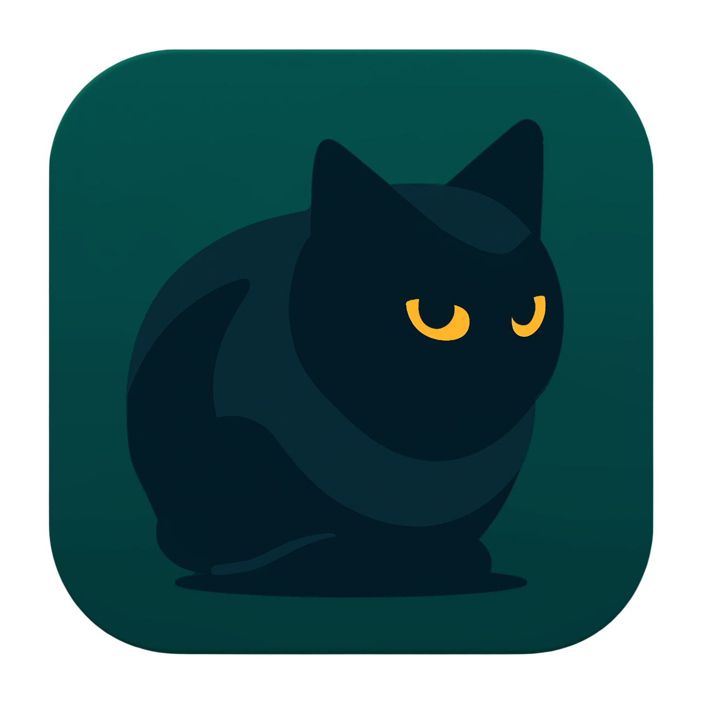

<p align="center">
  <a href="https://seoimchoi.vercel.app">
    
  </a>
</p>

<h3 align="center">My Portfolio Site</h3>

<p align="center">
  An Interactive Portfolio Site of SeoIm Choi —<br>
  You can explore Resume(with Password), Team or Toy Projects, Study Notes.<br><br>
  <b>v1.1.0 (Release)</b>
  <br>
  <a href="https://seoimchoi.vercel.app"><strong>Open Live Demo »</strong></a>
  <br><br>
  <a href="https://github.com/grapeve12/my-portfolio-site/issues/new?labels=bug">Report bug</a>
  ·
  <a href="https://github.com/EGU1832/my-portfolio-site/issues/new?labels=enhancement">Request feature</a>
</p>

---

## Demo

<p align="center">
  
</p>


## Tech Stack


## Directory Structure
```
my-portfolio-site/
├── app/                /* App Router (main page) */
├── components/         /* UI components */        
│   ├── ProfileCat.tsx        /* 3D interactive profile */
│   ├── MarkdownRenderer.tsx  /* Custom markdown renderer */
│   :
│   └── {Component}.tsx       /* Components for Web UI */
├── public/             /* Static assets */
│   ├── models/         /* GLB 3D model */
│   ├── images/         /* UI images */
│   ├── archive-md      /* .md files */
│   └── projects/       /* Demo media */
├── README.md           /* README */
└── next.config.ts
```

## Features
- Interactive Profile Cat (Just for fun)
- Resume Viewer & `Download (Now Preparing)`
- Project Viewer
- Study Notes Viewer


## Live Demo
Available in Vercel App:
https://egu1832.vercel.app/


## Content Submodule (Obsidian)
`content/obsidian` is a Git submodule pointing to
[`EGU1832/obsidian-published-content`](https://github.com/EGU1832/obsidian-published-content).

### Upstream pipeline
```
Vault Repository
  vault branch          (raw Obsidian notes, private editing branch)
     │
     ▼
  GitHub Action         (builds/publishes on push to vault)
     │
     ▼
  main branch           (generated Published/Nutshell, Published/Projects)
     │
     ▼
  Portfolio submodule   (content/obsidian, tracks main only)
```
Portfolio **only ever consumes `main`**. It never reads the `vault` branch or any other
branch of the content repository — `main` is the sole contract between the two repos.

### Branch pinning rule
`.gitmodules` pins the tracking branch explicitly:
```ini
[submodule "content/obsidian"]
	path = content/obsidian
	url = https://github.com/EGU1832/obsidian-published-content.git
	branch = main
```
This `branch = main` setting is what `git submodule update --remote` reads to decide which
branch tip to fetch — so "update to latest" always means "latest `main`", never a default
branch that could change upstream.

> **Important nuance:** a submodule is always checked out at a **pinned commit SHA**, recorded
> in the Portfolio repo's tree — not a live pointer to a branch. Cloning or running a plain
> `git submodule update` (without `--remote`) checks out that recorded SHA and leaves the
> submodule in a **detached HEAD** state. This is expected and intentional: it makes Portfolio
> builds reproducible even if `main` in the content repo moves forward later. Only an explicit
> `git submodule update --remote` (below) advances the pin to the new `main` tip.

### Procedure: getting the latest `Published` content after `git pull`
`git pull` on the Portfolio repo **does not** automatically fetch new submodule content — it
only updates the *recorded pointer* if someone else already bumped it. Two situations:

**A. Someone else already updated the submodule pointer and pushed it**
```bash
git pull                                   # fetches the new pointer (gitlink) for content/obsidian
git submodule update --init --recursive    # checks out the commit the new pointer refers to
```

**B. You want to pull in content newer than what's currently pinned in Portfolio**
```bash
git submodule update --remote content/obsidian   # fetch + checkout latest commit on main
git add content/obsidian                         # stage the new pin (gitlink SHA)
git commit -m "chore: update obsidian content submodule"
git push
```
Verify what changed before committing:
```bash
git -C content/obsidian log --oneline -5
```

### Recommended workflow
1. Content author edits notes in Obsidian and pushes to the **Vault repo's `vault` branch**.
2. The Vault repo's GitHub Action builds `Published/Nutshell` and `Published/Projects` and
   publishes the result to the Vault repo's **`main` branch**. This step is entirely inside
   the Vault repo and out of Portfolio's control.
3. When new Published content should ship, run **Procedure B** above from the Portfolio repo
   to bump the submodule pin and commit it — this is a deliberate, reviewable step (a single
   commit changing one gitlink), not an automatic sync.
4. Push the pin-bump commit; Vercel builds Portfolio against that exact pinned commit.
5. Everyone else picks up the new content via **Procedure A** on their next `git pull`.

This keeps content updates explicit and auditable (one commit per content sync) while still
guaranteeing Portfolio never tracks anything other than the content repo's `main` branch.

**Not implemented here (documentation only):** an automated job that periodically runs
Procedure B and opens a PR whenever `main` advances. If continuous sync is desired later,
that would be a separate GitHub Action in the Portfolio repo — out of scope for this change.


## License
MIT License — free for personal and educational use.