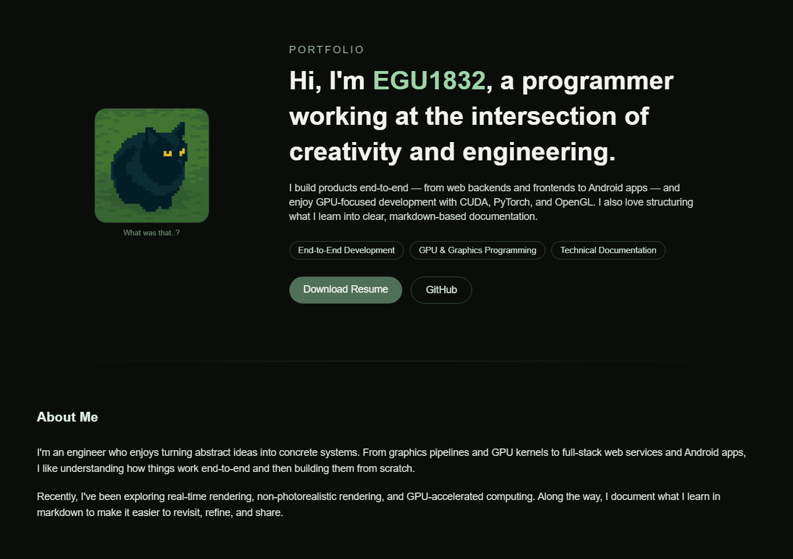

<p align="center">
  <a href="https://egu1832.vercel.app">
    
  </a>
</p>

<h3 align="center">My Portfolio Site</h3>

<p align="center">
  An Interactive Portfolio Site of SeoIm Choi —<br>
  You can explore (Resume), Team or Toy Projects, Study Notes, (Digital Art Gallery).<br><br>
  <b>v1.0.0 (Release)</b>
  <br>
  <a href="https://egu1832.vercel.app"><strong>Open Live Demo »</strong></a>
  <br><br>
  <a href="https://github.com/EGU1832/my-portfolio-site/issues/new?labels=bug">Report bug</a>
  ·
  <a href="https://github.com/EGU1832/my-portfolio-site/issues/new?labels=enhancement">Request feature</a>
</p>

---

## Demo

<p align="center">
  
</p>


## Tech Stack


## Directory Structure
```
my-portfolio-site/
├── app/                /* App Router (main page) */
├── components/         /* UI components */        
│   ├── ProfileCat.tsx        /* 3D interactive profile */
│   ├── MarkdownRenderer.tsx  /* Custom markdown renderer */
│   :
│   └── {Component}.tsx       /* Components for Web UI */
├── public/             /* Static assets */
│   ├── models/         /* GLB 3D model */
│   ├── images/         /* UI images */
│   ├── archive-md      /* .md files */
│   └── projects/       /* Demo media */
├── README.md           /* README */
└── next.config.ts
```

## Features
- Interactive Profile Cat (Just for fun)
- `Resume Download (Now Preparing)`
- Project Viewer
- Study Notes Viewer
- `Digital Art Gallery (Now Preparing)`


## Live Demo
Available in Vercel App:
https://egu1832.vercel.app/


## License
MIT License — free for personal and educational use.