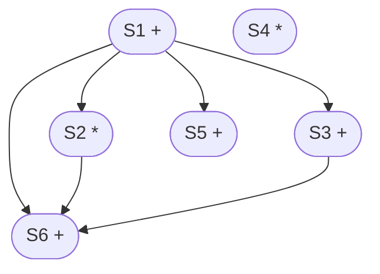
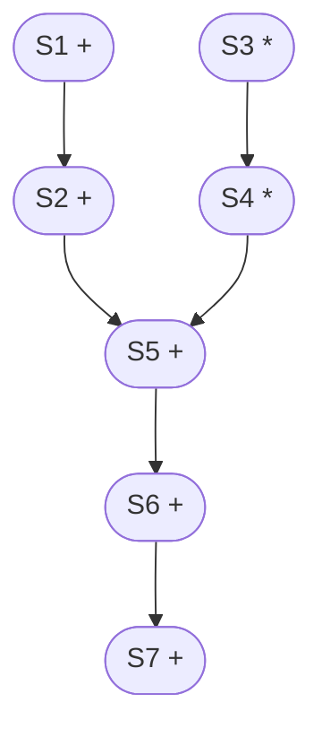
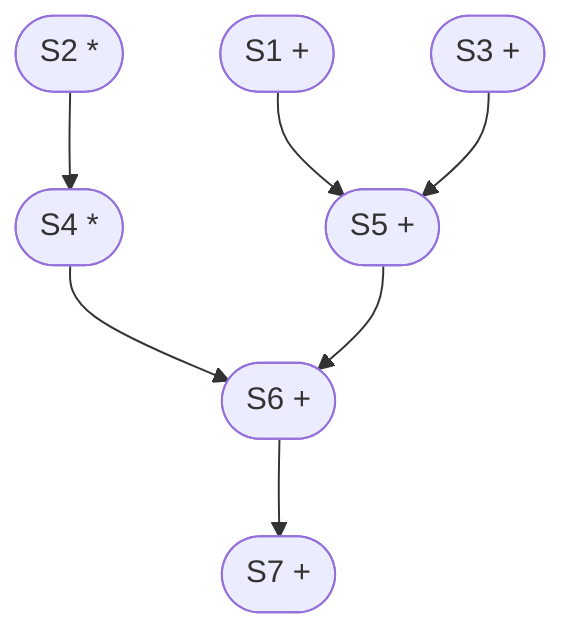
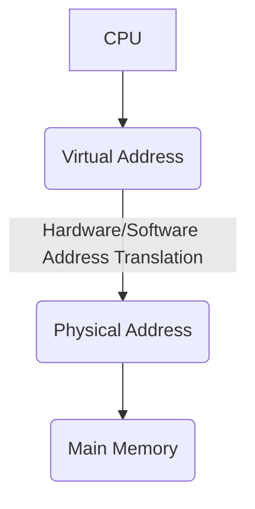

# 컴퓨터 아키텍처  

<br>

AP: applicatio proccess  
컴퓨터 아키텍처의 목표는 하드웨어와 소프트웨어 사이의 상호작용을 배우고, 컴퓨터의 기능을 이해하는 것이다.  
컴퓨터 design에 대한 기본 지식들을 배우며, 현재 컴퓨터의 구조와 트렌드에 대해서 배운다.  

<br>

컴퓨터 아키텍처의 주요 목차는 다음과 같다.  
1. Parallelism and Power  
- Parallelism(병렬성)이란, 멀티 코어에서 멀티 쓰레드를 동작시키는 방식이다.  
- 한 개 이상의 thread를 포함하는 각 코어들이 동시에 실행되는 성질을 말한다. 
  
-   
1. Parallelism and Instructions: Synchronization  
2. Parallelism and Computer Arithmetic  
3. Parallelism and Advanced Instruction-level Parallelism  
4. Parallelism and Memory Hierarchies  
5. AI Architecture  

<br>

# 1. Computer Abstractions and Technology  

<br>

## 1.1 The Computer Revolution  

<br>

- 컴퓨터 기술의 진보는 **무어의 법칙**에 의해 뒷받침된다.  
- 무어의 법칙이란, 마이크로칩 기술의 발전 속도에 관한 일종의 법칙으로 마이크로칩에 저장할 수 있는 데이터 분량이 18-24개월 마다 두 배씩 증가한다는 법칙이다.  
- 이는 다양한 어플리케이션을 가능케 하였다.  
- 전화기기  
- 인간 유전자 프로젝트  
- 머신러닝  
- AI  
- 컴퓨터 탑재 자동차 등  
- 컴퓨터는 다양한 분야에 영향을 끼치고 있다.  

<br>

## 1.2 Classes of Computers  

<br>

- 데스크탑 컴퓨터:  
- 법용성이 있고, 다양한 소프트웨어를 탑재하고 있다.  
- 비용과 성능 사이에서 여러 조율을 한다.  
- 서버 컴퓨터:  
- 네트워크가 기반인 컵퓨터이다.  
- 대용량, 성능, 신뢰성 등의 성질을 가지고 있다.  
- 소규모 서버에서 건물 규모에 이르기까지 다양한 규모가 있다.  
- 임베디드 컴퓨터:  
- 시스템을 동작시키는 소프트웨어를 하드웨어에 내장하여 특수한 기능만을 수행하는 컴퓨터이다.  
- 특정한 요구 사항을 가지고 있으며, 미리 정의된 작업만을 수행한다.  
- 엄격한 전력/성능/비용 등의 제약이 요구된다.  

<br>

기본적인 분류는 이렇지만 CPU, GPU등 어떤 소프트웨어를 돌리느냐에 따라 또 분류되기도 한다.  

<br>

## 1.3 The Processor Market  

<br>

- intel, AMD  
- MIPS: 워크스테이션, 계산용, 공학용으로 주로 쓰이는 mid-range 컴퓨터이다.  
- ARM, MPU등 apllication proccessor가 늘어나고 있다.  

<br>

## 1.4 What You Will Learn  

<br>

- 어떻게 프로그램들이 머신 language로 번역되고, 하드웨어가 그것을 어떻게 실행시키는지 배울 것이다.  
- 하드웨어/소프트웨어의 interface에 대해서 배울 것이다.  
- 프로그램의 성능을 무엇이 결정하는지, 또 어떻게 발전할 수 있는지 배울 것이다.  
- 하드웨어 기술자들이 어떻게 성능을 향상시키는지 배울 것이다.  
- 병렬 프로세싱이란 무엇인지 배울 것이다.  

<br>

## 1.5 Understanding Performance  

<br>

- Algorithm:  
- 실행될 명령의 수를 결정한다.  
- Programming language, Compiler, Architecture:  
- 실행될 기계 명령어의 수를 결정한다.  
- Processor & Memory system:  
- 명령어들이 실행될 속도를 결정한다.  
- I/O system (OS 포함):  
- 입출력 명령들이 실행될 속도를 결정한다.  

<br>

## 1.6 Below Your Program  

<br>

- Application software:  
- High-level 언어로 작성되어있다.  
- System software:  
- 컴파일러: HLL코드를 기계어로 번역한다.  
- 실행 시스템: 입출력 처리, 메모리 및 스토리지 관리, 작업 스케줄링 및 리소스 공유  
- Hardware:  
- 프로세서, 메모리, 입출력 컴트롤러들로 이루어져있다.  

<br>

## 1..7 Levels of Program Code  

<br>

- High-level 언어: 우리가 직관적으로 이해할 수 있는 코드. 생산성과 압축성을 자랑한다.  
- Assembly 언어: 명령어의 텍스트 표현  
- Hardware 표현: 이진수로 표현되며 암호화된 명령어와 데이터로 이루어져있다.  

<br>

## 1.8 Components of a Computer  

<br>

- 모든 컴퓨터에 공통적으로 들어가 있는 요소는 다음과 같다.  
- 데스크탑, 서버, 임베디드  
- 입출력 요소는 다음과 같다.  
- 사용자 인터페이스 장치:  
- 디스플레이, 키보드, 마우스  
- 저장장치:  
- 하드 디스크, CD/DVD, 플래시  
- 네트워크 어댑터  
- 다른 컴퓨터와 소통하기 위해 존재한다.  

<br>

## 1.9 Anatomy of a Computer  

<br>


  

<br>

## 1.10 Anatomy of a Mouse  

<br>

- 옵티컬 마우스:  
- LED  
- 소형 저해상도 카메라  
- 기본 이미지 프로세서: x, y 이동을 찾는다  
- 버튼 &   

<br>

## 1.11 Trough the Looking Glass  

<br>

- LCD 스크린 (픽셀들)
  

<br>

## 1.12 Opening the Desktop  

<br>


  
1. **중앙 처리 장치(CPU)**  
    - 컴퓨터의 두뇌로 불리며, 모든 계산과 명령 처리를 담당한다. 성능은 주로 클럭 속도, 코어 수, 쓰레드 수에 따라 달라진다.  
2. **메인보드(Motherboard)**  
    - 컴퓨터의 모든 구성요소가 연결되는 기판이다. CPU, 메모리, 확장 카드 등이 이곳에 장착된다.  
3. **램(RAM)**  
    - 임의 접근 메모리로, 현재 실행 중인 프로그램과 데이터를 일시적으로 저장한다. 높은 용량과 속도를 갖출수록 더 많은 작업을 동시에 빠르게 처리할 수 있다.  
4. **그래픽 처리 장치(GPU)**  
    - 화면에 이미지를 출력하는 역할을 담당한다. 내장 GPU와 외장 GPU로 나뉘며, 고성능 게임이나 그래픽 작업을 위해서는 외장 GPU가 필요하다.  
5. **하드 드라이브(HDD) / 솔리드 스테이트 드라이브(SSD)**  
    - 데이터를 영구적으로 저장하는 장치이다. SSD는 HDD보다 빠른 속도를 제공하지만, 가격이 비싼 편이다.  
6. **파워 서플라이 유닛(PSU, Battery)**  
    - 전력을 공급하는 장치로, 모든 내부 구성요소에 안정적으로 전력을 공급한다. 용량과 효율성이 중요한 요소이다.  
7. **쿨링 시스템**  
    - CPU 쿨러, 케이스 팬 등으로 구성되며, 컴퓨터를 적정 온도로 유지하여 성능 저하와 손상을 방지한다.  
8. **무선 네트워크 카드(Wireless Card)**  
- 컴퓨터가 무선 네트워크에 연결할 수 있도록 해주는 장치이다. 일반적으로 Wi-Fi 연결을 가능하게 하며, 일부 카드는 블루투스 기능도 제공한다.  
9. **DVD 드라이브 커넥터 보드**  
- DVD 드라이브와 메인보드 사이의 연결을 담당하는 작은 회로판이다.  
10. **메모리 슬롯**  
- 메모리 슬롯은 메인보드 상에 위치하며, RAM 모듈을 설치하는 데 사용된다. DDR 타입과 세대에 따라 호환성이 결정된다.  
11. **CMOS 배터리**  
- 메인 보드에 전원을 공급하여 시스템의 시간, 날짜 및 BIOS 설정을 저장하는 데 사용된다. 이 베터리는 시스템이 꺼져 있을 때에도 이러한 정보를 유지하기 위해 필요하다.  

<br>

## 1.13 CPU  

<br>


  
- Datapath: 데이터에 적용하는 명령어들  
- Control: datapath의 정렬, 메모리 등  
- Cache memory: 데이터에 빠르게 접근하기 위한 SRAM 메모리  

<br>

## 1.14 Abstractions  

<br>

- ISA(Instruction set architecture)를 결정하는 것이 컴퓨터 디자인의 가장 기초이며 중요한 단계이다.  
- Implementation: 기업과 협업하여 부품 생산, 조립 (예: 자동차 산업)  

<br>

## 1.15 A Safe Place for Data  

<br>

- I/O Device로 수명이 유한하며, 전원이 꺼졌을 때 데이터를 잃는 것도 있으며(Votile) 그렇지 않은 것도 있다.  
- ms 단위로 작용하며, CPU와 GPU에 비해서 속도가 월등히 느리다.  
- CPU, GPU가 1 동안 일을 한다고 칠 때, 이 하드디스크에 잠깐 데이터를 가지러 갖다 오면 10000이 걸린다고 칠 수 있다.  
- Flash memory: 전원이 끊겨도 데이터가 날아가지 않는 비휘발성 메모리  

<br>

## 1.16 Networks  

<br>

- NFC < Bluetooth < WiFi  

<br>


<br>

## 1.18 Defining Performance  

<br>

Bandwidth, 즉 work road가 중요하다.  
performance의 정의는 무조건 top speed만 보는 것이 아니라 그 스피드로 처리할 수 있는 데이터 양도 봐야한다.  

<br>

## 1.19 Response Time and Thtoughput  

<br>

- Respose time: 일을 끝내려면 얼마만큼의 시간이 드느냐?  
- Throughput: 시간 당 얼마만큼의 일을 할 수 있느냐?  

<br>

## 1.20 Relative Performance  

<br>


```math
\text{Performance} = \frac{1}{\text{Execution Time}}
```

- 예를 들면 다음과 같다. $`A`$의 execution time은 15$`s`$ 이고, $`B`$의 execution time은 10$`s`$ 일 때, $`A`$가 $`B`$보다 1.5배 빠르다.  

<br>

## 1.21 Measuring Execution Time  

<br>

- Elapsed time(경과 시간): 작업이 시작된 순간부터 완료될 떄까지의 실제 경과 시간이다.  
- 프로세스, 입출력, OS 오버헤드, idle 시간  
- CPU time(CPU 시간): 프로그램이 실제로 CPU를 사용하여 명령어를 실행하는 데 소요되는 시간. 이 시간은 시스템의 다른 프로세스나 입출력 작업을 기다리는 동안의 시간을 제외하고, 오직 CPU가 연산을 수행하는 데 직접적으로 사용된 시간만들 포함한다.  
- 오직 CPU가 사용되는 시간만 따진다.  
- OS dependancy가 존재한다.  

<br>

## 1.22 *CPU Clocking*  

<br>


  
- 일정한 clock에 의해 제어되는 디지털 하드웨어의 작동을 의미한다.  
- Clock period: 한 사이클의 간격  
- $`250ps = 0.25ns = 250 \times 10^{-12}s`$  
- Clock frequency (rate): 초당 사이클의 수  
- $`4.0GHs = 4000MHx = 4.0 \times 10^9Hz`$  
- Clock period의 역수가 clock frequency가 된다..  

<br>

- Tera operation per second, per walt  
- Temperature limit  

<br>

## 1.23 CPU Time  

<br>


```math
\begin{align}
&\text{CPU Time} = \text{CPU Clock Cycles} \times \text{Clock Cycle Time} \\
&= \frac {\text{CPU Clock Cycles}}{Clock Rate}
\end{align}
```


<br>

`Plus alpha: 31p. 퀴즈 또는 시험에 나옴`  

<br>

## 1.26 Performance Summary  

<br>

## 1.27 Power Trend  

<br>

## 1.28 Reducing Power  

<br>

- 새로운 CPU가 다음과 같은 특징을 지니고 있다고 생각해보자.  
- 기존 CPU 용량 부하의 85%  
- 15% 전압  15% 주파수 감소
<br>


```math
\frac{P_{new}}{P_{old}} = \frac{C_{old} \times 0.85 \times (V_{old} \times 0.85)^2 \times F_{old} \times 0.85}{C_{old} \times V_{old}^2 \times F_{old}} = 0.85^4 = 0.52
```


<br>

## 1.29 GPU Power Consumption  

<br>

## 1.30 Multiprocessors  

<br>

- 멀티코어 microprocessors  
- 명시적으로 병렬 프로그래밍을 하는 것이 필요  

<br>

# 2-A. Computer Architecture and Logic  

<br>

## 2.1 Instruction Set  

<br>

- 컴퓨터 language의 언어를 instruction이라 부른다.  
- 이 instruction의 모음을 instruction set이라 한다.  
- Instruction set은 다음과 같은 특징을 가지고 있다.  
- 컴퓨터마다 다른 instruction set들을 가지고 있다. (공통 부분이 대부분이긴 하지만 어쨌든 다르다.)  
- 초기의 컴퓨터는 매우 단순한 instruction set들을 가지고 있었다.  
- 현대의 컴퓨터도 매우 단순한 instruction set들을 가지고 있다. (효율적으로 줄임)  
- RISC (Reduces instruction set architecture) vs. CISC (Complex instruction set architecture)  

<br>

## 2.2 The ARM Instruction Set  

<br>


<br>

## 2.5 Register Operand  

<br>

### 2.5.1 Register Operand Example  

<br>

```c
f = (g + j) = (i + j);
```

<br>

- 동시다발적으로 데이터가 들어가야 되기 때문에 작게 나눠주는 것이 좋다.  

<br>

```ARM
ADD r5,r0,r1 ;register r5 contains g + h
ADD r6,r2,r3 ;register r6 contains i + j
SUB r4,r5,r6 ;r4 gets r5-r6
```

<br>

- 위 식이 3가지 simple instructions로 나눠지는 것을 볼 수 있다.  

<br>

## 2.6 Memory Operands  

<br>

- 메인 메모리는 다양한 데이터를 대상으로 한다.  
- Array, structures, dynamic data등  
- Arimetic operation을 수행하기 위해서:  
- 메모리에서 레지스터로 value를 load하고  
- 결과를 레지스터에서 메모리로 store한다.  
- 메모리의 주소는 byte addressed 되어있다. (8-bit byte) 
  
- ARM은 Little Endian이다. Least-significant byte가 least address에 있다.  
-   
- name  
- size(index)  
- same datatype  
- resources continuous  
- memory space  

<br>

#### Memory Operand Example 1  

<br>

```c
g = h + A[8];
// r1 = r2 + r3(base address)
// r5 temporary register
```
-compiling...  
```ARM
LDR r5,[r3,#32] ; reg r5 gets A[8]
ADD r1, r2, r5 ; g = h + A[8]
```

<br>

- `LDR`: Load  
- `#32`: word 당 4 byte인데 index 8을 가져와야 하므로  
- r5와 r2를 CPU register에 집어 넣고 ALU를 통해 계산을 수행한다.  

<br>

#### Memory Operand Example 2  

<br>

```c
A[12] = h + A[8];
// r3(base address) = r2 + r3(base address)
// r5 temporary register
```

<br>

- 컴파일러의 역할이 굉장히 중요하다.  

<br>

## 2.7 Registers vs. Memory  

<br>

- Access:  
- 레지스터 > 메모리  
- Operating:  
- 메모리에 명령을 적용하는 것은 load와 stores가 필요하다. 즉, 더 많은 inst가 필요하다.  
- Compiler:  
- 컴파일러는 될수 있는 한 많은 레지스터를 사용해야 한다.  
- 덜 사용되는 변수에만 메모리를 부여한다.  
- **Register optimization**은 중요하다!  

<br>

## 2.9 Representing Instructions  

<br>

- Instructions는 binary로 암호화 되어있다. (machine code)  
- ARM instructions:   
- Register numbers:  

<br>

#### ARM Data Processing (DP) Instructions  

  

  

  

  

<br>

- Cond: 조건  
- F: 명령어 유  
- I:  
- Opcode:  
- S  
- Rn:  
- Rd  
- Operand2:  

<br>

#### ARM Data Transfer (DT) Instruction  


  

  

<br>

둘 다 32-bit instruction으로 디자인 되어있다. Format을 32-bit으로 같게 만든것이다.  
거의 모든 시장을 점유할 정도로 ARM은 효과적이다. (영국 제외)  

<br>

#### Compiling If Statements  
```c
if (i == j) { f = g + h; }
else { f = g - h; }
```
```ARM
CMP r3, r4
BNE Else ; go to Else if i != j

ADD r1, r1, r2 ; f = g + h (skipped if i != j)
B Exit

Else : SUB r0, r1, r2 ; f = g + h (skipped if i = j)
Exit :
```

<br>

#### Compiling Loop Statements  
```c
while (save[i] == k) { i += 1; }
```
```ARM
Loop: ADD r12,r6, r3, LSL # 2 ; r12 = address of save[i]
LDR r0,[r12,#0] ; Temp reg r0 = save[i]
CMP r0,r5

BNE Exit ; go to Exit if save[i] != k
ADD r3,r3,#1 ; i = i + 1
B Loop ; go to Loop
Exit:
```

<br>


<br>

## 2.10 Basic Blocks  

<br>

#### Basic Block  
> 기본 블록(basic block)은 엔트리 외에는 들어오는 분기가 없고, 출구 외에는 나가는 분기가 없는 직선 코드열이다.  
- 컴파일러들은 보통 분석 과정의 첫 번째로 프로그램들을 그들의 기본 블록들로 분해한다.  
- 기본 블록들은 제어 흐름 그래프에서 정점 또는 노드의 형태를 갖는다.  
- Advanced processor는 이 기본 블록의 실행을 가속할 수 있다.  
- 뭔 말이냐, a, b, c, d가 있고 c = a + b와 f = d + e를 하고 싶은데 f 연산은 변수들이 이미 다 있으므로 앞의 c 연산을 기다릴 필요가 없다. 이럴 때 advanced 프로세서가 기본 블록의 실행을 가속할 수 있다는 것이다. 동시성이 중요한 것이다.  
- CUDA를 생각해보자.  
- Register에 최대로 집어넣을 수 있으면 가속화가 가능하다.  

<br>

#### Signed vs. Unsigned  
- Signed와 unsigned의 assembly 비교 연산자는 다음과 같다.
  
```ARM
CMP r0, r1
BLO L1 ; unsigned branch, branch not taken since 4,294,967,295_ten > 1_ten
BLT L2 ; signed branch, branch taken to K2 since -1_ten < 1_ten
```

<br>

# 2-B. Computer Architecture and Logic  

<br>

## 2.1 Procedure Call Instructions  

<br>

#### ARM Register  

  
- lr : return address를 저장하는 레지스터  
- 실제로 이 모든 주소는 stack에 두고, 이는 heap sapce에 있다.  

<br>

#### Procedure Call Instructions  

<br>


<br>

## 2.2 Stack and Memory Layout  

<br>

## 2.3 String Copy Example  

<br>

## 2.4 32-bit Constants  

<br>

## 2.5 Branch Instruction format  

<br>

## 2.6 Addressing Modes  

<br>

## 2.7 Synchronisation  

<br>

## 2.8 Translation and Startup  

<br>

## 2.9 Example Codes  

<br>

## 2.10 Comparison with  

<br>

# 4. The Processor  
#### Basic requirments of a processor  

<br>

3 main blocks  
1. instruction unit (I-unit)  
2. execution unit (D-unit)  
3. strorage register  

<br>

Instruction execution cycle  
`Instruction fetch`(D instruction fetch)  
-> `I-unit`(Decode -> Operand effective address calculation -> Operand fetch)  
-> `D-unit`(Execution (& Store) -> Next address)  

<br>

#### Gantt Chart  

<br>

```
D unit                     --i1--               --i2--
I unit              --i1--               --i2--
Inst fetch   --i1--               --i2--
            |------|------|------|------|------|------|
```
$`T = 3nt`$ 

<br>

```
D unit                     --i1-- --i2-- --i3-- --i4--
I unit              --i1-- --i2-- --i3-- --i4-- --i5--
Inst fetch   --i1-- --i2-- --i3-- --i4-- --i5-- --i6--
            |------|------|------|------|------|------|
```
$`T = (2 + n)t`$  `parallism이 존재하기 때문에 거의 3배에 달하는 효율을 얻을 수 있다.`

<br>

따라서 다음과 같은 비례식이 성립한다는 것을 알 수 있다.
<br>


```math
\text{speed up} \propto \text{number of pipeline stages}
```


<br>

#### Look-ahead & Look-behind facility  

<br>

```
	  ------
	 |      |    } look ahead
^    |      |
| PC ========
|    |      |
	 |      |   } look behind
	  ------
	    IB
```

<br>

C <- A + B  
E <- C + D  
>> 동시게 불가능  

<br>

C <- A + B  
G <- E + F  
>> 동시에 가능  

<br>

이런 instructions들을 병렬적으로 처리하기 위해서 CPU는 execution sceduling을 통해 최적화한다.  

<br>

#### Look-Ahead & Parallelism  

<br>

##### Simple Model  
> m functional units $`D_1, D_2, D_3, ... , D_m`$  
> n registers $`R_1, R_2, R_3, ..., R_n`$  
- Instruction forms:
<br>

$`R_i \leftarrow D_n(R_j, R_k)`$
<br>

$`\text{if } P(R_i) \text{ then go to L}`$
<br>

$`\text{else } next(\ sequential \ ) \text{ instruction}`$
<br>

$`R_i \leftarrow D_{load}`$
<br>

$`\emptyset \leftarrow D_{store}(R_i)`$  
```
*-----------*
|-----------|
|-----------|
|     :     |
|     pure  |
|     block |
|-----------|
*-----------*
```

<br>

- Cell resizing:  
- data dependency = precision dependency = funtional dependency  

<br>

- Look-Ahead Instruction Fetch  
I-fetcch.I-unit take a minor cycle  
- Factors preventing an instruction from being issued  
1. Unavailibility of a functional unit ro perform a task  
2. Procedure comflict  

<br>

ex) Unavailibitity of funtioanl unit  
a single adder(4 unit times)  
a single multiplier(10 unit times)  
```
S1: R1 <- R2 + R3
S2: R4 <- R2 * R5
S3: R6 <- R3 + R6
```

<br>

```
S1       -I_f- -I_u- ---------add(4)--------          
S2             -I_f- -I_u- ----mul(10)---------------------------
S3                   -I_f-  ..{bubble stall} -I-u- ----add(4)----
        |-----|-----|-----|-----|-----|-----|-----|--....--|-----|
```
$`\text{total cycles} = 13`$  

<br>

Property In-order Issue  
> Out of order execution  

<br>

#### Requirements for Parallel Execution of Two Instructions  
```
S_i, S_j   // two instuctions
I_i, I_j   // domain(input)
O_i, O_j   // range(output)
```

<br>

requirment  
> $`O_i \cap O_j = \emptyset`$, $`O_i \cap I_j = \emptyset`$, $`O_j \cap I_i = \emptyset`$ $`\text{for all i, j } i \neq j`$  

<br>

ex1)  
```
S1: R1 <- R2 + R3    // O_1={R1}, I_1={R2, R3}
S2: R4 <- R2 * R5    // O_2={R4}, I_2={R2, R5}
S3: R6 <- R3 + R6    // O_3={R6}, I_3={R3, R6}
```
$`\text{able to parallel execution}`$

<br>

ex2)  
```
S1: R1 <- R2 + R3
S2: R1 <- R4 * R5
```
$`O_1 \cap O_2 \neq \emptyset`$

<br>

ex3)  
```
S1: R1 <- R2 + R3
S2: R4 <- R1 * R5
```
$`O_1 \cap I_2 \neq \emptyset`$

<br>

ex2)  
`(I-fetch/I-unit)`: 1 cycle, `add`: 2 cycle, `multiply`: 4cycle  
Assume there are each single add, multiply.  
```
S1: R1 <- R2 + R3
S2: R2 <- R4 * R5
S3: R3 <- R3 + R4
S4: R6 <- R6 * R6
S5: R1 <- R1 + R5
S6: R2 <- R3 + R4
```

<br>

(i) Draw data dependency graph.  


<br>

(ii) Draw procedure dependency graph.  
```
 -I_u- --add(S1)--          
                   -I_u- -----multiply(S2)------
                         -I_u- --add(S3)--       -I_u- ---mlutiply(S4)----
                                                       -I_u- --add(S5)--    
|-----|-----|-----|-----|-----|-----|-----|-----|-----|-----|-----|-----|

 -----
 -I_u- --add(S6)--
|-----|-----|-----|
```
$`\text{total cycles} = 15`$  

<br>

#### 3 ways to remedy the small number of functional units and procedual dependencies  
> Dynamic Sceduling이라고도 한다.  
1. Virtual D-unit (FIFO Queue)  
For some operation I-unit can go ahead & keep dependencies  
``` ex2-ii
 -I_u- --add(S1)--          
                   -I_u- -----multiply(S2)------
                         -I_u- --add(S3)--       
                               -I_u-.......----- -----mlutiply(S4)------
                                     -I_u- --add(S5)--
                                                 -I_u- --add(S6)--
|-----|-----|-----|-----|-----|-----|-----|-----|-----|-----|-----|-----|
```
$`\text{total cycles} = 12`$  
2. Operand buffers & result buffer  
3. Conditional issue  
4. Forwarding  
```
C <- A + B
D = C * E

 -I_u- ----add----
                  ↓
       -I_u- ..... --------multiply--------
|-----|-----|-----|-----|------|-----|-----|
```
 
  

<br>

`plus alpha:`  
Pipeline stage가 일정 이상 커지면 overhead가 커진다.  

<br>

ex3)  
Compute the completion times of the sequences assuming a simple adder(2 unit) and a multiplier(4 unit)  
there are 3 virtual units, buffering & forwarding  

<br>

(a)  
```
S1: T1 <- A + B
S2: T1 <- T1 + C
S3: T2 <- D * E
S4: T2 <- T2 * F
S5: T1 <- T1 + T2
S6: T1 <- T1 + G
S7: T1 <- T1 + H
```

<br>



<br>

I-Fetch/D: 1 cycle  
```
S1   --- --(+)--
S2       ---     --(+)--
S3           --- ------(*)------
S4               --- ... ... ... ------(*)------
S5                   --- ... ... ... ... ... ... --(+)--
S6                       --- ... ... ... ... ... ... ... --(+)--
S7                           --- ... ... ... ... ... ... ... ... --(+)-- 
    |---|---|---|---|---|---|---|---|---|---|---|---|---|---|---|---|---|
```
$`\text{total} = 17 \ units`$  

<br>

(b)  
```
S1: T1 <- A + B
S2: T2 <- D * E
S3: T3 <- C + G
S4: T4 <- T2 * F
S5: T5 <- T1 + T3
S6: T6 <- T5 + T4
S7: T7 <- T6 + H
```

<br>


<br>



<br>

$`\text{total} = 14 \ units`$
$`\text{without pipelining??}`$

<br>

#### HBM  
`Plus aplha: 최신 컴퓨팅 메모리 제품과 기술`  
- Trend  
- 최근들어서 Generation이 넘어가는 속도가 느려지고 있다. (기술적 한계)  
- 최근에는 제품들의 다양성이 줄어들고 있는 추세이다.  
- AI가 요구하는 Data 양에 대한 니즈가 급격히 늘어나기 시작했다.  
- 인터페이스의 발전속도 << 하드웨어의 발전속도 << 알고리즘의 발전속도  

<br>

## 4.1 Code Scheduling  

<br>

컴파일러가 load를 기다리는 자리에 다른 instruction를 끼워넣어 cycle을 줄인다.  

<br>

컴파일러가 똑똑해지는 데는 한계가 있기 때문에 여러 알고리즘으로 이 스케줄링을 대체하기도 한다.  

<br>

Branch instruction인지의 여부는 Decodeing의 단계에서 알 수 있다.  
그럼 무조건 기다리느냐? 아니다!  

<br>

```
D;
if()
	A;
else
	B;
```

<br>

#### Branch Prediction  
D가 수행된 뒤 A로 갈지 B로 갈지 알 수 없다.  
하지만 확률적으로 어느쪽으로 갈 수 있는지는 알 수 있기에 더 확률이 높은 쪽으로 pipeline을 채워넣는다.  

<br>

우리는 확률적으로 일어날 일이 높은 코드문을 먼저 코드에 집어넣으면 된다.  

<br>

conditional jmp가 unconditional jmp보다 parity가 적다.  

<br>

#### Pipeline Summary  
- Instruction throughput  
- Hazards  
- Structure `adder, multiplier`  
- Data `data가 available하냐 아니냐`  
- Conrtol `jmp가 일어날 때, sequence가 바뀔 때, if else case..`  
hazard가 없으려면 $`I_i \cap O_j = \emptyset, I_j \cap O_i = \emptyset \ (RAW)`$, $`O_i \cap O_j \ (WAW)`$  
- Inst set 설계는 pipeline 구현의 복잡성에 영향을 미친다.  

<br>

## 4.3 Loop Unrolling  

<br>


  

<br>

105p.  
#### Example  
```c
for(i = 1000; i > 0; i = i - 1) {
	x[i] = x[i] + s;
}
```

<br>

```
L.D    F0,0(R1) ;F0=vector element
stall
ADD.D  F4,F0,F2 ;add scalar from F2
stall
stall
S.D    0(R1),F4 ;store result
DSUBUI R1,R1,8 ;decrement pointer 8B (DW)
stall
BNEZ   R1,Loop ;branch R1!=zero
stall
NOP ;delayed branch slot
```

<br>

- **Stall**이란 무엇이냐?  
Data dependency에 의해서 pipeline이 막히는 것  

<br>

그럼 다음과 같이 바꿔보자 (컴파일러가 알아서 해줌)  
```
L.D    F0, 0(R1)
DSUBUI R1, R1, 8
ADD.D  F4, F0, F2
stall
BNEZ   R1, Loop
S.D    0(R1), F4
```
10 cycle -> 6 cycle  

<br>

#### New Computer Architecture  
1. Usage  
2. Instruction Set Definition  
3. Performance, Area, Power  
4. Manufacturing  
5. OS, Application SW, System SW  
6. Program Language (Compiler)  
7. Application SC  
SOC (Simple Chip Compactor)  

<br>


  

<br>

# 5. Memory Hierarchy  

<br>

자잘한 세부사항은 건너뛰고 중요한 개념만 하겠다.  

<br>

## 5.2 The Basic of Caches  

<br>

#### Main Memory Supporting Caches  
CPU -> Cache -> DRAM  
CPU에 없으면 Cache로, Cache에도 없으면 DRAM으로  
DRAM은 휘발성 메모리이다. 따라서 메모리를 유지하기 위해 Power를 공급해줘야하기 때문에 전력이 꽤나 든다.  
Cache hit의 경우, data를 그냥 cache에서 가지고 오면 된다.  
Cache miss의 경우, data를 DRAM에서 찾아서 Cache로 가져오고, 다시 그걸 CPU로 가져와야 한다. Miss panelty가 일어나느 것이다.  
- Cache Block Read (Cache miss가 일어났을 때)  
- 1 bus cycle `address transfer`  
- 15 bus cycle `DRAM access`  
- 1 cus cycle `per data transfer`  
- 4-word Block을 search하고, DRAM이 1-word-wide일 경우  
- $`\text{Miss penalty} = 1+4\times15+4\times1=65 \ \text{bus cycles}`$  
`왜 처음 1에는 4를 안 곱할까? DRAM에 cache memory를 어떻게 mapping 하느냐에 따라 유동적으로 바뀐다..`  
- $`\text{Bandwidth} = \frac{16 \ \text{bytes}}{65 \ \text{cycles}} = 0.25 \ B/ \text{cycle}`$  

<br>

#### Imcresing Memory Bandwidth  
여기서 가로의 넓이는 bit, 즉 bandwidth를 뜻한다.  
Multiplexer는 다른 말로 data selector라고도 불린다.  
(a)   
(b) Cache가 한 개 이상이다. 즉, Multi-level Cache라고 불린다. `L1, L2`  
(c) Memory Bank가 있는데, 이는 ..?  

<br>

#### Performance Comparison at Cache Miss  
Basic memory가 다음과 같다고 가정하자.  
- 4 clock cycle `address send`  
- 56 clock cycle `per word data accesss`  
- 4 clock cycle `per word data send`  
Cache Block은 4 word라고 하자. `word = 8 byte`  
- $`\text{Miss penalty} = 4\times(4+56+4)=256 \ \text{clock cycles}`$  
- $`\text{Bandwidth} = \frac{\text{one word}}{\text{cycles}} = \frac{32}{256} = 0.125 \ \ text{byte/clock}`$  

<br>

Cache hit ratio가 올라가게 하려고 cache를 늘리면 그만큼 miss penalty도 늘어난다.  
Wide Memory의 drawback은 다음과 같다.  
- Wider memory bus cost  
- Multiplexer becomes critical timing path  
- Not expandable  

<br>

#### Interleaved Memory (시험 문제 내기 좋음)  
여러 Bank가 있으면 동시 접속이 가능하다.  
주소를 어떻게 bank에 mapping 하느냐에 따라 behavior가 달라진다.  
예제를 살펴보자.  
Example) `28p.`  
- 왜 1.2개의 memory access가 일어날까?  
- C = A + B: LD_A, LD_B, ADD_AB, SW_C를 예로 들어 보자. ALU 계산보다는 memory access가 많은 것을 볼 수 있다.  
- LD, SW가 많을지, ALU 계산이 많을지는 정책에 따라 달라질 수 있다.  
- CPI(Clock Per Instruction)  
- (표 관련) Block size가 늘어날 수록 Miss rate는 줄어들지만, Miss Panalty는 늘어난다.  
- Basic memory organization은 컴퓨터마다 다르기 때문에 문제마다 달라질 수 있다.  
- $`\text{CPI for base machine using 1 word block}`$ 
<br>

$`= \text{CPI} + (\text{mem access per inst} \times \text{miss rate} \times \text{cache miss panalty})`$  
- (1):  
- block이 2개로 늘어나니까 miss 됐을 때의 panalty cycle도 2배로 늘어난다.  
- Interleaving한다는 Memory bank를 가진다는 것이다. 그렇다면 2 word 이지만 1 word 인것과 같아진다.  
- (2):  
- 방식은 같다.  
예제를 통해서 알 수 있는 것은, Interleaving하는 것이 무조건 유리하다는 것이다.  
Interleaving이 없는 경우에는 benefit이 없었다.  

<br>

#### DRAM vs SRAM  
|                DRAM                |                  SRAM                   |  
| :--------------------------------: | :-------------------------------------: |  
|            Main memory             |                  Cache                  |  
| 휘발성, refresh 필요 (Power $`\uparrow`$) | 휘발성, refresh 필요 없음 (Power $`\downarrow`$) |  
|          1 bit 당 1 트랜지스터           |             1 bit 당 6 트랜지스터             |  
|           Capacity 4~8배            |     Capacity $`\frac14`$에서 $`\frac18`$배     |  
|             SRAM보다 느림              |             DRAM보다 8~16배 빠름             |  
(상기한 Capacity와 속도 수치는 현재와 조금 다를 수 있다.)  

<br>

#### Advanced DRAM Organization  
- Rectancular array organization  
- DDR  
- QDR  

<br>

## 5.3 Measuring and Improving Cache Performance  

<br>

#### Measuring Cache Performance
<br>


```math
\begin{align}
\text{Memory stall cycles} &= \text{\# of misses} \times \text{Miss panalty} \\
&= IC \times \frac{\text{Misses}}{\text{Inst}}\times \text{Miss Penalty} \\
&= IC \times \frac{\text{Memory Access}}{\text{inst}}\times \text{Miss Rate} \times \text{Miss Penalty}
\end{align}
```


```math
\begin{align}
\text{Memory stall cycles} &= IC \times \text{Reads per inst} \times \text{Read miss rate} \times \text{Read miss penalty} 
\\ &+ IC \times \text{Writes per inst} \times \text{Write miss rate} \times \text{Write miss penalty}
\end{align}
```


<br>

- Example) `33p.`  
Ideal 2인데 miss 때문에 5.44가 된다.  

<br>

#### Cache Performance
<br>


```math
\text{Memory access time}_{avg} = \text{Hit time} + \text{Miss rate} \times \text{Miss penalty}
```


```math
\begin{align}
\text{CPU time} = (\text{CPU execution clock cycles} + \text{Memory stall clock cycles}) \times \text{Clock cycle time}
\end{align}
```


<br>

- Can average memory access time due to cache miss predict processor performance?  
A) No! DRAM가는 것보다 더 큰 penalty가 존재하기 때문이다. (DISK 까지 가는 것이라던지)  

<br>

-------------- cut line --------------  

<br>

#### Associativity Example  

<br>

#### Set Associative Cache Organization  

<br>

**Locality**  
- Temporal  
- Spatial  

<br>

#### Replacment Policy  
- Direct mapped: 선택지가 없다.  
- Set associative: valid 하지 않은 entry가 있다고 하면(C <- A + B일 때, Cache에 C가 존재한다. 근데 C는 update되는 값이기 때문에 Cache가 제거되어야 한다.) 제거되어야 한다.  
- Least-recently used: Temporal Locality에 해당한다.  
- manageable for 4 way: 어딘가에는 timestamp가 나와야 한다. 가장 오래된 것을 제거해야하기 때문이다.  
- beyond: 여기서 부터는 너무 어렵다.  
- Random: Full Associativity로 갈 수록 random이 더 효과적인 결과를 보이더라.. 라는 이야기 `뭔 소리고?`  
- 뭔 소리냐? 여러가지 우리가 아는 locality같은 case들이 아무 의미가 없더라  
- `너무 복잡하면 오히려 규칙을 부여할 수록 더 복잡해져서 역효과가 난단 얘기인가?`  

<br>

## 5.4 Virtual Memory  

<br>

#### Virtual Memory  
> 컴퓨터 시스템에서 Main Memory를 보조 저장소(예: Hard disk)의 Cache로 사용하는 기술  
- Virtual Memory를 사용하면 프로그램이 Main Memory를 공유하며, 각 프로그램은 자주 사용되는 코드와 데이터를 포함하는 개별 가상 주소 공간을 얻게된다. 이는 다른 프로그램으로부터 보호되는 효과를 가져온다.  
- Virtual Memory는 Virtual Address와 실제 물리적인 Address 간의 Mapping을 통해 동작한다. 이러한 Virtual Memory의 기본 단위는 **Page**라고 불리며, CPU와 OS는 이러한 Page 단위로 메모리를 관리한다.  
- Virtual Memroy에서 주소 변환 과정에서 실제 메모리에 해당하는 Page가 없는 경우에는 **Page Fault**가 발생하며, 이는 해당 Page를 디스크에서 메모리로 가져와야 함을 의미한다.  

<br>



<br>

- Cache와 다른 점은 Cache miss는 하드웨어가 다루지만, Virtual MEmory replacement는 OS가 한다. 즉, Miss Penalty가 더 크다는 것이다.  

<br>

#### 2 Classes of Virtual Memroy  
- Pages (Fixed size blocks): 512 ~ 8192 bytes  
- Segments (Variable size): 다양하다.  

<br>

#### Mapping of a Virtual Address -> Physical Address  

  
- Page offset : Page start address, data reference  

<br>

#### Address Translation  

  
- Page offset은 그대로 가지고 온다.  

<br>

CPU와 Cache Memory 까지는 다 하드웨어 컨트롤이고,  
Virtual Memory Mapping은 OS의 역할이다.  

<br>

#### Page Fault Penalty  
> Cache와 달리 DRAM이 아니라 Disk 로부터 데이터를 가져와야한다. `패널티가 크다.`  

<br>

#### Page Tables  
- Page Table과 Paging Scheme이 CPU 안에도 만들어진다.  
- Page Table Entry는 Physical Page Number를 저장한다.  
- Page Not Present 일땐, Page Table Entry가 Disk의 Swap 공간에 있는 위치를 참조할 수 있다.\  

<br>

#### Translation Using a Page Table  
- Physical Address: DRAM Address  

<br>

#### Mapping Pages to Storage  

  

<br>

#### Replacement and Writes  
- Least-recently used(LRU)에 따른다.  

<br>

#### Fast Translation Using a TLB  
- PTE 하나 Access하는 데 시간이 많이 걸린다.  
- 일부 Table을 CPU에 아예 넣어버려서 좀 더 빨리 찾을 수 있도록 한다.. 뭔소린지 모르겠다  
- 느낌 상 이런 기술이 있다고 알아두면 되는 것 같다.  

<br>

#### Fast Translation Using a TLB  

  

<br>

## 5.8  

<br>

#### Concluding Remarks  
- 빠른 Memory는 작고, 큰 Memory는 느리다.  
- Caching은 큰 Memory가 빨라 보이는 것 같게 해준다.  
- Principle of Locality  
- Progrma들은 메모리의 특정 part를 자주 쓴다.  
- Memory Hierarchy  
- L1 <-> L2 <-> ... <-> DRAM <-> disk  
- Memory system의 디자인은 multiprocessor에 있어서 매우 중요하다.  

<br>

# 6. Storage Systems  

<br>

#### Motivation: Who Cares About I/O?  
- CPU: 해마다 60% 향상  
- I/O: 해마다 10% 향상 (CPU에 비해 저조함)  
- I/O 10%, CPU 10배 -> Performance 5배  
- I/O 10%, CPU 100배 -> Performance 10배  
-> I/O(Storage)가 성능의 많은 부분을 깎아 먹는다는 것이다!  
- I/O System이 많은 Bottleneck을 이루고 있다는 것이다.  

<br>

#### Storage Technology Drivers  
- Storage: Memory hierarchy에서 끝단, 느림, 그러나 용량이 큼  

<br>

#### Outline  
- Disk Basics  
- Disk History  
- Disk Options in 2000  
- Disk Fallacies and Performance  
- Tapes  
- RAID  

<br>

## 6.1 Disk Basics  

<br>

#### Disk Component  

  
- (일반적으로) 정보가 양쪽 표면에 자기적으로 기록된 여러 **Platter**  
- Bit는 **Track**에 기록되며, **Sector**단위로 분할된다.(ex: 512 Byte)  
- **Actuator**가 **Track**위로 **Head(Arm의 끝 부분, 1/Surface)** 이동하고 (*Seek*) 표면을 선택하고 **Sector**가 **Head** 아래로 회전할 때까지 기다렸다가 읽거나 쓴다.  
- **Cylinder**는 모든 **Track**의 Underhead이다.  

<br>

#### Disk Latency & Seek Time  
- Disk Latency: 디스크가 회전하는 동안 특정 Sector가 head 아래로 오는 데 걸리는 시간으로, 디스크 회전 속도에 따라 결정된다.
<br>

$`\text{Disk Latency} = \text{Seek Time} + \text{Rotation Time} + \text{Transfer Time} + \text{Controller Overhead}`$  
- Seek Time: 디스크 head가 한 track에서 다른 track으로 이동하는 데 걸리는 시으로, 평균 seek time은 head가 원하는 track으로 이동하는 평균 시간을 나타낸다.  

<br>

#### Disk Device Performance  
> 디스크의 성능은 다음과 같은 기준으로 측정할 수 있다.  
1. Capacity: 용량  
2. Average Access Time: 데이터를 찾아 Access하는 데 걸리는 시간으로, head의 이동과 디스크의 회전에 의해 결정되며, 일반적으로 디스크 회전 시간의 반 정도가 이에 해당한다.  
- $`\frac12 \text{time of a ratation}`$  
- $`10000\text{ Rotation Per Minute(RPM)} \approx 166.67\ Rotation/sec`$  
- $`1 \text{ rotation} = \frac{1}{166.67}\ sec \approx 6.00\ ms`$  
- $`\frac12 \text{ rotation(revolution)} \approx 3.00\ ms`$  
- 어떻게 성능을 측정할까? Disk에 random하게 데이터를 뿌려놓고 seek한다.  
- Access 시간을 모두 더해서 1000으로 나누면 avg Access Time이 나올 것이다.  

<br>

#### Devices: Magnetic Disks  

<br>

## 6.2 Disk History  

<br>

#### State of the Art: Barracuda 180  
- 제일 중요한 것이 모터  
- 에러가 나는데, 뒤집어 놓으면 갑자기 Head가 돌아가는 중에 떨어지거나 전기가 끊길 수 있다.  

<br>

#### Example  
한번 풀어보자. (시험에 낼수도 `협박`)  

<br>

#### 1 inch Disk Drive  
- 플래쉬보다 싸다.  
- 가격적인 메리트 때문에 많이 사용한다.  

<br>

#### Disk Performance Example  
21p. 한 번 풀어보자. (시험에 낼수도 22)  

<br>

## 6.3 Disk Fallacies and Performance  

<br>

#### Use Arrays of Small Disks  
- 지금은 Disk Array: 1 disk design과 같이 디스크가 디자인된다.  

<br>

## 6.4 RAID: Redundant Arrays of Inexpensice Disks  

<br>

#### RAID  
- Error Detect를 하기 위해서  
- Reliability of N disks = Reliability of 1 Disk / N  
- 50,000 Hours / 70 disks = 700 hours  
- 대신 Error가 나면 1/70만 고치면 된다.  
- 그러니까 수명이 늘어날 수록 Erorr도 줄어든다.  
- Disk system MTTF(Mean Time To Failure, Error가 날 때까지 걸리는 평균 시간):  
- Drops from 6 years -> 1 month!  

<br>

#### RAID1: Disk Mirroring/Shadowing  
- 일반적으로 두 개의 디스크로 구성되며, 데이터가 기록될 때 동일한 데이터를 복사하여 두 디스크에 동시에 기록한다.  
- 따라서 하나의 디스크에 문제가 발생해도 나머지 디스크로 대체하면 된다.  
- RAID1은 데이터의 안전성을 제공하지만 저장 용량은 하나의 디스크 용량만큼으로 제한된다.  

<br>

#### RAID3: Parity Disk  
- 여러 개의 데이터 디스크와 단일 Parity 디스크로 구성되며, 데이터가 기록될 때 Parity 디스크에는 데이터 디스크들의 해당 비트에 대한 Parity 정보가 계산되어 기록된다.  
- 데이터 디스크 중 하나가 손상되면, 해당 데이터 디스크의 내용을 복원하는 데 Parity 정보가 사용된다.  
- 어디서 Error가 났는지는 모른다는 특징이 있다.  
- 한꺼번에 쫙 읽을 수 있다.  

<br>

#### RAID4: High I/O Rate Parity  
- RAID3과 비슷하게 Parity Disk를 둔다. 다만 얘도 항상 돌아가다 보니 Bottleneck이 생긴다.  

<br>

#### RAID5: High I/O Rate Interleaved Parity  
- Parity Disk를 분리해버린다. 따라서 RAID4의 단점을 보완할 수 있다.  
- 현재 쓰고 있는 방식이다.  

<br>

#### Problems of Disk Arrays: Small Writes  
- 두 번의 XOR 연산: 두 개가 다른 경우 Parity bit의 변화가 생긴다.  
- 두 개가 달라서 1의 결과가 나오면 Parity bit이 0이면 1로 바뀌고, 1이면 0으로 바뀐다.  
- 두 번의 Write  

<br>

#### Sumary: RAID Techiques  
- RAID에 의미있는 변화가 있었다. 끝!  
- RAID1, 3, 5를 특히 잘 기억해라.  

<br>

`14p.`  
- `65MB/s`: 뭔가 이상한듯  

<br>

`plus alpha: `  
1. Instruction Set Design  
- Performance PPA, 가격  
- 제일 중요하다.  
1. Implementation  
2. Compiler  
- High level Language -> Instruction Set으로 Translation  
- Assembly Language: 컴파일러가 똑똑하지 못할 때 어셈블리로 코딩을 하면 컴퓨터를 100% 활용 가능하다.  