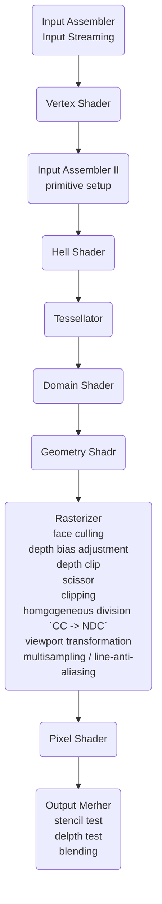

# 0. What is Graphics?  

<br>

- 글로벌 스탠다드~  
- 3D 컴퓨터 그래픽스에 관해서 일을 할 때 필요한 것  
    - 3D 렌더링 파이프라인  
        - 밑바닥까지 알아놓으면 나중에 직장 다닐 때 좋을 것이다.  
    - Ray tracing 계산 과정  
    - 가상현실/증강현실/혼합현실 등 에서의 real-time 렌더링 issue  
- RTX  
- OpenGL 프로그래밍 관련  
    - OpenGL Programming Guide  
    - OpenGL 4 Shading Language Cookbook  
- OpenGL이 DirectX 보다는 단순함  
- Vulcan은 굉장히 Low-level에서 돌아간다. 하드웨어 수준에서 코딩하기 때문에 굉장히 디테일한 언어고, 학부 수준에서 배우기에는 무리가 있다.  
- 3D computer vision vs 3D computer graphics  
    - 3D computer graphics: 내 머릿속으로 생각하는 상상의 세상에 가상의 카메라를 들이대서 정지영상이나 동영상을 촬영하여 나오는 영상을 만들어내는 것 (3D -> 2D)  
    - 3D computer vision: 위의 방향이 거꾸로 간다. 실제 영상을 촬영해서 추출 가능한 데이터로 뽑아내는 것 (2D -> 3D)  
    - 예전에는 다른 분야였는데, 어느새부터 둘 사이의 벽이 허물어지기 시작했다.  
    - 더 알아보기 위해서는 컴퓨터 비전이라는 과목을 추천한다.  
- 3D 기하 모델링: 기하 물체들을 만드는 것  
- 3D 애니메이션: 물체들을 움직이는 것  
- 3D 렌더링: 사실적인 이미지 생성  
- Navies Stokes equation: 유체역학의 가장 기본이 되는 방정식. 식 만드는 건 물리학과 사람들이 하고 우리는 하니깐 되더라.. 정도만 알고 하는 듯.  
- 영상은 보통 1초에 30fps씩  

<br>

# 1. 강의자료1  
## 1.1 3D Computer Graphics and Applications  

<br>


  
RTX는 RT 코어들을 가지고 있다. 이는 raytracing을 가속화 해준다. D = A * B + C와 같이 단순한 연산들을 빠르게 계산해준다는 특징이 있다.  
이전에는 상상도 못했던 것들이 NVIDIA 덕분에 real-time rendering이 일부분 가능하게 되었다.  

<br>

## GLUT  

<br>


<br>

# 2. 강의자료2  

<br>

- 이 단원에서는 최신 GPU의 성능에 대하여 알아볼 것이다.  
- Raster graphics system과 앞으로 사용할 color model에 대하여 이해해 볼 것이다.  

<br>

## 2.1 Graphics Processing Unit (GPU)  

<br>

- GPU란 우리가 만들고자 하는 영상에 비해서 프로세서(CPU)가 느린데, 이의 간견을 줄이기 위해 새로 만든 core processor이다.  
- real-time rendering연산을 위한 floating point연산을 가속화해준다.  
- vertex shader를 가지고 프로그래밍을 할 것이다.  
- GPU의 변천사는 다음과 같다.  
1. NVIDIA GeForce 6 Series (NV40) - 6800 Ultra (2004):
  
- vertex shader -> rasterization -> fragment shader  
2. NVIDIA GeForce 8 Series (G80) - 8800 GTX (2007):
  
- 연두색 네모를 CUDA core라고 부른다.  
- 전의 GPU와 달리 같은 부품(CUDA core)이 다양한 계산을 행한다.  
- FLOPS: float형 변수의 초당 계산 속  
- 현재 GPU의 기본 구조이다.  
3.  AMD Radeon RX Vega64 Liquid Cooled Edition (2017):
  
4.  AMD Radeon 6900 XT (Navi 21) (2020):
  
5.  NVIDIA GeForce GTX 4090 (2022): Ada Architecture:
  
- mad operation(multiply-accumulate operation, a = b * c + d) 을 one clock에 해준다.  
- memory access latecny hiding  
- Super computer vs GPU:  
- 2004년 당시의 제일 빠른 슈퍼컴퓨터가 70 TFLOPS 정도가 나오는데, 최신 GPU 하나가 40 TFLOPS 정도가 나온다.  
- GPGPU(General-Puspose GPU) Computing:  
- APIs for GPU Programming:  
- OpenGL, Vulkan, DirectX, Metal  
- CUDA, OpenCL: 좀더 low-level에서 GPU를 구동한다.  
## 2.2 Introduction to Raster Graphics System  

<br>

- Raster Graphics System이란?:
  
- frame buffer: 화면에 띄우고자 하는 한 순간의 이미지 데이터 덩어리  
- processor(GPU)가 계속 화면에 그림을 그리는 것이다.  
- Raster Image:  
- 직사각형 형태의 이미지를 픽셀화 하여 각각의 픽셀의 RGB 값을 결정한다.  
- 연속적인 영상을 유한개의 pixel를 사용하는 영역으로 표현하므로 오차가 발생한다. (aliasing)  
- Pixel (화소)  
- Resolution (해상도)  
- Raster image vs Vector image  
- Color Model:  
- RGB, CMY(Cyan, Magenta, yellow), HSV  
- 

  
- RGB Color Model(Red, Green, Blue):  
- (r, g, b) (0.0 <= r, g, b <= 1.0)  
- Additive primary colors: 빨간색(Red) = (1, 0, 0), 초록색(Green) = (0, 1, 0), 파란색(Blue) = (0, 0, 1)  
- Subtractive primary colors: 시안색(Cyan) = (0, 1, 1), 자홍색(Magenta) = (1, 0, 1), 노란색(Yellow) = (1, 1, 0)  
- Neutral colors: 검정색(blacK) = (0, 0, 0), 흰색(White) = (1, 1, 1), 회색(Gray) = (a, a, a)  
- Computer Representation for RGB Color Model:  
- 채널 당 8비트, 즉 색깔 당 총 24 비트를 사용할 경우 256 단계로 나누어 표현 (0, 0, 0) - (255, 255, 255), 총 $`2^{24}`$ 개의 색깔을 나타낼 수 있다.  
- 만약 한 색깔 당 16비트를 사용하는 경우 $`2^{16}`$ 개의 색깔을 나타낼 수 있다. 이때는 (5bit, 6bit, 5bit)를 할당한다. 왜 녹색만 더 주냐? 하면 우리 눈이 녹색과 황색에 가장 예민하게 반응하기 때문이다. 신기하군!  
- 채널 당 더 많은 비트를 사용할 수록 메모리 요구량이 증가한다.  
- 해상도가 1280 $`\times`$ 1024인 래스터 이미지를 24-bit 색깔을 사용할 경우  
- $`1280 \times 1024 \times 24 / 8B = 3.75 MB`$의 메모리가 필요하다.  
- 일반적으로 채널 당 8-bit면 충분하지만 정밀한 그래픽스 계산 또는 이미지 처리를 위해서 채널 당 12/16/24/32-bit 등을 사용하기도 한다.  
- 비트맵 or 픽스맵  
- 래스터 이미지 데이터, 비트맵은 흑백 이미지의 픽스맵에 한정하여 쓰이기도 한다.  
- CMY (CMYS) Color Model: R, G, B의 세가지 원색을 흰색에서 적절히 빼서 표현하는 방식  
- 검정색이 왜 있을까?  
- HSV (HSB) Color Model: 주어진 색깔을 Hue(색상), Saturation(채도), Value(명도) 등의 세가지 직관적인 값으로 표현하는 방  
- Raster Graphics System:<br>
  
- Raster Image terminology:  
- Screen  
- Frame buffer  
- Depth  
- 해상도와 frame buffer 크기와의 관계  
- Video controller / Display controller  
- Digital to Analog converter  
- Phospher  
- Raster scan  
- Scan line  
- Refresh rate: 화면 재생률이란 1초 동안 디스플레이가 화면에 프레임을 나타내는 횟수를 의미한다. 인간의 눈은 약 60Hz 이상의 사물을 볼 수 없고, 초당 30~60 프레임 정도를 볼 수 있다.  
## 2.3 Frame Buffer (Graphics 관점)  

<br>

- [참고 youtube](https://youtu.be/DIh3KlG99LY?si=hxQAE37kVOvUqiIq)  
- Color buffer: 픽셀의 색상값을 저장한다.  
- Double buffer: 움직이는 물체를 그릴 때 사용한다.  
- Stereo buffer: 양안식 이미지(VR 이미지) 를 그릴 때 사용한다.  
- Alpha buffer: 픽셀 투명도에 대한 정보를 저장한다.  
- Depth buffer (Z-buffer): 한 물체의 픽셀들이 다른 물체보다 앞에 있는지 판정하기 위해 사용하는 기법이다. 하드웨어적으로 구현되는 부분이다.  
- Stencil buffer: 렌더링을 하는 영역의 한계를 정의할 때 쓰인다.  

<br>

#### Stereoscopic Images  
- Buffer를 left buffer, right buffer, 총 두 개 사용한다.  
- 3D 영화 이미지나, VR 이미지라 생각하면 된다.  

<br>

### 2.3.2 Single Buffering  

<br>

- Rendering: 렌더링 코드가 기술한 바 대로 장면을 구성하는 요소들을 하나씩 그리는 것. 즉, 이미지의 각 픽셀에 해당하는 color buffer의 메모리 영역의 내용을 바꾸는 것이다.  
- Color buffer를 한 개 사용하는 경우, 이미지가 생성되고 있는 도중의 내용이 예측할 수 없는 형태로 바뀌기 때문에 (frame rate와 refresh rate가 다름) 불규칙한 이미지가 생성된다. 이를 *flickering*이라고 한다.  

<br>

### 2.3.3 Double Buffering  

<br>

- Color buffer를 두 개(front buffer, back buffer) 사용하는 경우, front buffer(완성된 이미지)를 화면에 표시하고, GPU는 back buffer에 렌더링 계산을 수행한다.  
- 그 다음 front buffer와 back buffer를 swap한다. 방법은 다음과 같다.  
- Page flip: 두 버퍼를 지칭하는 포인터를 서로 바꾼다.  
- Copy(blit): back buffer의 메모리를 front buffer의 메모리 영역에 복사한다.
<br>


```math
BB \rightarrow FB \rightarrow  BB
```


```math
FB \rightarrow BB \rightarrow FB
```

- Double buffering without VSync:
  
- Buffer writing  
- Buffer reading  
- Buffer swapping  
- 프레임을 그리다가 FB와 BB가 뒤바뀌는 일이 생길 수 있다. 이를 *screen tearing*이라고 한다.
  
- 해결 방법은 다음과 같다.  
- **Double buffering with VSync**:
  
- *VSync(Vertical Synchronization)*: 비디오 제어기가 refresh를 마친 시점 (FF를 화면에 모두 그린 시점)에 buffer swapping이 일어나도록 하여 위의 문제점을 방지한다.  
- $`\text{Rendering frame rate} > \text{Display refresh rate}`$ 일 경우 GPU가 idle 상태에 들어가 자원 낭비가 될 수 있다. 그 문제는 다음과 같다.  
- Stutterting과 VSync lag 문제: 
  
- 동일한 이미지가 여러 번 디스플레이된다. 즉, 화면이 변하는 속도가 달라지는 *stuttering* 문제가 발생할 수 있다.  
- GPU 자원도 낭비되며 frame rate가 낮아지는 *VSync lag*문제도 발생할 수 있다.  

<br>

### 2.3.4 Triple Buffering with VSync  

<br>

 - 총 세 개의 buffer(FB $`\times`$ 1, BB $`\times`$ 2)를 사용한다.
  
 - Vsync 시점에 렌더링이 끝난 BB가 하나도 없을 경우, FB의 이미지를 한 번 더 디스플레이  
 - Vsync 시점에 렌더링이 끈탄 BB가 하나라도 있을 경우, 가장 최근에 렌더링을 한 BB에 대해 buffer swapping을 함: Most-recent buffer swapping  
 - Vsync 시점에 이르기 전에 두 개의 BB에 대한 렌더링이 모두 끝나면  
 - GPU는 두 개의 BB중 먼저 렌더링이 끝난 버퍼에 새롭게 렌더링 수행  
 - 한 번의 refresh 동안 BB들에는 복수의 frame의 영상이 렌더링 될 수 있음  
 - 이렇게 하면 Vsync lag 현상을 줄일 수 있다.: Nvidia's Fast Sync  
- 장점은 다음과 같다.  
1. Vsync lag를 줄일 수 있다.
  
2. Stuttering 문제를 줄일 수 있다. `frame rate stabilization`
  
- 3개의 버퍼를 사용하면 드로잉 프로세스가 디스플레이 프로세스로부터 분리된다. 이는 프레임 드로잉이 프레임 디스플레이 시간보다 더 오래 걸리더라도 VSync로 일관된 높은 frame-rate가 달성됨을 의미한다.  

<br>

# 3. 강의자료3  

<br>

GLUT 프로그래밍 방법에 대하여 이해한다.  
SimplefreeGLUTcode.cpp를 이해하고 자신이 원하는 방식으로 수정하여 본다.  

<br>

## 3.1 Window Programming for OpenGL  

<br>

#### OpenGL 프로그래밍  
> 윈도우 시스템(Microsoft, X, Android, iOS..)의 래스터 시스템 기반  
1. 추상적 래스터 시스템인 OpenGL을 윈도우 시스템에 연결 (pixel format 설정)  
2. OpenGL 함수로 3차원 그래픽스 프로그래밍  
3. 윈도우 시스템은 확장 함수(WGL, GLX, AGL, RGL...)로 OpenGL과 연결  
`OpenGL -- (WGL) -> Window 이런 느낌인듯`  

<br>

#### 윈도우 프로그래밍  
> 윈도우 시스템의 구조는 클라이언트-서버 시스템이다.  
- 윈도우 프로그래밍의 기본 구조를 간단히 나타내면 다음과 같다.
  
- (5): 특정 요청을 완료했다는 표  
- 윈도우 응용 프로그램(Client)의 구조는 다음과 같다.
  
- while문 안에 있는 switch문의 구조같이 돌아간다.  

<br>

### 3.1.1 간단한 윈도우 프로그래밍의 예  

<br>

#### Win32  
> Microsoft Window에서 제공하는 Window API로, C및 C++ 기반이다.  
- WndProc(Window precedure):  
- 윈도우에 전달된 메시지 처리  
- WinMain, RegisterClassEx, CreateWindow, ShowWindow, UpdateWindow, GetMessage, TranslateMessage, DispatchMessage  

<br>

#### Win32 + WGL + OpenGL  
> GDI에 의해 정의되는 윈도우 시스템의 그래픽스 시스템과 OpenGL이 정의하는 그래픽스 시스템과의 연결이 필요하다. *사용 pixel format에 대한 설정이 중요하다.*  
- OpenGL이 희망하는 frame buffer의 성능을 pixel format을 통하여 요청  
- buffer의 색상 구성, z-buffer의 비트 수, stencil buffer의 존재   
- 하드웨어에 대한 정보를 가지고 있는 GDI가 하드웨어가 지원을 하는 범위 내에서 OpenGL에서 요구한 성능을 최대로 만족시켜주는 pixel format을 설정  
- GDI(Graphics Device Interface, 윈도우 시스템의 그래픽스 API)는 그래픽 디바이스의 정보를 알고 있으며, 이 정보를 기반으로 OpenGL이 요구하는 성능을 만족시킬 수 있는 최적의 픽셀 형식을 선택한다.  
- 윈도우 시스템의 그래픽스 작업에 관련된 모든 정보를 저장하는 device context에 저장을 한 후 사용  
- OpenGL은 device context를 사용하여 그래픽 카드와 통신하고, OpenGL 함수 호출을 통해 그래픽 렌더링 작업을 수행한다.  
- WinMain, SetDCPixelFormat, WndProc  

<br>

`plus alpha: stencil buffer`  
렌더링된 픽셀에 대해 추가적인 조작을 수행하기 위해 사용된다. 그래픽 하드웨어의 RAM에서 Z-buffer와 영역을 공유하는 경우가 많다.  
특정 영역을 마스킹하거나, 클리핑하거나, 반전시키는 데 유용하다.  
빛을 차단하거나, 그림자 효과를 추가하거나, 반투명한 영역을 처리할 수 있다.  

<br>

#### GLUT + OpenGL  

<br>

#### Window Class & MSG  
> Window class는 윈도우의 모양(appearance), 동작(behavior), 특성을 정의한다.  
> MSG는 윈도우에 전달된 메시지를 설명한다. OS는 사용자의 입력이나 시스템 이벤트가 발생하면 메시지를 생성하고 이를 해당 어플리케이션의 메시지 큐에 배치한다.  
- 윈도우 프로그래밍에서 window class와 MSG구조는 microsoft windows 운영체제의 핵심 요소 중 일부이다. 이들은 윈도우 API를 사용하여 윈도우 기반 애플리케이션을 개발할 때 필수적으로 이해해야 하는 개념들이다.  
- Window & window precedure 함수:  
- Window precedure: 해당 윈도우 클래스에 속한 모든 윈도우로부터 전달되거나 게시된 메시지를 처리한다. 이렇게 함으로써 윈도우의 외관과 동작에 관한 모든 측면을 결정하고 제어한다.  
- Window class:  
```c++
typedef struct {
	UINT cbSize; // 이 구조체의 크기를 byte 단위로 저장한다.
	UINT style; // 윈도우 클래스의 스타일을 지정한다.
	WNDPROC lpfnWndProc; // 윈도우 클래스의 윈도우 프로시저를 가리키는 포인터
	int cbClsExtra; // 윈도우 클래스의 여분의 메모리를 byte 단위로 지정한다.
	int cbWndExtra; // 각 윈도우 인스턴스에 대해 추가로 할당할 메모리의 양을 지정.
	HINSTANCE hInstance;
	HICON hIcon; HCURSOR hCursor;
	HBRUSH hbrBackground;
	LPCTSTR lpszMenuName;
	LPCTSTR lpszClassName;
	HICON hIconSm;
} WNDCLASSEX;
```
- MSG:  
```c++
typedef struct {
	HWND hwnd;
	UINT message;
	WPARAM wParam;
	LPARAM lParam;
	DWORD time;
	POINT pt;
} MSG;
```

<br>

```c++
case WM_CHAR:
	if (wParam == 'q') {
		PostQuitMessage(0);
	}
	break;
```
exit -1;은 하수. 원래 윈도우 프로그램은 이렇게 한다. ???: 죽을 때도 우아하게 죽어라.  
```c++
case WM_PAINT:
	glClearColor(0.259, 0.259, 0.435, 1.0);
	glClear(GL_COLOR_BUFFER_BIT);
	glColor3f(1.0, 1.0, 1.0);
	glBegin(GL_LINES);
	glVertex2f(-1.0, 0.0);
	glVertex2f(0.0, 0.0);
	glEnd();
	glFlush();
	ValidateRect(hwnd, NULL);
	break;
```
- WM_PAINT: 조금이라도 화면의 내용을 다시 그려야할 때  

<br>

## 3.2 Window Programming Using freeGLUT  

<br>

- `glutInitContextProfile (GLUT_COMPATIBILITY_PROFILE);`  
- 우리는 `GLUT_CORE_PROFILE`을 쓸 것임.  
- `glutInitWindowPosition(500, 200);`  
- 윈도우를 띄울 때 좌표를 (500, 200)으로 해라  
```c++
void register_callbacks(void) {
	glutDisplayFunc(display);
	glutKeyboardFunc(keyboard);
	glutSpecialFunc(special);
	glutMouseFunc(mousepress);
	glutMotionFunc(mousemove);
	glutReshapeFunc(reshape);
 	glutCloseFunc(close);
}
```
- 등록할 함수를 callback이라는 함수를 통해서 다시 실행시키는 것  
- 특정 이벤트 또는 액션이 발생했을 떄 호출되도록 함수를 등록한다.  

<br>

### 3.2.1 Main 함수의 설명  

<br>

- `void glutInit(int *argcp, char ** argv);`  : GLUT 라이브러리 초기화  
- `void glutInitDisplayMode(unsigned int mode);` : 초기 상태의 디스플레이 모드 설정  
- `void glutInitWindowSize(int width, int height);` : 초기 상태의 윈도우 크기 설정  
- `void glutInitWindowPosition(int x, int y);` : 초기 상태의 윈도우 위치 설정  
- `int glutCreateWindow(char *name);` : Top-level의 윈도우 생성  
- `void glutSetOption(GLenum eWhat, int value);` : 기본 상태/옵션 변수를 설정  
- `void glutMainLoop(void);` : GLUT 이벤트 실행 loop 진입  
- `void glutLeaveMainLoop(void);` : 이벤트 loop 종료  

<br>

### 3.2.2 Callback 함수의 등록  

<br>

- Function pointer: Function 함수라는 객체를 나타내는데 어떤 타입의 값을 받아들여 어떤 타입의 값을 반환하는지에 대한 정보가 들어있는것.  
- Callback function: 윈도우 프로그램 수행 시 발생하는 여러 종류의 윈도우 및 입력 이벤트 중 관심이 있는 이벤트에 대하여 선별적으로 어떠한 처리를 하고자 한다는 것을 기술해주는 함수  
- `void glutDisplayFunc(void (*func)(void));` : Display callback 함수. void 타입을 인자로 받기 때문에 display()함수는 void형이여야만 한다.  
- `void glutKeyboardFunc(void (*func)(unsigned char key, int x, int y));` : Keyboard callback 함수. 어떤 키를 눌렀는가 (char), 좌표 (int x, int y)가 인자로 들어간다. 따라서 keyboard()함수는 char, int, int를 인자로 받아들여야 한다.  
- `void glutPostRedisplay(void);` : 현재 창을 다시 표시해야 하는 것으로 표시한다.  
- `void glutSpecialFunc(void (*func)(int key, int x, int y));` : GLUT_KEY_LEFT 같은 특별한 키보드 callback을 한다.  
- `void glutMouseFunc(void (*func)(int button, int state, int x, int y));` : 좌클릭, 우클릭 같은 마우스 callback을 한다.  
- `void glutMotionFunc(void (*func)(int x, int y));` : 움직임 callback을 한다.  
- `void glutReshapeFunc(void (*func)(int width, int height));` : 윈도우 크기가 변했을 때 callback을 한다.  
- `void glutCloseFunc(void (*func) (void));` : 윈도우 창을 닫는 함수를 callback 한다.  

<br>

# 4. 강의자료4  

<br>

2D 및 3D 공간에서 geometric tranformation의 한 부류인 `affine transformation`에 대하여 이해한다.  

<br>

## 4.1 2D Affine Transformation  

<br>

- Affine transform(아핀 변환)은 scaling(크기 조정),  rotation(회전)과 같은 선형 변환에 translation(평행 이동)을 추가하여 구성된 선형 변환의 특수한 형태이다.  
- Affine transformation $`f : R^2 \rightarrow R^2`$ 는 점 $`p = (x \ y)^t`$ 를 $`p' = (x' \ y')^t`$ 로 옮기는 것이다. 이는 $`p' = f(p) = Ap + v`$ 와 같이도 표현 된다.  
- 형렬에 벡터가 곱해지는 linear transformation과 달리 $`v`$ 가 더해진다는 특징이 있다.  
- Affine transformation의 자유도는 6개이다. 인자가 6개이기 때문이다.
<br>


```math
S = \begin{pmatrix}
x & 0 \\
0 & y \\
\end{pmatrix} =
\begin{pmatrix}
a_{11} & a_{12} \\
a_{21} & a_{22} \\
\end{pmatrix}
\begin{pmatrix}
x \\
y \\
\end{pmatrix} + 
\begin{pmatrix}
v_1 \\
v_2 \\
\end{pmatrix}
```

- 아핀 변환은 다음과 같이 구성된다.  
* Linear transforn  
* Scaling ($`S`$)  
* Rotation ($`R`$)  
* etc.  
* Translation ($`T`$)  
- 동차 좌표를 이용하면, 모든 변환은 2 차원에서는 $`3 \times 3`$ 행렬로, 3 차원에서는 $`4 \times 4`$ 행렬로..와 같이 크기가 동일한 행렬로 표현할 수 있다.  
- 행렬에서 교환법칙이 성립하지 않듯이, $`SRT, RST`$와 같이 변환의 순서가 바뀌면 물체는 같은 위치로 이동하지 않는다는 것을 기억하자.  
- 아핀 변환의 기본적인 성질은 다음과 같다.
  
- 평형성의 유지  
- 비율의 보존  
- 투영 변환은 아핀변환이 아니다.  

<br>

### 4.1.1 2D Affine Transform with Homogeneous Coordinates  

<br>

- Scaling ($`S`$):  

<br>


```math
S(s_x, s_y) = \begin{pmatrix}
s_{x} & 0 & 0 \\
0 & s_{y} & 0 \\
0 & 0 & 1 \\
\end{pmatrix}
```

- Rotation ($`R`$):  
회전하는 방향은 $`CCW`$이다.  

<br>


```math
R(\theta) = \begin{pmatrix}
\cos\theta & -\sin\theta & 0 \\
\sin\theta & \cos\theta & 0 \\
0 & 0 & 1 \\
\end{pmatrix}
```

- Translation ($`T`$):  

<br>


```math
T(d_x, d_y) = \begin{pmatrix}
1 & 0 & d_{x} \\
0 & 1 & d_{y} \\
0 & 0 & 1 \\
\end{pmatrix}
```

- Shearing ($`SH`$):  

<br>


```math
SH_x(sh_x) = \begin{pmatrix}
1 & sh_x & 0 \\
0 & 1 & 0 \\
0 & 0 & 1 \\
\end{pmatrix}
```


<br>


```math
SH_y(sh_y) = \begin{pmatrix}
1 & 0 & 0 \\
sh_y & 1 & 0 \\
0 & 0 & 1 \\
\end{pmatrix}
```

- Reflectiont($`Rf`$):  

<br>


```math
Rf_{y = 0} = \begin{pmatrix}
1 & 0 & 0 \\
0 & -1 & 0 \\
0 & 0 & 1 \\
\end{pmatrix}
```

가로세로 비율: aspect ratio  
역변환: innverse transformation  

<br>

#### 연습문제 1  

<br>


```math
M = T(5, 0) \cdot R(-\frac{4}{\pi}) \cdot SH_x(-2) \cdot R(\frac{4}{\pi}) \cdot T(-5, 0)
```

#### 연습문제 2  
> 사각형의 중심이 원점에 오게 한 다음, 돌린 뒤 목표 위치로 옮기면 된다.
<br>


```math
T() \cdot R() \cdot T()
```

### 4.1.2 Composition of 2D Transformation (Example4)  

<br>


  
좌표계는 서로 수직인 x, y축이 있다.  
x축 방향으로 (1, 0)이라는 벡터가 있을 것이고 y축 방향으로 (0, 1)이라는 벡터가 있을것이다. 원점은 (0, 0)이다.  
(x, y) = x(1, 0) + y(0, 1)  
그런데 세상이 바뀌어서 x, y축의 방향이 달라졌다. 세로운 세상에서는 원래 있던 점의 위치도 상대적으로 다르게 보일 것이다.
<br>


```math
u = (u_x, u_y), v = (v_x, v_y)
```


```math
\begin{align}
\vec{u} \cdot \vec{u} = 1 \\
\vec{v} \cdot \vec{v} = 1 \\
\vec{u} \cdot \vec{v} = 0
\end{align}
```

이 새 두 축은 서로 수직이고 크기는 1인 unit 벡터이다.  

<br>

#### 좌표계 사이의 변환  
(x', y') -> (x, y)과 (x, y) -> (x', y')의 식은 각각 다음과 같다.
<br>


```math
\begin{pmatrix} x \\ y \\ 1 \end{pmatrix}
= \begin{pmatrix}
u_{x} & v_{x} & 0 \\
u_{y} & v_{y} & 0 \\
0 & 0 & 1 \\
\end{pmatrix}
\begin{pmatrix} x' \\ y' \\ 1 \end{pmatrix}
```


```math
\begin{pmatrix} x' \\ y' \\ 1 \end{pmatrix}
= \begin{pmatrix}
u_{x} & u_{y} & 0 \\
v_{x} & v_{y} & 0 \\
0 & 0 & 1 \\
\end{pmatrix}
\begin{pmatrix} x \\ y \\ 1 \end{pmatrix}
```

proof) x'과 y'은 각각 내적으로 나타낼 수 있다.
<br>


```math
x' = \vec{u} \cdot \vec{p}, y' = \vec{v} \cdot \vec{p}
```

따라서 다음과 같은 식을 도출할 수 있다.
<br>


```math
\begin{pmatrix} x' \\ y' \end{pmatrix}
= \begin{pmatrix} u_{x} & u_{y} \\ v_{x} & v_{y} \end{pmatrix}
\begin{pmatrix} x \\ y \end{pmatrix}
```

카메라의 좌표계 변환을 하기 위한 기초라고 생각하면 되겠다.  
#### $`M = R \cdot T(-e_x, e_y)`$  
> $`T()`$ 변환까지 포함한 완전체 식을 적는다면 다음과 같다.
<br>


```math
\begin{pmatrix} x' \\ y' \\ 1 \end{pmatrix}
= \begin{pmatrix}
u_{x} & u_{y} & 0 \\
v_{x} & v_{y} & 0 \\
0 & 0 & 1 \\
\end{pmatrix}
\begin{pmatrix} x-e_{x} \\ y-e_{y} \\ 1 \end{pmatrix}
```

 Translation 먼저하고 Rotation을 나중에 해도 된다. 다만 이 때는 Translation의 값이 달라진다.  

<br>

## 4.2 3D Affine Transformation  

<br>

#### 좌표계  
> 좌표계에는 오른손 및 왼손 좌표계가 있다.  
- 좌표계의 판별: x -> y축을 감쌌을 때 엄지 방향이 z축이라고 생각하면 된다.  
- OpenGL에서는 기본적으로 **오른손 좌표계**를 쓴다.  

<br>

#### 3D Affine Transformation  
> 다음과 같은 방식으로 주어진 점 $`p`$를 $`p'`$으로 매핑해주는 변환을 3D 아핀 변환이라고 한다.
<br>

 
```math
p = \begin{pmatrix} x & y& z\end{pmatrix}^t \rightarrow p' = \begin{pmatrix} x' & y' & z'\end{pmatrix}^t
```
  
- 3D Affine transformation의 자유도는 12개이다. 인자가 12개이기 때문이다.  
- 3D 그래픽스에서 사용되는 중요한 부류의 좌표 변환은 Translation, scaling, rotation, shearing 등의 합성으로 표현이 가능하다.  
- $`p' = Mp`$ 형태로 표현하였을 때 $`M`$의 네 번째 행은 항상 (0 0 0 1)이다.  

<br>

### 4.2.1 3D Affine Transform with Homogeneous Coordinates  
- Scaling ($`S`$):  

<br>


```math
S(s_x, s_y, s_z) = \begin{pmatrix}
s_{x} & 0 & 0 & 0 \\
0 & s_{y} & 0 & 0 \\
0 & 0 & s_{z} & 0 \\
0 & 0 & 0 & 1 \\
\end{pmatrix}
```

- Rotation ($`R`$):  
회전하는 방향은 $`CCW`$이다.  
3차원 공간에서의 회전 변환은 회전축 방향과 회전 각도로 설정한다.
<br>


```math
R(\alpha, n_x, n_y, n_z)
= \begin{pmatrix}
\bar{n}_x^2(1-c) + c & \bar{n}_x \bar{n}_y(1-c) - \bar{n}_zs & \bar{n}_z \bar{n}_x(1-c) + \bar{n}_ys & 0 \\
\bar{n}_x \bar{n}_y(1-c) + \bar{n}_zs  & \bar{n}_y^2(1-c) + c & \bar{n}_y \bar{n}_z(1-c) - \bar{n}_xs & 0 \\
\bar{n}_z \bar{n}_x(1-c) - \bar{n}_ys & \bar{n}_y \bar{n}_z(1-c) + \bar{n}_xs & \bar{n}_z^2(1-c) + c & 0 \\
0 & 0 & 0 & 1
\end{pmatrix}
```


```math
where c = \cos(\alpha), s = \sin(\alpha), n = \begin{pmatrix}n_x & n_y & n_z\end{pmatrix}^t, \bar{n} = \begin{pmatrix}\bar{n}_x & \bar{n}_y & \bar{n}_z\end{pmatrix}^t = \frac{n}{|n|}
```

행렬 R의 tr이 주어지면, 우리는 회전각 $`\theta`$와 $`\bar{n}`$을 구할 수 있다.
<br>


```math
trR = 1 + 2 \cos{\theta}
```


```math
R_{x} = \begin{pmatrix}
1 & 0 & 0 & 0 \\
0 & \cos\theta & -\sin\theta & 0 \\
0 & \sin\theta & \cos\theta & 0 \\
0 & 0 & 0 & 1 \\
\end{pmatrix}
```


<br>


```math
R_{y} = \begin{pmatrix}
\cos\theta & 0 & \sin\theta & 0 \\
0 & 1 & 0 & 0 \\
-\sin\theta & 0 & \cos\theta & 0 \\
0 & 0 & 0 & 1 \\
\end{pmatrix}
```


<br>


<br>


```math
R_{z} = \begin{pmatrix}
\cos\theta & -\sin\theta & 0 & 0 \\
\sin\theta & \cos\theta & 0 & 0 \\
0 & 0 & 1 & 0 \\
0 & 0 & 0 & 1 \\
\end{pmatrix}
```

- Translation ($`T`$):  

<br>


```math
T(d_x, d_y, d_z) = \begin{pmatrix}
1 & 0 & 0 & d_{x} \\
0 & 1 & 0 & d_{y} \\
0 & 0 & 1 & d_{z} \\
0 & 0 & 0 & 1 \\
\end{pmatrix}
```


<br>

#### 아핀 변환과 행렬 계산  
> 행렬의 성질과 연관지어 아핀 변환의 성질을 정리해보자.  
- 변환의 합성과 행렬의 곱셈:  
- 역변환과 역행렬:  
- 역변환의 존재와 행렬의 계수:  
- 변환의 순서와 행렬 곱셈의 교환법칙:  
- 성립하지 않는다. $`M_2M_1 \neq M_1M_2`$  

<br>

#### Example 3: 두 좌표계 간의 좌표 변환  


<br>

$`u, v, n`$은 각각 길이가 1이고 서로 수직인 벡터이다.

```math
\begin{align}
u &= (u_x \ u_y \ u_z)^t \\
v &= (v_x \ v_y \ v_z)^t \\
u &= (n_x \ n_y \ n_z)^t \\ \\
u \cdot v &= v \cdot n = n \cdot u = 0 \\
u \cdot u &= v \cdot v = n \cdot n = 1
\end{align}
```

위의 변환은 R변환이라고 생각하면 된다.  
이때, 새로운 좌표축이 만들어내는 공간은 **Camera space**이고 원래의 좌표계는 **Reference space**이다.  

<br>

#### Example 4: 강체의 움직임  
> 강체의 움직임은 T와 R로 나타낼 수 있다. 
<br>


```math
\begin{align} 
M &= T(p_0') \ R(u' \ v' \ n') \ R(x \ y \ z) \ T(-p_0) \\
M &= T(p_0') \ R^* \ R \ T(-p_0)
\end{align}
```


<br>

## 4.3 Rigid Body Transformation and Orthogonal Matrix  

<br>

#### 강체 변환  
> 물체 구성 요소의 길이와 각도가 보존이 되는 변환, 즉 물체의 형태가 보존되는 변환이다.  

<br>

#### 직교 백터 (orthogonal vector, orthonormal vector)  
> $`n`$개의 $`n`$ 차원 공간 벡터 $`v_1, v_2, \cdots, v_n`$에 대해 $`v_i \cdot v_j = 0 \ \forall \ i \neq j`$일 경우 이를 **직교 벡터**라한다.  
> 이때 모든 벡터가 normal vector일 경우, 이는 **정규직교 벡터(orthonormal vector)**이다.  

<br>

#### 직교 행렬 (orthogonal matrix)  
> $`n`$행 $`n`$열 정방 행렬 $`M`$이 $`M^{-1} = M^t`$인 경우, 이를 **직교 행렬**이라 한다.  

<br>


```math
M^tM = \begin{pmatrix}u_x &  u_y & u_z \\
 v_x &  v_y & v_z \\
 n_x &  n_y & n_z \end{pmatrix}
 \begin{pmatrix}u_x &  v_x & n_x \\
 u_y &  v_y & n_y \\
 u_z &  v_z & n_z \end{pmatrix} = 
 \begin{pmatrix}1 &  0 & 0 \\
 0 &  1 & 0 \\
 0 &  0 & 1 \end{pmatrix}
```


<br>

#### 강체 변환과 직교 행렬  
> 3차원 공간에서의 임의의 아핀 변환에 해당하는 4행 4열 행렬 $`M`$의 왼쪽 위의 3행 3열 부행렬이 **직교 행렬이고 행렬식(determinant)이 +1일 경우** 이 변환은 강체 변환이다.  

<br>


<br>

`plus alpha: Concept of [L|t]`  
- $`[L|t]`$는 $`[`$ Affine Matrix $`]`$  $`[`$ Translation Vector $`]`$표기법으로, 아핀 변환 행렬의 표현 방식 중 하나이다.  
- $`[L|t]`$는 아핀 변환 행렬에서 마지막 row를 제외한 나머지 부분이다.  

<br>


```math
\begin{pmatrix}
L_{11} & L_{12} & L_{13} & t_{14} \\
L_{21} & L_{22} & L_{23} & t_{24} \\
L_{31} & L_{32} & L_{33} & t_{34} \\
0 & 0 & 0 & 1
\end{pmatrix}
```

- Affine Matrix ($`L`$):
<br>

$`L`$은 $`T`$를 제외한 모든 선형 변환($`S`$, $`R`$ 등)이 합쳐진 것, 즉 combined linear transform을 뜻한다. **이때는 교환법칙이 성립한다.**  
- Tanslation Vector ($`t`$):
<br>

$`t`$는 선형 변환이 적용 된 $`T`$ 변형, 즉 conbined translation을 뜻한다.  
 - 2D affine transform에서의 $`[L|t]`$:  
곱해지는 아핀 행렬의 개수나 종류에 상관 없이, 우리는 $`[L|t]`$라는 하나의 행렬을 얻는다.
<br>

$`[L|t]`$가 점 $`p`$를 옮기는 방식은 $`Lp+t`$로 표현될 수 있다.  
 - Rigid motion affine transform에서의 $`[L|t]`$:  
곱해지는 아핀 행렬의 개수나 종류에 상관 없이, 우리는 $`[L|t]`$라는 하나의 행렬을 얻는다.  
강체의 움직임에서, 우리는 $`S`$ 변형을 다루지 않는다. 강체는 늘어나거나 줄어들지 않기 때문이다.
<br>

$`[L|t]`$가 점 $`p`$를 옮기는 방식은 $`Rp+t`$로 표현될 수 있다.  

<br>

## 4.4 Affine Transformation for Point, Normal Vector, and Plane  

<br>

주어진 점에 대한 아핀 변환 $`M`$을 상이한 부류의 기하 개념인 벡터와 평면에 적용할 때에는 **그에 맞는 방식**을 사용해야 한다. 증명은 알 필요 없고, 머릿 속에 넣어두자.  

<br>

#### Affine T for Point
<br>


```math
\begin{pmatrix}x' \\ y' \\ z' \\ 1\end{pmatrix}
= M \begin{pmatrix}x \\ y \\ z \\ 1\end{pmatrix}
```


<br>

#### Affine T for Normal Vector
<br>


```math
\begin{pmatrix}n_x' \\ n_y' \\ n_z' \\ 0\end{pmatrix}
= (M^{-1})^t \begin{pmatrix}n_x \\ n_y \\ n_z \\ 0\end{pmatrix}
```

강체 변환일 경우 $`(M^{-1})^t = M`$ 이므로 그냥 곱하면 된다.  

<br>

#### Affine T for Plane  
plane을 나타내는 식을 $`ax+by+cz+d = 0`$이라고 할 때,
<br>


```math
(a' \ b' \ c' \ d') = (a \ b \ c \ d) \cdot M^{-1}
```


<br>

## 4.5 Rendering in 3D Computer Graphics  

<br>

## 4.6 Conventional Real-Time Rendering Pipeline on GPU  

<br>


  
- 이 중 파란색으로 표시된 과정은 우리가 직접 코딩을 해야하는 과정이다.  

<br>


  
- 이 과정을 머릿속에 넣어놓고 각 단계에서 어떤 정보가 흐르는지, 어떤 계산이 필요한지 생각하길 바란다.  

<br>

#### Rasterization  
> 점, 선분, 다각형 등 꼭지점으로 표현된 geometric primitive들을 이미지를 구성하는 pixel(fragment) 단위로 재구성하는 과정  
- 삼각형이 차지하는 픽셀이 정해진다.  

<br>

OpenGL Shader language 라는 언어로 vertex shader라는 것을 코딩할 것이다.  
vertex shader에서 affine 변환이 일어난다.  
vertex & primitive processing  
vertex shader -> fragment shader  

<br>

#### Geometry primitive  
> OpenGL의 geometry primitive는 point, line, polygon(triangle) 총 세개로 이루어져 있다.  
- primitive assembly: vertex shader에서 쪼개졌던 것들이 다시 합쳐지는 것이다.  

<br>

### 4.6.1 OpenGL Rendering Pipeline  

<br>

- Compute shader: 일반 렌더링 파이프라인과 별도로 그래픽 카드에서 실행되는 프로그램이다. 대량 병렬 GPGPU 알고리즘 또는 게임 렌더링의 일부를 가속시키기 위해 사용할 수 있다.  

<br>

### 4.6.2 Dissection of the Rendering Computation  

<br>


  
- 게임을 예로 들어서 vertex 계산, pixel 계산 등 어느 계산에 집중하느냐에 따라 각 단계에 할애하는 렌더링 비용이 달리진다.  

<br>

#### Example: Geforce 6 Series  

  
- Programmable pipeline: vertex shader, fragment shader  
- Fixed function piptline: Cull, Clip, Setup, Z-Compare and Blend  

<br>

## 4.7 OpenGL Geometry Pipeline  

<br>

#### Input  
> Scene description 즉, 하나의 scene에 대한 정보들이 들어간다.  
- Polygon model  
- Per-vertex attribute: 1st order, linear, planar의 특징을 띤다. 꼭짓점 별 속성이라고 생각하면 된다.  
1. Position $`(x, y, z, 1)`$  
2. Normal $`(n_x, n_y, n_z, 0)`$  
3. Color $`(r, g, b, a)`$  
4. Texture coordinates $`(s, t, r, q)`$: 텍스쳐 이미지의 어떤 좌표를 어느 부분에 붙일 건지 나타낸 좌표  
5. any vertex properties  
- Camera: 어느지점에서 어디를 바라보고 시야각은 어떻게 할 건지에 대한 정보가 들어있다.  
- Position  
- Orientation  
- Field of view  
- Shading parameters  
- Material properties: 물체에 대한 정보  
- Light properties: 광원에 대한 정보  
- Shading model  
- Textures: 생각보다 많은 텍스처 이미지를 덕지덕지 붙인다..  
- Etc.  

<br>

#### Output  
> Raster image가 나온다.  

<br>

### 4.7.1 Fixed-Function OpenGL Pipeline  

<br>


  
- MC(Model Coordinate, 모델 좌표계):  
- $`(x_m, y_m, z_m)`$  
- 3차원 좌표로, 물체(object)의 정점(vertex)들이 원점에서 얼마나 떨어진 공간에 있는지를 나타낸다. `.obj` 등의 매쉬 파일을 열면 저장되어있는 정보이다.  
- WC(world Coordinate, 세상 좌표계):  
- $`(x_w, y_w, z_w)`$  
- 3차원 좌표로, 각 정점이 세계의 원점을 기준으로 어디에 있는지를 나타낸다. 모델 좌표계가 각각의 물체 자신에 대한 좌표계라면, 세상 좌표계는 그 물체가 어디에 배치되는지에 대한 좌표계이다. 다른 오브젝트간의 위치를 표시한다고도 볼 수있다.  
- EC(Eye Coordinate / Camera Coordinate, 눈 좌표계 / 카메라 좌표계):  
- $`(x_e, y_e, z_e)`$  
- 3차원 좌표로, 카메라(눈)에서 볼 때 정점의 위치를 나타낸 좌표계이다.  
- $`z_e`$가 의미하는 의미는 카메라와 물체 사이의 거리이다. Depth라고도 한다. 오른손 좌표계이므로 $`|z_e| = \text{Depth} = -z_e`$이다.  
- CC(Clip Coordinate, 클립 좌표계):  
- $`(x_c, y_c, z_c)`$  
- NDC(Cormalized Device Coordinate, 정규 디바이스 좌표계)  
- Wdc(Window Coordinate, 윈도우 좌표계):  
- $`(x_{wd}, y_{wd}, z_{wd})`$  

<br>

#### Transformation  
- 모델링 변환(Modeling transformation):  
- $`M_M`$, `glTranslatef(), glRotatef(), glScalef()`  
- MC -> WC  
- 피사체 및 조명 배치  
- 뷰잉 변환(Viewing transformation):  
- $`M_V`$, `gluLookAt() (of glTranslatef() & glRotatef())`  
- WC -> EC  
- 카메라의 위치와 방향 설정  
- 카메라의 위치와 방향을 설정하는 자유도는 위치(3) + 방향(3) = 6이다.  
- 카메라는 n축의 정 반대방향으로 세상을 바라본다. (u축이 오른쪽, v출이 위쪽) 그냥 OpenGL에서 오른손 좌표계를 쓰는 것이다.  
- 투영 변환(Projection transformation):  
- $`M_P`$, `gluPerspective(), glFrustum(), glOrtho()`  
- 사용할 렌즈 및 촬영 대상 결정  
- 카메라의 셔터를 누름  
- EC -> CC -> NDC  
- EC -> CC로 갈 때, $`(x_c, y_c, z_c, w_c)`$처럼 1이 아닌 벡터가 생기는데, 이를 persfective division을 이용해서 다시 $`(x_{ndc}, y_{ndc}, z_{ndc}, 1)`$로 변환해준다.(CC -> NDC)  
- 뷰폿 변환(Viewport trasformation):  
- $`M_{VP}`$, `glViewport(), glDepthRange()`  
- 사진의 크기 결정 및 인화  
- NDC -> WdC  

<br>

`plus alpha: NDC WdC의 z좌표`  
왜 2차원인데 z좌표가 필요할까? 겹쳐있는 물체 중 어느 것을 그릴 것인지 알기 위해서.  
color buf: 색 저장해놓는 buf  
depth buf: 가장 앞에 있는 에 depth를 저장한 buf  
stencil buf: fragment가 폐기될지 안 될지 테스트하는 것이다.  

<br>

`plus alpha: Depth buffering`  
한 물체의 픽셀들이 다른 물체보다 앞에 있는지 판정하기 위해 사용하는 기법이다.  
물체의 뒷면과 같이 보이지 않는 부분이 나타나지 않도록 할 때, 그리고 물체의 어느 부분이 보이는가를 나타낼 때 사용된다.  
Z-buffer: 3차원 메모리를 렌더링 할 때 보이는 점에서 물체까지의 거리 Z값을 보관해두는 기억 장치  

<br>

# 5. 강의자료5  

<br>

[Hierarchical Modeling (tistory.com)](https://gofo-coding.tistory.com/entry/Hierarchical-Modeling)  
#### Hierarchical Modeling  
> Parent part에 대해서 child part를 그룸으로 묶어서 tree 구조를 형성한다.  
> 각 part는 자신의 reference frame(local frame)을 가지고 있다.  
- Articulated body(다관절체):  
Hierarchical model로 구성된 구조. joint, link, end effector로 이루어져 있다.  
- Matrix stack(OpenGL):  
OpenGL에서 제공하는 hierarchilcal object를 렌더링하는 방법이다.  

<br>

## 5.1 Camera Setup in OpenGL: Viewing and Projection Transformations  

<br>

`MC` -$`M_M`$-> `WC` -$`M_v`$-> `EC` -$`M_p`$-> `CC` -> `NDC` -$`M_{VP}`$-> `WdC`  

<br>

기본적으로 카메라는 pose와 fov(field of view) 정보를 통하여 설정한다.  
Pose: Viewing Transformation 카메라가 어디를 가리킬 것인가  
Fov: Projection Transformation 얼마나 넓은 영역을 투영할 것인가  

<br>

#### Viewing Transformation: Setup for Camera's Pose  
> 카메라의 위치와 방향 설정 (WC -> EC)  

<br>

원근 투영(perspective progection)  
직교 투영(rothogonal projection)  

<br>

Camera frame:  
서로 수직이고 길이가 1인 세 개의 벡터를 사용하여 표현한다.  
Viewing transformation:
<br>

$`M_v = RT(-e)`$  
glm::lookAt:  
glm::lookAt(eye, center, up)  
`gluLookAt(eye, center, up): 옛날 방식`  

<br>

#### Viewing Transformation Setup  
> PRP에서 VRP를 바라보는데 VUP(위쪽)만큼 카메라를 기울인다.  
- 투영 참조점(Projection reference point): eye $`PRP = (e_x\ e_y\ e_z)^t`$  
- 뷰 참조점(View reference point): center $`VRP = (c_x\ c_y\ c_z)^t`$  
- 뷰 상황 백터(View-up vector): up $`VUP = (u_x\ u_y\ u_z)^t`$  
- 뷰잉 변환의 유도는 다음과 같다.  

  
- 그러니까 포인트는, VUP는 꼭 v와 같을 필요는 없고 VPN 외적 VUP를 하면 U가 나오도록 할 수 있는 벡터이기만 하면 된다.  
- 이제 PRP(T(-e)를 위해)와 u v n 벡터(R를 위해)를 가지고 $`M_v`$를 만들면 된다.  
-> 이 모든 것은 glm 헤더파일에 구현되어 있다.  

<br>

## 5.2 2D/3D Homogenous Coordinates and Projective Space  

<br>

#### Euclid Geometry & Projective Geometry  
- Ehuclid geometry: `EC, NDC`  
유클리드 공간(Euclidean space), 아핀 공간(affine space)
<br>

$`(x, y)`$ `2차원 공간의 점`, $`(x, y, z)`$ `3차원 공간의 점`  
- Projective geometry: `CC`  
투영 공간(projective space)
<br>

$`(X, Y, W)`$ `2차원 공간의 점`, $`(X, Y, Z, W)`$ `3차원 공간의 점`
<br>

$`(X, Y, W) \equiv (\frac XW, \frac YW, 1)`$
<br>

$`(X, Y, 0)`$ `point at infinity, 방향에 해당하는 vector로 보자`  
평행한 두 직선의 교점을 정의할 수 있다..? `저 무한대에서 만남 (point at infinity)`  
- 투영 공간은 아핀 공간보다 더 완전한 공간이라 할 수 있다.  
- 무한의 개념 도입  
- 아핀 공간에서의 여러 기하학적 예외가 사라짐  
- 점(위치)와 벡터(방향)의 구별이 사라짐  

<br>

#### Homogeneous Coordinate System  
> 주어진 좌표가 벡터를 나타내는지 여부를 저장하기 위해 컴퓨터 과학에서 가장 일반적으로 사용되는 여분의 차원이 있는 좌표계이다.  
- (x, y, 0): 벡터, (x, y, W): 점  

<br>

## 5.3 Planer Geometric Projection  

<br>

#### Planer Geometric Projection  
> 평면 기하 투영은 3차원 공간의 점들을 2차원 투영면의 점들에 선형으로 mapping하여 구성된 3차원 그래픽 투영이다.  
- Components  

  
1. Projection reference point(투영 참조점)  
2. Projection plane(투영 평면)  
3. Projector(투영선)  
- Type  
1. Perspective projection(원근 투영)  
2. Parallel projection(평행 투영)  

<br>

#### Perspective Projection (원근 투영)  
> 투영 참조점이 투영 평면에서 유한 거리만큼 떨어진 투영 `W != 0`  
- 투영 참조점: $`COP(\text{center of projection})`$  
- 원근감이 있다.  
- 비아핀 변환이다.  
- Example1: $`COP = (0, 0, 0)`$ 이고 $`PP: z = d`$  
 일 때 `고정된 평면`
<br>

$`M_{pers} = \begin{pmatrix} 1&0&0&0\\ 0&1&0&0\\ 0&0&1&0\\ 0&0&\frac1d&0 \end{pmatrix}`$
<br>

$`\begin{pmatrix} \frac {dx}{z}\\\frac{dy}{z}\\d\\1\end{pmatrix} \leftarrow \begin{pmatrix} x\\y\\z\\\frac zd\end{pmatrix}=M_{pers}\begin{pmatrix} x\\y\\z\\1\end{pmatrix}`$  

<br>

$`\frac zd`$: depth  
- Example2: $`COP = (0, 0, 0)`$ 이고 $`PP: ax + by + cz = 1`$ 일 때 `자유로운 평면`
<br>

$`M_{pers} = \begin{pmatrix} 1&0&0&0\\ 0&1&0&0\\ 0&0&1&0\\ a&b&c&0 \end{pmatrix}`$  

<br>


<br>

#### Parallel Projection (평행 투영)  
> 투영 참조점이 투영 평면에서 특정 방향으로 무한 거리만큼 떨어진 투영 `W = 0`  
- 투영 참조점: $`DOP(direction of projection)`$  
- 투영 방향에 따라 직교 투영과 경사 투영으로 분류된다.  
- 아핀 변환이다.  
- Example1: $`DOP = (0, 0, 1)`$ 이고 $`PP: z = d`$ 일 때  
- Example2: $`DOP = (-a, -b, -c)`$ 이고 $`PP: ax + by + cz = 1`$ 일 때  

<br>

 더 자세한 분류는 다음과 같다.  
 
  
 
  
 Axonometric example: zomboid, stardew valley  
 [reference](https://www.geeksforgeeks.org/parallel-othographic-oblique-projection-in-)  

<br>

## 5.4 Camera Setup in OpenGL: Viewing and Projection Transformations  

<br>

#### OpenGL Geometry Pipeline Overview  
> 4.7.1에서 배웠던 pipeline을 복기해보자.  
- Viewing transformation: $`M_V`$  
WC -> EC  
`gluLookAt(), glTranslatef() & glRotate()`  
- Projection transformation: $`M_P`$  
EC -> CC  
`gluPerspective(), glFrustum(), glOrtho()`  
- Perspective division:  
CC -> NDC  
Wc가 0이 아닌 경우에만 변환을 수행  
- Viewport transformation: $`M_{VP}`$  
NDC -> WdC  
최종 이미지를 렌더링할 창의 크기와 위치 설정 `x, y, w, h 사용`  
`glViewport(), glDepthRange()`  

<br>


<br>

---------------------------------------------  

<br>

## 5.5 EC -> NDC: Projection Transformation  

<br>

#### NDC(Normalized Device Coordinates)  
>   

<br>

### 5.5.1 Setup for Camera's FOV: 원근 투영  
> Projection Transformation이 결정된다.  
- OpenGL은 기본적으로 `직교 투영`과 `원근 투영`을 제공한다.  
- XrPosef: 위치와 방향  

<br>

#### Setup for Viewing Volume  
> glm::mat4 perspective(float fovy, float aspect, float zNear, float zFar);  

  
- `fovy`: 위 아래 각도  
- `aspect`: $`w/h`$ 가로 세로 비율  
- `zNear`: 앞 절단 평면까지의 거리  
- `zFar`: 뒤 절단 평면까지의 거리  

<br>

#### Projection Matrix: Perspective
<br>

$`M_P = M_{pers} = \begin{pmatrix} \cot (\frac{\frac{fovy}{2}}{asp})&0&0&0\\ 0&\cot (\frac{fovy}{2})&0&0\\ 0&0&-\frac{f+n}{f-n}&-\frac{2nf}{f-n}\\ 0&0&-1&0 \end{pmatrix}`$

<br>

이는 비아핀변환이다.  

<br>

#### View Mapping  
- EC에서 NDC로 갈 때 z축 방향으로의 공간이 찌그러진다.
<br>

$`z_{nd} = \frac{-\frac{f+n}{f-n}z_e - \frac{2nf}{f-n}}{-z_e}`$  
- 가능하면 앞, 뒤 절단 평면의 간격을 좁히는 것이 좋다.  

<br>

### 5.5.2 Setup for Camera's FOV: 직교 투영  

<br>

#### Setup for Viewing Volume  
> glm::mat4 glm::ortho(float left, float right, float bottom, float top, float zNear, float zFar);  

  
- `left, bottom`: 왼쪽 아래 꼭짓점  
- `right, top`: 오른쪽 위 꼭짓점  
- `zNear, zFar`: 원근 투영 `perspective()`과 같음  

<br>

#### Projection Matrix: Ortho
<br>

$`M_P = M_{ortho} = \begin{pmatrix} \frac{2}{r-l}&0&0&-\frac{r+l}{r-l}\\ 0&\frac{2}{t-b}&0&-\frac{t+b}{t-b}\\ 0&0&-\frac{2}{f-n}&-\frac{f+n}{f-n}\\ 0&0&0&1 \end{pmatrix}`$

<br>

이는 아핀변환으로, 단순하게 Scaling과 Trasformation으로 이루어져 있다.  

<br>

#### View Mapping  

<br>

`plus alpha: Descretizing`  
- depth buffer = z buffer -> 32 bit unsigned int $`[0, 2^{32}-1]`$  
- NDC $`[-1, 1]`$ -> WdC $`[0, 1]`$  
- 32 bit 아래로 (16 bit, 8it..) 내려가게 되면 사람의 눈은 생각보다 예민하기에 괴리감이 생길 수 있다.  

<br>

### 5.5.3 Clipping  

<br>


```math
\begin{align}CC &= M_P \ EC \\
\begin{pmatrix}x_c\\y_c\\z_c\\w_c\end{pmatrix} &= M_{pers}\begin{pmatrix}x_e\\y_e\\z_e\\1\end{pmatrix} \\
x_{nd} = \frac{x_c}{w_c},\ y_{nd} &= \frac{y_c}{w_c},\ z_{nd} = \frac{z_c}{w_c}
\end{align}
```

- OpenGL에서는 동차 좌표 $`(x_c, y_c, z_c, w_c)`$를 사용하는 CC로 기하 변환 된 각 primitive들에 대해, 사용자가 EC에서 설정한 View Volume의 경계 면에 해당하는 6개의 평면 조건 
```math
x_c \geq -w_c,\ x_c \leq w_c\, y_c \geq -w_c,\ y_c \leq w_c,\ z_c \geq -w_c,\ z_c \leq w_c
```
이 정의하는 View Volume 영역 
```math
-w_c \leq x_c \leq w_c,\ -w_c \leq y_c \leq w_c,\ -w_c \leq z_c \leq w_c
```
에 대해 Clipping을 수행한다.  
- 2차원 공간에서의 Clipping 알고리즘은 자연스럼게 3차원 동차 좌표계 공간의 방법으로 확장된다.  
- 선분이나 다각형의 각 선분이 절단되어 일부분만 남을 경우 원래의 꼭지점에 대한 속성들이 새로운 꼭지점으로 적절히 선평 보간이 되어야 한다.  
- Cliiping 후 살아 남은 꼭지점에 대해 원근 나눗셈 연산을 수행하여 NDC 좌표계의 $`-1 \leq x_{nd} \leq 1,\ -1 \leq y_{nd} \leq 1,\ -1 \leq z_{nd} \leq 1`$ 영역으로 매핑한다.  

<br>

## 5.6 NDC -> WdC: Viewport Transformation  

<br>

- NDC 상의 정규화된 필름에 맺힌 상을 WdC 상의 윈도우라는 인화지에 Viewport이라 하는 특정 부분을 설정하여 사진을 인화한다.  

<br>

#### Setup for Viewport $`(x_{nd}, y_{nd}) \rightarrow (x_{wd}, y_{wd})`$  
> void glViewport(GLint x, GLint y, GLsizei w, GLsizei h);  
- NDC의 정규 윈도우 $`[-1, 1]\times[-1, 1]`$ 영역이 WdC의 Viewport $`[x, x+w]\times[y, y+h]`$ 영역으로 mapping이 된다.  

<br>

#### Setup for Depth Range $`z_{nd} \rightarrow z_{wd}`$  
> void glDepthRange(GLclampd n, GLclampd f);  
- NDC의 $`[-1, 1]`$ 구간이 WdC의 $`[n, f]`$ 구간으로 mapping이 된다.  

<br>

### 5.7 Total Pipeline of OpenGL  

<br>


  

<br>

다음을 복기하자.  
> `MC` -$`M_M`$-> `WC` -$`M_V`$-> `EC` -$`M_P`$-> `CC` -`원근 나눗셈 연산`> `NDC` -$`M_{VP}`$> `WdC`  

<br>

- ModelView Matrix Stack: 4행 4열짜리 행렬 $`M = M_V \cdot M_M`$ `2d transform 코드를 생각해보자.`  
- Normal Vector에는 $`(M^{-1})^t`$을 곱해야 한다.  

<br>

#### Per vertex shading vs Per fragment shading  

  
- Per vertex shading `Gouraud shading`:  

  
Shading 계산을 vertex마다 하기 때문에 성능과 퀄리티가 trade-off 관계에 있다. Rasterization 되기 이전에 꼭짓점을 이용해 계산한다.  
- Per pixel shading `Phong shading`:  

  
Shading 계산을 pixel마다 하기 때문에 필요한 정보가 보간된다. 많은 계산을 필요로 한다. Rasterization 이후에 각각의 pixel의 위치를 이용해 계산한다.  

<br>

- View Volume Clipping: polygon이냐, line이냐, point이냐에 따라 다른 알고리즘을 쓴다.  
- Polygon Culling:  
- Polygon Mode: 경계만 그릴건지, 도형을 채울 건지 결정하는 함수  
- Vertex attributes -정보 전달-> Fragment attributes  
1. v_position_EC  
2. v_normal_EC  
3. v_tex_coord_EC  
4. v_shadow_coord_EC  
이 4개의 정보를 일대일 대응 output, input으로 전달하여 필요한 계산들을 수행  

<br>

#### Polygon Culling  
> 보이지 않는 부분을 보여줄 지 말지 결정한다. `Blender의 Wire frame과 Solid를 생각해보자`  
- `glFrontFave(GL_CCW)`: 다각형이 시계 반대 방향(Counter Clock Wise)으로 정의되어 있다.  
- `glCullFace(GL_BACK)`: 후면 면을 제거한다.(보이지 않는 면)  
- `glEnable(GL_CULL_FACE)`: 후면 면 제거 기능을 활성화한다.  
- $`a = \frac12 \Sigma^{n - 1}_{i = 0}(x^i_{wd}y^{i \oplus 1}_{wd}-x^{i \oplus 1}_{wd}y^i_{wd})`$: 외적과 비  

<br>


<br>

#### Direct3D 11 Rendering Pipeline  


<br>

# 6. 강의자료6  

<br>

다음 Rendering Pipline을 복기하자.  
> `Vertex Shader` -> `after-vs operations` -> `Rasterization` -> `Fragment Shader` -> `Raster operations` -> `Frame buffer`  

<br>

## 6.1 Rasterization  

<br>

#### Rasterization  
> Vertex attributes -> Fragment attributes  
- Vertex Attributes:  
- Built-in  

<br>

- User-defined  
layout (location = 0) in vec3 a_position;  
layout (location = 1) in vec3 a_normal;  
layout (location = 2) in vec2 a_tex_coord;  
out vec3 v_position_EC; // $`M_V \cdot M_M = M_{MV}`$  
out vec3 v_normal_EC; // $`((M^{3 \times 3}_{MV})^{-1})^t`$ / $`M_{MV}`$`(강체 변환일 경우)`  
out vec2 v_tex_coord;  
- Fragment Attributes:  
- Built-in  

<br>

- User-defined  
in vec3 v_position_EC;  
in vec3 v_normal_EC;  
in vec2 v_tex_coord;  
layout (location = 0) out vec4 final_color;  

<br>

#### Rasterization Process  
> Vertex -pixel position match, linear interpolation-> Fragment  
- Vertex Attributes:  
1. Position `(x, y)`  
2. Depth `z`  
3. w `1/w`  
4. Normal `(nx, ny, nz)`  
5. Color `(r, g, b, a)`  
6. Texture coordinate `(s, t, r, q)`  
7. etc  

<br>

### 6.1.1 Polynomial Interpolation  

<br>

n개의 데이터가 있는 경우 (n-1)차의 다항식 보간이 가능하다.  

<br>

#### Linear Interpolation  
두 개의 점을 보간하는 것
<br>

$`e(x) = \frac{f^{(2)}(\xi)}{2}(x-x_0)(x-x_1), \ \xi \in [x_0, x_1]`$

<br>

### 6.1.2 After Rasterization  

<br>

per-fragment attributes
<br>

$`[(x_{ij},\ y_{ij}),\ z_{ij},\ 1/w_{ij},\ (r_{ij}, g_{ij},\ b_{ij}, a_{ij}),\ (s_{ij}, t_{ij},\ r_{ij}, q_{ij}),\ f_{ij},..]`$

<br>

#### Fragment Shader  
> 각 fragment에 대해 독립적으로 그 fragment에 attriutes를 사용하여 좌표가 가리키는 pixel에 칠할 최종 색깔을 계산한다.  
- 보통 이 fragment shader에서 승부를 본다. 텍스처를 멋지게 잘 입히거나 광원 표현을 기깔나게 하던가...  

<br>

#### Streaming Processing in the Current GPU  
>여태까지 배운 pipeline을 `또` 정리해보자면 다음과 같다.  
>> `Vertex stream` -> Vertex Shader -> `vertex stream` -> Promitive Assembly -> `primitive stream` (-> Grometry Shader -> `primitive stream`) -> Clipping & Setup -> Rasterization -> `pixel stream` -> Pixel Shader -> pixel stream -> Raster Operation -> `Framebuffer`  
- 여기에 Raytracing 기술이 조금씩 추가되고 있다.  

<br>

## 6.2 Lighting/Reflection/Illumination Models for Pixel Shading  

<br>

Phong shading -> PBR hading  

<br>

#### Math Basic: Rendering Equation
<br>


```math
\begin{align}
L_o(x, \vec{\omega}) &= L_e(x, \vec{\omega}) + L_r(x, \vec{\omega}) \\ 
&= L_e(x, \vec{\omega}) + \int_\ohm f_r(x, \vec{\omega}\prime, \vec{\omega})L_i(x, \vec{\omega}\prime)(\vec{\omega}\prime\cdot\vec{n})d\vec{\omega}\prime
\end{align}
```


<br>

#### Consideration for Shading Calculation  
1. 광원 모델의 정의  
2. 빛의 경로, 방향, 밝기, 색깔 모델의 정의  
3. 물체 표면에서 빛이 반사되는 방식의 정의  
4. 계산 모델의 정의  

<br>

$`v = \frac{p_e}{||-p_e||}`$

<br>

#### Type of Light Sources  

  
1. 점 광원(point light source)  
광원의 크기가 렌더링 하려는 전체 장면에 비하여 상대적으로 작을 경우에 사용한다.  
- 계산을 단순화 시키기 위하여 한 점 $`(x, y, z)`$에 광원이 있다고 가정한다.  
- 그림자가 뚜렷하게 질 것이다. (hard shadow)  
- `크기가 작은 전구, ..`  
2. 평행 광원(parallel light source/directional light source)  
광원이 물체로부터 상당히 멀리 떨어져 있을 경우에 사용한다.  
- 계산을 단순화 시키기 위하여 모든 빛이 주어진 방향 $`(x, y, z)`$에 평행하게 들어온다고 가정한다. `점 광원 <- 동차 좌표 (x, y, z, w) -> 평행 광원`  
- `태양, ..`  
3. 스폿 광원(spot light source)  
점 광원의 특수한 형태로 원뿔과 같이 일정한 범위로 빛을 발하는 광원이다.  
- 광원의 위치, 빛을 발하는 중심 방향과 범위의 설정이 필요하다.  
- `손 전등, 헤드라이트, 무대 조명, ..`  
4. 면적 광원(area light source/distributed light source)  
광원이 전체 장면이나 물체에 비하여 무시할 수 없는 면적을 가질 경우에 사용한다.  
- 경우에 따라 길이, 면적, 체적을 가지는 물체로 가정한다.  
- 상대적으로 계산량이 많으나 자연스러운 조명 효과를 얻을 수 있다.  
- `상대적으로 크기가 큰 형광등, ..`  
5. 엠비언트 광원(ambient light source)  
광원이 분명히 존재하나 어디에 있는지 알기 힘들거나, 광원에서 들어오는 빛을 정확하게 또는 단순하게 모델링 하기 힘든 경우에 사용한다.  
- 지역 조명 모델에서 처리하기 힘든 간접 조명의 흉내를 내주기도 한다.  
- `흐린 날의 태양 광선, 실내에 깔려 있는 빛, ..`  

<br>

`plus alpha: spot light`  
광원의 중심으로부터 멀리 떨어질 수록 광원의 세기가 줄어드는 것을 $`(\cos\theta)^n`$으로 나타낼 수 있다.  

<br>

### 6.2.1 Phong's Illumination Model  

<br>

#### Phong's Illumination Model Lights  
> Phong's Illumination Model에서는 다음 3가지 형태의 반사를 고려한다.  

<br>

##### Diffuse reflection (난반사)  

  
- 특징:  
- 입사 광선을 사방으로 고르게 동일한 밝기(색깔)로 반사시키는 형태의 반사를 시뮬레이션 하는 데 사용한다.  
- 석고상과 같이 반짝거리지 않고 좀 둔탁해 보이는 물체의 표면을 표현하는 데 사용한다.  
- 바라보는 지점을 고정한 상태에서 시점을 옮겨도 동일한 밝기(색깔)로 보인다.  
- *램버트의 코사인 법칙(Lambert's Cosine Law)*:  
어떠한 빛이 들어오는 각도에 따라 반사되는 빛의 intensity가 다르다.  

  
반사되는 빛 에너지의 양은 $`\cos{\theta}`$에 비례한다.  
- 난반사 공식:
<br>

$`I_{\lambda} = I_{l}{\lambda}\cdot k_{d\lambda}\cdot \cos{\theta} = I_{l}{\lambda}\cdot k_{d\lambda}\cdot (N \circ L)`$  

<br>

##### **Specular reflection (정반사)**  

  
- 특징:  
- 입사 광선을 특정 방향을 중심으로 집중적으로 반사시키는 형태의 반사를 시뮬레이션 하는 데 사용한다.  
- 금속과 같이 반짝거리는 물체의 표면을 표현하는 데 사용한다. 즉, 하이라이트를 생성한다.  
- 바라보는 지점을 고정한 상태에서 시점을 옮기면 반사되는 빛의 밝기(색깔)가 급격히 변한다.  
- 정반사를 하는 극단적인 예: 거울  
- 정반사 공식:
<br>

$`I_{\lambda} = I_{l}{\lambda}\cdot \omega(\theta, \lambda)\cdot \cos^n{\phi} \approx I_{l}{\lambda}\cdot k_{s\lambda}\cdot \cos^n{\phi} = I_{l\lambda}\cdot k_{s\lambda}\cdot(R \circ V)^n`$  
- 정반사 지수 $`n`$의 역할:  
생성되는 하이라이트의 크기를 결정할 수 있다.
  

  

<br>


<br>

##### Ambient reflection (엠비언트 반사)  
> 직접적이 아니라 간접적으로 들어오는 빛이 있는데, 이를 무시한다면 어색한 쉐이딩 결과를 얻게 된다. `실제적으로 보이게 하기 위한 약간의 꼼수 수준이라 생각하면 편할 듯 하다.`  
- 특징:  
- 지역 조명 모델은 기본적으로 광원에서 직접 들어오는 빛을 고려하기 때문에 간접적으로 들어오는 빛을 무시하게 된다.  
- 이러한 문제를 조금이나마 덜기 위햐어 사방에 일정한 밝기의 빛이 고르게 퍼져 있다고 가정한다.  
- 간접적으로 들어오는 빛을 단순한(야매) 방법으로 모델링 한다. 
  
- 엠비언트 반사 공식:
<br>

$`I_{\lambda} = I_{a\lambda} \cdot k{a \lambda}`$  

<br>

#### Phong's Shading Equation
<br>


```math
\begin{align}
I_\lambda &= I_{a\lambda} \cdot k_{a\lambda}+I_{l\lambda} \cdot k_{d\lambda} \cdot (N \circ L)+I_{l\lambda} \cdot k_{s\lambda} \cdot (R \circ V)^n \\
&= \text{embient reflection} + \text{diffuse reflection} + \text{specular reflection}
\end{align}
```

- 특징:  
- 보통 정반사, 난반사 광원의 색깔을 같게 설정하지만 다르게도 설정할 수 있다.  
- 여러가지 변형된 모델이 존재한다. `Halfway vector, Light attenuation, Multiple light sources..`  
- Meterial Property ($`k`$): 물체가 빛을 반사하는 반사 성질 `얼마나 반사 시킬거냐`  
- Light color ($`I_{\lambda}`$): 광원의 색깔
<br>

$`I_{\lambda} = \begin{pmatrix} I_R \\ I_G \\ I_B\end{pmatrix}`$  
- Geometry ($`N, L, R, V`$): shading의 계산에 필요한 벡터들
  
- 다음 Parameter의 예시를 보면서 색깔에 따라 어떻게 값들이 달라지는지 봐보자.
  

<br>

장면을 그릴 때 모든 광원을 평범한 uniform으로 받아들이면 된다.  
물체에 대한 빛의 반사 성질을 받아들이기 때문에 uniform으로 받아들여도 괜찮은 것  

<br>

#### Ambient Refelction  
> 직접적이 아니라 간접적으로 들어오는 빛이 있는데, 이를 무시한다면 어색한 쉐이딩 결과를 얻게 된다.  
- 실제적으로 보이게 하기 위한 약간의 꼼수 수준이라 생각하면 편할 듯 하다.  
- $`I_{\lambda} = I_{a\lambda} \cdot k_{a\lambda} = \text{엠비언트 광원의 색깔} \cdot \text{엠비언트 반사 계수}`$  

<br>

#### Material Parameter Example  
> 실제로 색상별로 진짜 처럼 보이게 하기 위해 다음과 같이 각 값을 조정한다.  

  
- 난반사 $`k_{d\lambda}`$에 해당하는 값이 물체의 base 색깔이 된다.  
- 여담으로, 실제로 물체의 부위 별로 색깔이 다양한데 어떻게 이 값을 설정하느냐? 하면 texture mapping 후 texture의 각 부분마다 다르게 색깔을 할당한다.  

<br>

#### 변형1: Halfway Vector  
> Phong Shading에서 중요한 개념 중 하나로, 빛의 반사와 물체 표면의 방향을 결합하여 쉐이딩을 계산하는 데 사용된다.  
- 왜 쓰냐? 하면 보편적인 상황에서 shading 계산 시 매번 정반사(Specular Refrlction) 방향 $`R`$을 계산해주어야 하는데, 이때 $`R`$벡터와 $`V`$벡터의 사이가 $`90\degree`$보다 큰 경우 문제가 발생할 수 있다.  

  
- 해결책은, 정반사 공식 계산 시 Halfway Vector를 사용하는 것이다. 실제로도 Halfway Vector를 더 많이 사용한다.  


<br>

$`H = \frac{L+V}{|L+V|}`$  
- 따라서, Phong Shading에 쓰이는 정반사 공식은 다음과 같이 바뀔 수 있다.
<br>

$`I_{\gamma} = I_{l\gamma}\cdot k{s\gamma}\cdot (R \circ V)^n \rightarrow I_{\gamma} = I_{l\gamma}\cdot k{s\gamma}\cdot (N \circ H)^n`$  
- 부가 설명:  
R, V 두 벡터의 각도가 N, H 두 벡터의 각도의 2 배이다. 이는 고딩 수준에서도 충분히 증명할 수 있다.  
이 때문에 미묘하게 결과값이 달라질 수 있지만 $`n`$승의 $`n`$을 가지고 적절히 조절하면 (클 수록 하이라이트가 작아짐) 비슷하게 보이게 할 수 있다.  
`교수님 왈: 어차피 쉐이딩이란 90%는 눈속임이다.`  

<br>

#### 변형2: Light Attenuation  
> 물체와 빛 사이의 거리가 멀어질수록 빛의 세기가 감소하는 현상을 모델링 한다.  
- 이 감쇠 인자 $`f_{att}(d)`$를 넣으면 phong's equation은 다음과 같이 바뀐다.
<br>

$`I_\lambda = I_{a\lambda} \cdot k_{a\lambda}+f_{att}(d) \cdot I_{l\lambda} \cdot \{ k_{d\lambda} \cdot (N \circ L)+k_{s\lambda} \cdot (N \circ H)^n \}`$  
- 감쇠 함수는 실제로는 원점으로 가면 무한대로 크기가 커지는 함수이기 때문에, 다음과 같이 min 함수를 적용한다.
<br>

$`f_{att}(d) = \frac{1}{d^2}`$
<br>

$`f_{att}(d) = \frac{1}{k_0+k_1\cdot d + k_2 \cdot d^2}`$
<br>

$`f_{att}(d) = min(\frac{1}{k_0+k_1\cdot d + k_2 \cdot d^2}, 1.0)`$  

<br>

#### 변형3: Multiple Light Sources  
> 하나 이상의 광원이 물체에 영향을 미치는 경우를 다룬다.  
- 광원이 하나가 아닌, 0번 ~ m-1번까지 m개가 있을 때를 가정하면 Phong's equation은 최종적으로 다음과 같이 바뀐다.
<br>


```math
I_\lambda = I_{a\lambda} \cdot k_{a\lambda}+ \sum\limits_{i=0}^{m-1} f_{att}(d) \cdot I_{l\lambda} \cdot \{ k_{d\lambda} \cdot (N \circ L)+k_{s\lambda} \cdot (N \circ H)^n \}
```
  

<br>

#### How to Make a Grid in `Phong_vc`?  
```
if (...) {
	discard;
}
```
pixel을 죽여버려라(grid의 구멍에 해당하는 부분), 걔는 그리지 마라 라는 명령어이다.  

<br>

```
final_color = lighting_equation(v_position_EC, normalize(v_normal_EC));
```
눈 좌표계의 position과 normal을 가지고 phong 조명 모델을 적용해서 계산해라.  

<br>

```
tmp_float = cos(300.0f * acos(tmp_float));
```
blind effect로, 소용돌이 모양의 광원의 shading을 하는 것이다.  

<br>

온라인 강의 3을 참고하여 이 코드를 이해해보아라.  

<br>

#### Comparison with Textbook-Level Lighting Formulas  
> 실제로 현실 세계에서 쓰는 조명 공식을 알아보며 shading에서는 이를 어떻게 활용한 것인지 생각해보자.
<br>


```math
\begin{align}
c_{pri} &= e_{cm} + a_{cm} \times a_{cs} \\
&+ \sum\limits^{n-1}_{i=0}(att_i)(spot_i)[a_{cm} \times a_{cli} + (n\odot\vec{VP}_{pli})d_{cm} \times d_{cli} + (f_i)(n\odot\hat h_i)^{srm}s_{cm} \times s_{cli}] \\
c_{sec} &= (0, 0, 0, 1)
\end{align}
```

- *스폿 광원 효과 공식*: 중요하다. 이해해보자.
<br>

$`spot_i = d`$  
- 빛의 감쇠 효과:
<br>

$`att_i`$  

<br>

## 6.2 After Rasterization: Pixel Shading and Raster Operations  

<br>

#### Reference  
[The #1 Skill You NEED For Lighting in UE5 (youtube.com)](https://www.youtube.com/watch?v=jAz4Lb93gwY)  

<br>

# 7. 강의자료7  

<br>

이 강의에서는 $`\alpha`$ 값을 이용한 투영 및 영상합성과,    
OpenGL의 **Blending** 기능을 알아볼 것이다.  

<br>

## 7.1 RGBA Color Model and OpenGL Blending  

<br>

#### Image Composition (이미지 합성)  
- **Blue-Screen Matting**: Marvel 같은 영화를 촬영할 때 자주 사용하는, 뒤에 초록색 배경으로 촬영하는 블루스크린 합성 기법을 얘기한다.  
- **Morphing**: 대략적으로, Pixar의 장편 애니메이션 영화 Luca(2021)을 생각 했을 때, 폴리모프 시 자유자재로 모습을 바꿀 때 자연스럽게 변하는 것처럼 보이게 하는 기술과 관련이 있는 것 같다.  

<br>

#### Alpha($`\alpha`$) Channel  
> RGB와는 성격이 조금 다른, pixel의 "속성"을 정의하는 채널이다.  
> $`\alpha`$ 값은 응용하려는 문제에 따라 그 값의 의미가 조금씩 다르게 사용된다.  
- 불투명도(opacity)로서의 $`\alpha`$  
- RGB 색깔을 가지는 미립자들이 랜덤하게 분포되어있다고 생각했을 때, $`\alpha`$ 값에 따라 또 이 미립자들이 랜덤하게 가려지는 것이다.  
- $`\alpha`$ 비율만큼 이 미립자의 색깔로 보이고, $`1-\alpha`$의 비율만큼은 아직 색깔이 정의되지 않은 상태라고 생각하면 된다.  
- 그러니까 말하자면, `ibis paint`의 투명한 이미지 만들기를 위한 값이라고 생각하면 되겠다.  
- $`\alpha`$ 값의 응용  
- 불투명도(opacity)  
- 매트 정보(matte information)  
- 포함 정보(coverage information)  
- 혼합 인자(mixing factor)  
- etc.  

<br>

#### Pre-Multiplied Color (Associated Color)  
> 미리 곱한 색깔, Pre-Multiplied Color는 합성 계산을 효율적으로 수행할 수 있게 해준다.  
- $`(0.8, 0.0, 0.0, 1.0) = (0.32, 0.0, 0.0, 0.4)`$  

<br>

#### Compositing Digital Images  
> 다음 그림의 영역의 종류에 따라 색을 어떻게 보이게 할 지 총 12가지를 선택 가능하다.  
> 마치 집합과 같다.  

  
- 영역:  
- SD: S와 D 어떤 입자도 보일 수 있음 `S, D, N`  
- S: S만 보일 수 있음 `S, N`  
- D: D만 보일 수 있음 `D, N`  
- N: 어느 입자도 보이지 않음 `N`  
- (SD, S, D, N)으로 각 영역에 따라 어느 입자를 보이게 한 건지 표현할 수있다.  
- 다음과 같이 모든 경우를 나타낼 수 있다.  

  

<br>

**Calculation**
<br>


```math
\alpha_O = \alpha_SF_S + \alpha_DF_D
```


```math
c_O = c_S F_S+c_D F_D
```

- $`C = (R, G, B)`$: 원래 화소  
- $`c = (\alpha R, \alpha G, \alpha B)`$: 확률 적용된 화소  
- $`F_S`$: $`S`$ 화소에서 $`\alpha_S`$의 비율로 존재하는 미립자들 중 결과 화소 $`O`$에 살아남는 미립자의 비율  
- $`F_D`$: $`D`$ 화소에서 $`\alpha_D`$의 비율로 존재하는 미립자들 중 결과 화소 $`O`$에 살아남는 미립자의 비율  

<br>

**Conclusion**  
> 기본적인 opacity는 $`\alpha`$, 이미지가 겹칠 때의 합성 연산은 $`F`$로 한다.  

<br>

**over 연산 $`A \odot B`$**  
- 투명한 물체를 렌더링하거나, 안개 등의 기상효과, ㄷ텍스쳐의 혼합, 앤티 앨리어싱 기법들을 구현하는 데 유용하게 사용된다.  
- 교환 법칙이 성립하지 않는다. 즉, 두 이미지의 순서를 바꿀 수 없다.  
- Opacity 30 물체와 Opacity 70인 물체의 순서를 바꾸면 눈에 보이는 것이 달라지는 모습을 생각하면 된다.  

<br>

**Transparent Object Rendering**  
> 이미지의 합성은 이제 알겠다. 그럼 반투명한 3D 물체는 어떻게 렌더링 할까?  
- BSPT(Binary Space Partitioning Tree) 등의 자료구조를 사용하여 다각형들을 정렬한 뒤, 앞에서 뒤로 가면서 또는 뒤에서 앞으로 오면서 적절히 **over** 연산을 수행한다.  

<br>

#### 기타 이미지 합성 연산  
> 오버레이, 곱하기, 더하기, 어둡게 등등을 생각하며 보자.  
- **Unary Composition Operations**:   
- Darken  
- Dissolve  
- Opaque  
- **Binary Composition Operations**:   
- clear, S, D, over, in, held-out-bym atop, xor  
- S plus D  

<br>

#### Blending in OpenGL  
> `glBlendFunc(GLenum sfactor, GLenum dfactor);`  
> `glEnable(GL_BLEND);`: ON  
> `glDisable(GL_BLEND)`: OFF  
- University/3-1/Term/CSE4170의 OpenGL Pipeline Overview를 상기하자.  
- **Blending**이라는 과정이 보일 것이다.   
```cpp
glBlendFunc(GL_ONE, GL_ZERO);
/* Default */

glBlendFunc(GL_ONE, GL_ONE_MINUS_SRC_ALPHA);
/* OVER: Back-to-Front */

glBlendFunc(GL_ONE_MINUS_DST_ALPHA, GL_ONE);
/* OVER: Front-to-Back */
```

<br>

`ChatGPT: Front-to-Back vs Back-to-Front`  
```
실제로 OpenGL에서는 블렌딩을 할 때 픽셀의 알파 값을 기준으로 하며, 이는 오브젝트의 렌더링 순서에 상관없이 동일하게 적용됩니다. 따라서 front-to-back과 back-to-front 블렌딩을 적용해도 시각적 차이가 거의 나지 않을 수 있습니다. 특히 오브젝트가 서로 겹치는 경우에는 알파 값에 의존하여 블렌딩이 이루어지기 때문에, 그려지는 순서가 크게 중요하지 않을 수 있습니다.

그러나 오브젝트의 불투명도가 낮고(즉, 알파 값이 낮음), 블렌딩 함수가 특정한 상황에서 차이가 있을 수 있습니다. 예를 들어, front-to-back 블렌딩에서는 뒤에서 앞으로 블렌딩이 진행되므로, 뒤의 오브젝트가 앞의 오브젝트를 완전히 덮을 수 있습니다. 반대로 back-to-front 블렌딩에서는 앞에서 뒤로 블렌딩이 진행되므로, 앞의 오브젝트가 뒤의 오브젝트를 완전히 가릴 수 있습니다.

따라서 front-to-back과 back-to-front의 시각적 차이가 거의 없는 것은 일반적입니다. 그러나 특정 상황에서는 알파 값이 낮은 경우나 블렌딩 함수가 특정한 상황에서 시각적인 차이를 보일 수 있습니다.
```

<br>


<br>
