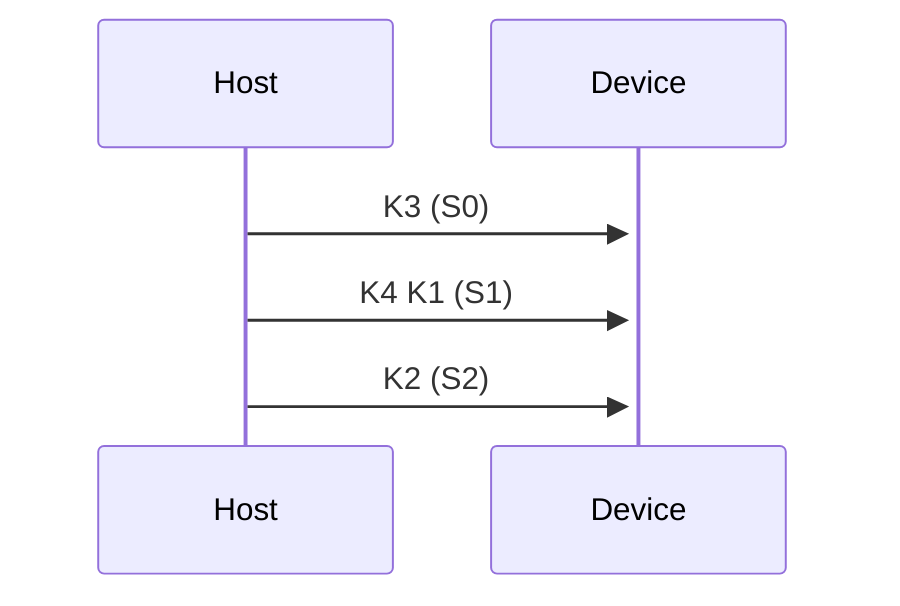

# 기초 GPU 프로그래밍  

<br>

Register, Cache  

<br>

CUDA 설치 시 directory를 ``:C\usr\local\CUDA`` 를 만들고 여기다 설치  
``github 12.2\samples\원하는코드``  

<br>

최종 목표: 2주에 걸쳐 marchingCudas 코드 분석  

<br>

driver가 아니라 runtime API  
cuBLAS 선형대수학 등 수학적 요소가 함수로 구현디어있음  

<br>

# 1.   
## 1.1 Conventional Real-Time Rendering Pipeline on GPU  

<br>

3D Graphics Processing on GPU  
왜 GPU는 이렇게 생겨먹었을까?  
삼각형 polygon,   
real-time rendering 을 가속하기 위해 코어 프로세스를 붙인 것이 GPU이다.  
projection 계산 : resterization  
그렇게 계산한 vertex들을 화면의 pixel 어디에 적용하면 좋을지 계산한다.  
vertex 정보 -> 삼각형 정보 -> pixel 정보  
이렇게 정보가 흘러간다.  

<br>

## 1.2 GPU의 성질  

<br>


<br>


<br>

## 1.3 SIMD  

<br>

- SIMD(single instruction mutiple data)  
- 만약에 $`2^{20}(1048576)`$개의 프로세서들이 있다고 가정하자. SIMD가 적용되면 원래 순차적으로 일어날 이 프로세서들에, 병렬처리가 일어난다.  
- 각각의 명령들의 프로세서에 가서 클락 시그널에 맞춰 한꺼번에 수행된다. 이론적으로 1048576만큼 빨라진다.  
- vector 컴퓨터라는 이름도 있다.  
- **SIMD 병렬성**  
- MMX, SSE, AVX: [SIMD 병렬 프로그래밍MMX, SSE, AVX (tistory.com)](https://pepic.tistory.com/163)  
- 기술 상 core가 많아봤자 만 개 정도 되는데, GPU에서는 이 때문에 SIMD에 더해 더 많은 병렬 처리 기능들을 가지고 있다.  
- Why SIMT(Single Instruction Nultiple Threads) not SIMD?:  
- 일반적으로 실제로 풀고자 하는 SIMD 병렬성을 가진 문제에서는 각 SIMD element마다 execution path가 달라 고유의 context가 필요하다. 다음과 같은 코드의 예시가 있다.  
```c++
if(obj.0) {
...
}
else if(obj.1) {
...
}
// 객체의 종류마다 다른 context의 프로그램이 돈다.
```

<br>

`Plus alpha: -o 옵션 (컴파일 시)`   
- 컴파일 시 다음 옵션을 추가해주면 자동적으로 최적화된다.  

<br>

## 1.4 NVIDIA GeForce  

<br>

- NVIDIA Geforce 6 Series (NV40) - 6800 Ultra (2004):  
- 전통적인 GPU 파이프라인을 구현한 마지막 GPU  
- Vertex를 얼마나 처리해주는가, pixel을 얼마나 처리해주는가가 성능의 기준  

<br>

- (2007)  
- CUDA core 동일한 계산을 하는 core를 꽉 채워놓고 명령에 따라 공간 배분  
- FLOPS: F32(single precision), F64(double precision), F16(half precision)  
- 우리가 코딩해서 GPU의 최고 속도가 나올 일은 없음  
- floating point를 얼마나 처리해주는가가 성능의 기준  

<br>

## 1.5 GPGPU  

<br>

- GPGPU Computing: General한 목적으로 GPU를 설계한 것  
- RTX(RT Cores, Tensor Cores): Tensor core는 mad, fma formula를 빠르게 계산해줌  

<br>

## 1.6 GPU의 발전  

<br>

## 1.7 APIs for GPU Programming  

<br>

## 1.8 OpenGL 4.5 Rendering Pipeline  

<br>

- Compute Shader: CUDA보다는 훨씬 단순하지만 같은 방식으로 돌아하는 것  

<br>

## 1.9 What is CUDA?  

<br>

- CUDA는 NVIDIA GPU에서 병렬 컴퓨팅 엔진을 활용하는 범용 병렬 컴퓨팅 플랫폼 및 프로그래밍 모델이다.  
- Runtime library: high-level의 CUDA 프로그래밍에 특화되어있다.  
- Header: cuda_runtime.h  

<br>

## 1.10 NVIDIA GPU Architecture  

<br>

- 기본 terminology  
- Kernel: CPU가 아니라 GPU에서 돌아가는 함수

  
1. Thread: SIMD 형태로  kernel 함수가 돌아가는 각각의 task  
2. Thread block: Thread를 같은 크기로 묶어 놓은 것 $`2^{22}`$ 의 thread를 $`2^8`$ 의 tread block으로 묶으면 $`2^{14}`$ 개이다. 항상 동일한 개수로 묶어야 한다.  
- Thread block dimension: 이것이 결정되면 몇개의 thread block이 나올지 결정된다. (ex. 128, 256..)  
- `Thread block dimension은 32의 배수로 해라... 되도록이면...`  
- [Thread block (CUDA programming) - Wikipedia](https://en.wikipedia.org/wiki/Thread_block_(CUDA_programming))  
- thread를 이런 모양으로 만드면 warp가 이렇게 잡힌다.
  
- Cache적 관점에서는 thread를 이렇게 만드는 게 났다.
  
1. Grid: Thread block의 묶음  
- Grid dimension: Thread block의 개수이다.  
2. Warp: GPU가 thread block에서 32개씩 쪼개간다. 왜 그런지는 묻지 마라.  
- 이렇게 32개로 묶어놓은 것을 warp라고 한다. 256개로 이루어진 thread block이라면 8 warp로 쪼개지는 것이다. 바로 이 32개가 SIMD 형태로 돈다.  
- 하나의 명령만이 적용되어 병렬처리 된다는 것이다. 각각의 warp들은 순차적이 아니라 독립적으로 처리된다. warp가 모두 처리 되면 하나의 thread block의 task가 끝난 것이다.  
- Warp의 크기는 *32*로 고정이다.
  

<br>

## 1.11 NVIDIA GPU Generation  

<br>


  
- GeForce에서 그래픽 기능을 빼버린 게 Tesla이다.  
- Quadro는 tesla의 장점에 그래픽까지 껴 놓은 것이다. 한 마디로 명품 GPU.  
- Compute Capability: GPU의 기능 (본인은 Turing에 해당하는 capability이다.)  

<br>


  
- **SM(Streaming multiprocessor)**: CUDA core를 여러 개 모아놓은 것  
- L1 Cache/Shared Memory: L1 Cache만큼 빠른 메모리를 잡아서 프로그래밍 하는 것  
- 82.6 TFLOP의 계산과정은 위에 나와있다. 이거의 $`\frac{1}{10}`$ 정도가 나오도록 코딩하는 것을 목표로 잡으면 된다.   
- Memory Bandwidth: 메모리에서 데이터가 올라오는 속도  

<br>


  

<br>

## 1.12 ADA AD102 GPU  

<br>

- 4090보다 높은 스펙  
- GPC: 총 12개  
- 6개의 TPC로 이루어져 있다.  
- 1개의 Raster Engine `이걸 빼버린게 tesla 계열`  
- 2개의 Raster Operations (ROPs) 파티션들  
- TPC:   
- 2개의 SM  
- 1개의 PolyMorph Engine  
- **SM**: `스레드의 관점에서는 SM이 가장 중요한 프로세싱 단위이다.`  

  
- CUDA core를 여러 개 박아놓은 것  
- CUDA core는 streaming processor라고도 한다.  
- 128 KB의 L1 Cache/Shared memory  
- 4개의 Texture Units  
- 1개의 $`3^{rd}`$ Gen. RT core  
- 2개의 FP64 units: `나는 정밀도가 중요해서 double precision으로 갈거야! 그럼 속도가 128 : 2라 64배 느려짐..`
  
- 각각의 processing block:  
- 16개의 FP32: 한 순간에 floating point계산을 해준다.  
- 16개의 FP32/INT32: 같은 clock에 floating point 연산을 하거나 int 연산을 해준다.  
- 즉, 32개의 FP32 연산을 하거나 16개의 FP32 연산/ 16개의 INT32 연산을 해준다.  
- L0 instruction cache  
- 1게의 Warp 스케줄러 + 1개의 dispatch unit  
- *1 개의 64KB 레지스터 파일: 16384개의 register, 즉 $`2^{14} \times 2^2 = 2^{16}`$ 256KB per SM* `CPU(해봤자 30개..?)에 비해서 어어어엄청 많다.. 왜 그러냐 (zerp-cost context switching)?`  
- 1개의 SFU(Special Function Unit)  
- 4개의 Load/Store units  
- 1개의 Tensor Core  
- 만약 256크기의 Thread block이 있어 37번 block, 96번 block을 저기에 배정한다고 칠 때, 16개의 warp가 줄을 설 것이다. 스케줄러에 의해 4개의 warp까지는 동시에 처리 가능하다. `너 다시 나가야 될거 같은데..? (Cache miss)`  
- *GPU에서의 Context switching은 cost가 많이 든다. 그래서 그냥 스레드마다 register를 붙여서 context를 만들어놓는다.* >> **Zero-cost context switching**  
- [OS - Context Switch(컨텍스트 스위치)가 무엇인가? (tistory.com)](https://jeong-pro.tistory.com/93)  
- Latency hiding: 메모리 엑세스 시 드는 비용을, CPU에서는 cache(L1, L2..)를 써서 latency를 hiding한다. GPU에서는 memory에 엑세스 해야되는 warp를 그냥 다른 warp로 대체해버린다. `어차피 zero-cost context switching이니까..`  

<br>

- 하나의 thread block이 하나의 SM에 들어가게 된다. 2개 이상의 thread block이 동시에 할당될 수도 있다.  
- Memory controler: 72MB의 L2 Cache,   
- CPU와는 달리, 코어보다 훨씬 많은 캐쉬가 있기 때문에 코어 개수보다 월등히 많은 스레드를 띄워도 괜찮다. 즉, warp를 많이 띄우면 띄울 수록 좋다. `야 다음 누구야! 빨리 줄 서!`  
-Warp occupancy를 높이는 것이 좋다. `너무 높이 올리지는 말고.. 그냥 알잘딱깔센`  

<br>

## 1.13 Warp Processing on the SM  

<br>

[WARP Execution (tistory.com)](https://junstar92.tistory.com/277)  

  
- Stall: memory에 access하거나..하는 delay..를! 번갈아가며 명령을 수행하게 함으로서 delay를 줄인다.  
- _syncwarp()를 시켜 Z; 뒤에 일어날 명령을 warp에서 한꺼번에 할 수 있도록 sync 시켜준다.  

<br>

- Compute capability(CC) 7.0 이전: 한 와프 당 한 종류의 명령어 수행  
- 7.0 이후: 한 와프 당 다양한 명령어 수행  
- **_syncwarp()**: warp안 32개의 스레드이 싱크를 맞추라는 명령어 (옛날 CUDA 코드를 최신 GPU로 돌릴 때 오류가 생길 것을 방지하기 위해)  
- Branch divergence:  
```c++
if(x[i] > 0) {
	z[i] = x[i] - y[i];
}
else {
	z[i] = 2 * x[i] + y[i];
}
```
- 이것과 같은 코드가 있을 때, 와프에서는 다음과 같이 동작하게 된다. 
  
- 그래서 최대한 branch code (switch나 if 등)을 줄이는 것이 좋다.  
- Inactive thread 판별:  
- 먼저 끝난 스레드  
- 지금 실행되고 있는 warp와 다른 branch path를 탔다고 판단된 스레드  
- 순서가 32의 배수가 아닌 스레드  

<br>

- Concurrent thread execution:  
- 이렇게 같은 곳으로 store 될때, 어느 순서로 store 될지는 모른다.
  
- SIMD vs SIMT:  
- 단일 명령어, 다중 스레드(SIMT, single instruction, multiple thread)는 병렬 컴퓨팅에서 사용되는 실행 모델로, 단일 명령어, 다중 데이터(SIMD)가 다중 스레드와 결합된다.
  

<br>

## 1.14 GPU Memory Hierarchy  

<br>

## 1.15 Scalable Programming Model for GPU  

<br>

- GPU는 scalable 하다. 라는 것은 SM의 개수가 프로그램을 짜는 방식에 영향을 미치지 않는다.<br>
  

<br>

## 1.16 CPU vs GPU  

<br>

- CPU는 task parallelism하고, GPU는 Data Parallelism하다. CPU는 스레드가 많아봐야 몇십개 돌지만, GPU는 스레드가 몇십만 개도 돌고 있다. `GPU 참... 무식하게도 생겼다.`
  

<br>

## 1.17 CUDA Execution Model  

<br>

지금까지 한 걸 종합해보자..  
각각의 픽셀에 대해서 kernel 함수(GPU 함수)를 쓸건데, 항상 이 task 수가 너무 많다.  
각각의 픽셀이 각각의 task라고 생각하자.  

<br>

Task와 CUDA thread간의 mapping관계는 다음과 같이 두 종류가 있다.  

  
- 각각의 task에 대해서 thread 하나씩  
- (Data가 클 경우) Thread를 건너뛰면서 CUDA 스레드 하나에 여러개의 task 할당  

<br>

### 1.17.1 Execution of CUDA Program (CC 9.0 이전)  

<br>

1. Grid and Thread Block Size Specification: 전체 thread들을 동일한 개수의 thread들로 구성되는 thread block으로 분할 
<br>


```math
\text{전체 스레드 개수 }= (\text{전체 스레드 개수} + \text{스레드의 스레드 개수} - 1) / \text{스레드의 스레드 개수}
```
  
- float 연산을 해서 올림한 것이다.  
- Thread < Thread block < Grid  
- Thread -> TB dimension -> Grid dimension  
2. Kernal launch: Host에서 커널에 수행 명령을 내린다.  
- `CombineTwoArrayKernal <<< dimGrid, dimBlock >>> (d_A, d_B, d_C)`  
- 1(dimGrid), 2(dimBlock), 3(dynamic shared memory size), 4(stream <- default stream)  
- Shared memory는 block당 잡힌다.  
3. Thread Block Scheduling: GPU scheduler는 grid의 thread block들을 가용한 SM에 배분하여 순차적으로 처리하도록 한다.  
- 서로 다른 스레드에서 온 thread block이 하나의 SM 안에서 돌아갈 수 있다.  
- 0번 2번 7번 TB들이 어디에 들어가서 어떤 순서로 될지 모르고 그들을 동기화 할 수도 없다. 예외는 있음  
1. 예외 1: Cooperative group(CC 7.0) 기능을 사용하면 전체 thread block들 사이에 동기화가 가능하다. 다만, 전체 TB들이 동시에 GPU에서 로드되어 수행이 되어야 한다.  
2. 예외 2: CC 9.0 부터는 TB cluster를 사용하여 부분적인 동기화가 가능하다. 다만, 해당 TB들이 동시에 동일한 GPC에 로드가 될 수 있어야 한다.  

<br>

## 1.18 CUDA Programming Model  

<br>

- CUDA 프로그래밍을 하려면 다음과 같은 정보는 읽을 줄 알아야 한다.

<br>


```math
\begin{align}
&(x_{1D}, y_{2D}, z_{3D}) \\
&1D(256, 1, 1) \\
&2D(32, 16, 1) \\
&3D(4, 2, 2)\\
\end{align}
```

- K : $`2^{10}`$  
- GPU는 특성이 다르기 때문에 GPU에 따라 내가 parameter들을 바꿔줘야한다.  

<br>

### 1.18.1 Sample Program: vectorAdd_24_simple.cu  

<br>


  
- Main memory / GPU memory  
- .cpp program / .cu program  
- PINED(page-locked memory): [Pinned Memory (tistory.com)](https://junstar92.tistory.com/284)  
- STREAM(command queue): CPU가 GPU에게 명령을 내리는 통로. 서로 다른 stream끼리는 우선순위를 따질 수 없다.  

<br>

## 1.19 CUDA C++ Language Extensions  

<br>

- `__global__`:  
- 디바이스로 실행하는 커널 함수 지정에 사용할 수 있다.  
- Host, 즉 CPU에서 호출할 수 있는 함수이다.  
- 주의 사항은 다음과 같다:  
1. 리턴 값은 항상 void이다.  
2. <<<, >>>를 이용하여 실행 시 블록과 스레드 지정이 가능하다.  
3. 재귀 호출은 불가능하다.  
4. 함수 내 static 변수를 가질 수 없다.  
5. 가변형 인수를 가질 수 없다. (`__global__function <<<...>>>(int a..) ` (x))  
6. `__global__`로 지정한 함수의 포인터를 사용할 수 있다.  
7. `__host__`와 동시에 이용할 수 없다.  
8. 디바이스에서 처리가 완료되기 전에 호출한 즉시 반환하여 비동기 동작 (그래서 `cudaDeviceSynchronize()`가 있다.)  
9. Shared memory를 이용하여 256 바이트까지의 인수 사용이 가능하다.  
- PINNED 메모리에서 GPU 메모리로 보내는 중에 커널이 수행되어 버리면 어떡하나?:  
- Stream queue에서 명령어들이 전송 완료 되는 것을 기다리고 있기 때문에 괜찮다.  
- Warming up GPU:  
- GPU가 워밍업을 해야지 딜레이가 발생하지 않고 정확한 시간을 잴 수 있다.  
- `__device__`:  
- 디바이스, 즉 GPU에서 돌아가는 함수이다.  
- GPU에서 호출할 수 있다.  
- `__host__`:  
- Host에서 실행된다.  
- Host에서 호출할 수 있다.  

<br>

## 1.20 Thread Hierarchy  

<br>

- Built-in variables for dimensions and indices:  
- gridDim (type dim3, (x, y, z)이며 각각이 unsinged int): 몇 개의 TB로 이루어져 있는가  
- blockDim (type dim3): block이 몇 개의 thread로 이루어져 있는가  
- blockIdx: 내가 속한 TB의 index  
- threadIdx: 내가 속한 thread 속에서의 index  

<br>

#### 1D Example  

  
- blockDim: $`(2^8, 1, 1)`$  
- `구구단 외듯이 외우셈~`
<br>


```math
\text{현재 thread의 전체 idx} = blockDim.x \times blockIdx.x + threadIdx.x
```


<br>

#### 2D Example  


<br>


```math
\begin{align}
\text{현재 thread의 전체 idx} = gridDom.x \times blockDim.x \times \\
(blockDim.y \times blockIdx.y + threadIdx.y) + \\
blockDim.x \times blockIdx.x + threadIdx.x
\end{align}
```

- threadID: 한 thread block 내의 thread의 순서 (1D와 2D같은 경우 계산 방식이 다름)

<br>


```math
threadID_{2D} = blockDim.x \times threadIdx.y + threadIdx.x
```

- 한 TB 안에 최대 스레드 수는 **1024개**이다.  
- warp는 32개임에 의거하여 실제로 $`64 \times 16`$, $`32 \times 32`$, $`16 \times 64`$, $`8 \times 32`$ 순으로 performance가 느려지는 것을 볼 수 있다.  

<br>

#### 결론적으로  
> Thread들은 다음과 같이 처리된다.  
- 각각의 TB는 처음에는 1D row-major order로 정렬된다.  
- TB안의 정렬된 스레드들은 32-thread warp로 쪼개진다.  
- 각각의 32-thread warp에는 항상 같은 명령이 수행된다.  

<br>

## 1.21 Warp Occupancy  

<br>

> $`\text{Warp occupancy} = \frac{\text{the number of concurrently active warps}}{\text{the number of maximum possible warps}}`$  

<br>

`Plus alpha: Thread block cluster(optional)`:  
- CUDA의 가장 최신 기능  
- 소수(최대 8개)의 TB을 묶는다. `TBC0, TBC1, TBC2...`  
- 전 버전에서는 TB는 전체적으로 동기화할 수 없었지만, cluster를 이용하면 TB가 하나의 GPU Processing Cluster(GPC)에서 돌아가서 일부분 동기화가 가능하다.  
- 같은 GPC에 있는 TB끼리는 Shared memory도 하나의 space로 연결되어 서로 접근이 가능하다.  

<br>

# 2.  

<br>

## 2.1 부동 소수점 숫자: 표현 및 연산 (Floating-Point Numbers: Representation and Operations)  

<br>

#### Half-Precision Floating-Point Format(FP16)  
> 우리는 single-precision(32-bit)이나 double-precision(64-bit)에만 익숙하나, 16-bit연산도 때론 유용하다.  

<br>

### 2.1.1 Features  

<br>

[reference: single precision, double precision](https://m.blog.naver.com/juyoung_g/220531910814)  

<br>

#### Single precision  
> 4 bytes (32 bits)  
- 구조는 다음과 같다.
  
- 구성은 다음과 같다.  
- Sign indicator: $`(-1)^S, \ S = 0 \ or 1`$  
- Exponent Characteristic:  
- Mantissa:   
- Exponent의 값과 F의 값에 따라 분기가 나뉜다.  
- `NaN`: Not the number.  
- 보통은 subnormal($`SUBN`$)을 허용한다.  

<br>

#### Double precision  
> 8 bytes (64 bits)  
- 구조는 다음과 같다.
  

<br>

#### Format of Single & Double Precision  
- 여기서 Single의 유효숫자 9와 double의 유효숫자 17은 믿을만한지 다시 한 번 생각해 볼 필요가 있다..
  

<br>

### 2.1.2 Floating-Point Operations  

<br>

- 부동 소수점 연산 시 별의 별 상황이 다 생긴다.  
- 컴퓨터가 실수를 정확하게 저장을 못해서 생기는 문제  
- 컴퓨터가 실수 간의 연산을 정확하게 수행을 못해서 생기는 문제  
- 컴퓨터 자체 문제 외에 문제를 푸는 해법, 즉 알고리즘 자체가 본질적으로 unstable 해서 생기는 문제  
- etc.  
- $`x \cdot y \ (x, y \in \mathbb{R})`$ 연산은 다음과 같이 진행된다.  
- $`x`$와 $`y`$를 $`fl(x)`$와 $`fl(y)`$에 차례대로 store한다.  
- $`fl(x) \cdot fl(y)`$를 최대한 정확하게 계산한다.  
- $`fl(fl(x) \cdot fl(y))`$에 결과를 store한다.  
- 미분은 어떻게 할까?  
- $`f'(x) \approx \frac{f(x+h) - f(x)}{h}`$ for $`o(h)`$  
- $`f'(x) \approx \frac{f(x+h) - f(x-h)}{2h}`$ for $`o(h^2)`$  

<br>

### 2.1.3 Precision Loss  

<br>

#### Example 2  
- 최소한 소숫점 6자리까지는 신뢰성이 있어야하는데 다음과 같은 문제가 발생한다.  
- 문제점, 비슷한 숫자끼리의 뺄셈 (y - x):  
- 비슷하면 비슷할수로 연산 시 garbage값이 더 많이 들어온다.  
- debug mode에서는 이상하게 도는데 릴리즈 mode에서는 정확하게 돌 수도 있다. debug mode로 컴파일 했을 때와 릴리즈 mode로 컴파일 한 것은 다른 프로그램으로 컴파일 한 것이다.  
- 릴리즈 모드에서는 컴파일러가 분석을 해보고 수학적으로 z = g이기 때문에 값을 그렇게 배치하기 때문이다.  

<br>

#### Example 3: Solving quadratic equations  
- x0: 결론적으로 float의 연산이 일어남  
- x2: 결론적으로 double의 연산이 일어남  

<br>

#### Example 5  
- FMA: mad연산을 GPU에서는 FMA라 한다. ($`a \times b + c`$)  
- with FMA: rn(X * Y + z) <- one rounding step  
- without FMA: rn( rn(X * Y) + Z ) <- two rounding step  

<br>

#### Example 6  
- 큰 숫자와 작은 숫자 사이의 덧셈ㅇ르 피해라!  

<br>

### 2.1.4 FP Calculation Cautions  

<br>

1. 비슷한 숫자 사이의 뺄셈  
2. 아주 큰 수와 아주 작은 수와의 덧셈/뺄셈  
3. 아주 작은 수로의 나눗셈  
4. 기타  

<br>

## 2.2 Parallel Reduction  

<br>

#### Reduction Operator $`\oplus`$  
> Used in Parallel programming to reduce the elements of an array into a single result.  
- Binary operator `+` (addition):  
- 결합법칙과 교환법칙이 성립한다. `floating-point addition은 결합법칙이 성립하지 않는다!`  
- Binary operator `min/max`:  
- 결합법칙과 교환법칙이 성립한다.  
- Binary operator `x` (matrix multiplication):  
- 결합법칙은 성립하나 교환법칙은 성립하지 않는다.  

<br>

#### Implementation 1: reduce0  
```c++
CHECK_TIME_START(_start, _freq);
for (int m = N / 2; m > 0; m /= 2) {
    int threads = (256 < m) ? 256 : m;  
    int blocks = (m / 256 > 1) ? m / 256 : 1;   
    reduce0 <<< blocks, threads >>> (d_A, m);
}
cudaDeviceSynchronize();
CHECK_TIME_END(_start, _end, _freq, _compute_time);
```

  
- reduce0에서 사용하는 prarllel computing 알고리즘:  
- 종이를 반씩 접는다고 생각  
- 매 지점마다 sunc를 맞춰줘야 한다. 동일한 크기의 TB로 할당하기 때문에 같이 계산해야되는 TB끼리 단계를 맞춰줘야하기 때문이다.  
- **매 지점마다 동기화를 해야되는지 판단하는 것이 매우 중요하다**  

<br>

`Plus alpha: Kahan summation algorithm`  

<br>

#### reduce0  
- 매번 동기화를 해줄 수 있는 방법은 커널을 끝내는 방법밖에 없다.  
- 동기화를 해주지 않으면 계산 방식에 따라 매법 결과값이 달라질 수도있다.  
- TB dimension: 256  
- tid: 자신의 위치에 해당하는 idx  
- reduce0_bad: parallel 알고리즘의 관점에서는 아무 문제가 없다. 하지만 미처 계산되지 못한 TB  가 할당 될 수 있기 때문에 sync가 필요한 것이다.  
- `syncthreads()`: 한 TB 안에 있는 warp들을 sync -> 이를 하면 계산이 조오오금 더 정확해지겠지 근데 근본적인 해결책은 되지 않는다.  
- Naive (single) != Naive (double) : 큰 수(누적 값)와 작은 수의 덧셈, 더 많은 수를 더하면 double로도 문제가 생긴다.  

<br>

#### reduce1  
- $`288 \times 256 = 73728`$ 일단 288은 36의 배수이다.  
- TB의 개수가 288인 이유는 코드 제작자의 SM이 36개였기 때문에 288일 것이다.  
- Data에 비해 전체 스레드 수가 적다.  
- 왜 reduce0보다 빨라졌을까?:  
- kernel launch 비용(reduce1은 세 번밖에 호출을 안 한다)  
- reduce0  
```
m
2048 256 8개
1024 256 4개
512 256 2개
.
.
32 32 1개
16 16 1개
8 8 1개
1 1 1개
```
- 일을 안하고 노는 SM이 너무 많다!  

<br>

#### reduce0 vs reduce1  

  
- 왜 동일한 GPU 상에서의 결과 값이 미묘하게 변화하였을까?  
A) 더하는 순서가 바뀌었기 때문이다.  
- reduce0의 컴파일 모습  
```c
x[tid] += x[tid + m];

id r5, x[tid]
id r6, x[tid+m]
add r7, rs, r6
st(store) r7. x[tid]
```
- reduce1의 컴파일 모습: global memory access 비용이 상당히 줄어든다.  
```c
float tsum; // register에 있는 변수, r6
x[tid] = tsum;

set r6, 0
id r5, x[k]
add r6, r6, r5
st(store) r6, x[tid]
```

<br>

#### Implementation 4: reduce0_poor  
- 얘는 왜 형편없는 kernel인가?  
- 처음에 전체의 1/2를 스레드로 띄운다.  
- 옆에 있는 것 끼리 2개씩 더해나간다.  
- 왜 0.3에서 2.~으로 갔냐? 점점 벌어지는 idx 때문에 access coalescing 문제가 생기기 때문이다.  
- CUDA 관점에서 locality가 떨어지는 코드이다.  

<br>

# 3.  

<br>

## 3.1 CUDA Memory Hierarchy  

<br>

GPU -> GPC -> TPC -> SM  

  
##### On-chip memory and cache  
- Register  
- Shared memory / L1 cache / Texture cache  
- Constant cache `64KB..?`  
- L2 cache  

<br>

##### Device memory (Graphic memory) in CUDA perspective  
- Global memory: cache miss가 일어나면 수 백 cycle  
- Local memory: cache miss가 일어나면 수 백 cycle  
- Constant memory: 어떤 조건을 만족하면 굉장히 빨리 access 가능  
- Texture / Surface memory: 어떤 조건을 만족하면 굉장히 빨리 access 가능  

<br>

### 3.1.1 Scope and Lifetime  

<br>


  
- Register and local memory: Per thread  
- Shared memory: Per thread block  
- Global, constant, texture memory: persistent across kernel launches by the same application  

<br>


  
- Scope: 어떠한 변수가 영향을 미치는 범위  
- Lifetime: 어떠한 변수를 쓸 수 있는 수명  
- Automatic variable: 특정한 함수 안에서만 사용하는 변수  

<br>

### 3.1.2 Features of each Component  

<br>

#### Registers  
- register spill: register가 넘쳐서 할당하고 싶은 변수(automatic variable)를 모두 할당 못한다. 이때 나머지 애들은 device memory에 할당된다.  
- 많아보여도 thread당 할당해야되는거기 때문에 그리 많은 게 아니다.  
- nvcc option: `--maxrregcount` 커널 당 사용 register 수 제한  
- 하나의 SM에 register를 넣을만큼 넣어서 warp occupancy를 늘리자. -> memory access hiding  
- $`Reg: n_{TH} \times n_R`$, $`Sh \ mem : Bs \ bytes`$  
- Shared memory는 L1(128KB)을 가져다가 쓴다. 보통 CUDA 컴파일러가 알아서 쓰는데 사용자가 정의를 할 수 도 있다. `강의자료 1 63p.`  
- Register를 많이 쓰면 프로그램의 속도는 빨라지지만, 한 TB당 쓰는 register가 늘어나기때문에 SM에 들어올 수 있는 TB가 줄어든다. warp occupancy가 줄어든다.  

<br>

#### Local Memory  

<br>

#### Shared Memory  
- Block 당 잡히는 메모리이다.  
- warp occupancy에 영향을 미친다.  
- Compile time에 몇 byte가 필요한지 아는 경우 직접 할당을하지만, 보통은 모르기 때문에 `extern __shared__ float shared[];`라 한다.  

<br>

### 3.1.3 Shared Memory Bank Conflict  

<br>


  
- bank bandwidth = 32 bits / clock  
- Shared memory의 bandwidth = 128 bytes / clock  

<br>

#### Bank Conflict  
> 각각의 shared memory가 access하는 bank는 무작위로 분포되어있다. 같은 bank로 찾아갈 수도 있다. 이를 bank conflict라 한다.  
- bank conflict가 나면 clock 한 번으로 안 되고 두 번이상 걸린다.  
- 만약 thread 4개가 한 bank에 access하면 4번의 cycle이 필요한 것이다.  
- 문제점, write: thread가 한 bank를 한 번에 access하면 뭘 write할지 아무도 모른다.  

<br>

## 3.2 Reduction Implementation  

<br>

#### reduce2  
- 생각보단 빨라지지 않고 있음  
- 방식은 reduce1과 같음  

<br>

#### reduce3  
- <<< gridDim, blockDim, Shared memory size, stream(command queue) >>>  
3번째는 없으면 0, 4번째는 defualt  

<br>

## 3.3 Global memory  

<br>

### 3.3.1 Global Memory Access  

<br>

L1 L2  
L2 캐쉬만 되는 경우에는 32byte 올라오고 32byte올라온다  
같은 영역을 참조할 때는 core alising이 된다.  

<br>

#### Example 1  
32 * 4bytes = 128 bytes  

<br>

#### Example 2  
- L1 chaching이 되는 경우:  
4 byte를 마지막 thread에 주기 위해서 128 byte가 올라와야 하는 상황  
- L2 caching이 되는 경우:  
5번의 memory transition이 일어나더라  

<br>

#### Global Memory Coalescing Example  
- N = $`2^{26}`$  
- combine_three_array_GPU_0:  
이게 더 효율적이다.  
쭈루루룩 들어감  
실험을 해보면 32개도 문제는 없어야 하는데 느려진 거 보면 thread block이 너무 많이 생성이 돼서 그런게 아닌가 추정 `256이 제일 좋은거 같긴 함`  
- combine_three_array_GPU_1:  
띄엄띄엄 들어감  
왜 빨라지다 느려질까? 교수님도 이유는 모르겠다 함 caching과 align이 맞아가지고 그런거 같  
- array access 효율을 따질 때와 비슷하다고 생각하면 된다.  
- combine_three_arrau_GPU_2:  
2D에서 row column access도 똑같이 하면 된다.  
왜 느려질까? 2D array에서의 warp 크기에 따른 access 효율을 생각해보자. `1.20 2D Example 참고`  

<br>

## 3.3 Matrix Multiplication on GPU  

<br>

$`C_{ij} = \sum\limits_{k = 0}^{n} (A_{ik} \times B_{kj})`$
이 행렬 곱셈 식을 상기하자. 우리는 $`A \cdot B = C`$ Matrix multiplication 계산을 수행할 것이다. 이 행렬 계산은 특별히 다음과 같은 조건을 만족한다.  
- single-precision floating-point number  
- row-major format (->, $`C[row][col] = row \times C_x + col`$)  
- 각 행과 열의 개수는 32의 배수이다. `편의상`  
- 강의자료의 예시에서, 우리는 $`A_{1024 \times 2048} \times B_{2048 \times 3200} = C_{1024 \times 3200}`$ 계산을 구행한다.  

<br>

초기값들은 다음과 같다. `row(행): 세로, col(열): 가로`  
```cpp
int Arow = 1024; int Acol = 2048;
int Brow = Acol; int Bcol = 3200;
int Crow = Arow; int Ccol = Bcol;
```

<br>

#### hostmult0  
그냥 CPU에서 돌리기  

<br>

기본 적으로 A의 가로, B의 세로를 순차적으로 방문하며 inner product 연산을 수행한다. 이를 for loop으로 구현하면 다음과 같다.  
```cpp
for(int i = 0; i < Ay; i++) {
	for(int j = 0; j < Bx; j++) {
		C[i * Bx + j] = 0.0f;
		for(int k = 0; k < Ax; k++) {
			C[i * Bx + j] += A[i * Ax + k] * B[k * Bx + j];
		}
	}
}
```
load: $`A_yB_xA_x \times 3`$  
store: $`A_yB_x(1+A_x)`$  
`상식적으로 생각해보면 알 수 있다. 잘 생각해보자.`  

<br>

#### hostmult1  
함수에 전달하는 인자에 `__restrict`를 부여한다.  

<br>

`__restrict`는 컴파일러로 하여금 포인터가 가리키는 객체에 접근하는 유일한 방법이 해당 포인터라는 것을 알려준다.  
`애꿎은 최적화 시도 하지 말고 가리킨대로 메모리에 접근하라는 말 같다.`  
```cpp
int hostmult1(float* __restrict C, float* __restrict A, float* __restrict B, int Ay, int Ax, int Bx) {...}
```
하지만 이렇게 `__restrict`를 해도 속도에는 크게 변화가 없는데, 컴파일러가 이미 최적화를 한 것으로 추정된다.  

<br>

#### gpumult0  
위 행렬 계산 방법(Naive한 방법)은 그대로 두고, 최종 계산 될 행렬 C를 Thread Block으로 쪼개서 GPU에서 Thread Block 단위로 한꺼번에 계산하게 하는 것이다.  
`강의자료 예시에서는 32(가로) * 16(세로) 크기로 쪼갰다.`  

<br>

```cpp
/* Host */
gpumult0 <<< blocks, threads >>> (d_C, d_A, d_B, Arow, Acol, Bcol);

/* Kernel */
int tx = blockidx.x * blockDim.x + threadidx.x; // i
int ty = blockidx.y * blockDim.y + threadidx.y; // j
```
hostmult0 대비 약 178배의 속도 향상을 얻을 수 있다.  

<br>

- 왜 thread{32, 32}는 느려졌을까? warp occupancy 때문에..?  
occupancy 1 = 48/48 -> 32(warp) * 16 * 3개의 thread block이 SM에 들어옴  
occupancy 0.667 = 32/48  
thread 요구량이 32 * 16에서 32 * 32 두 배가 돼서 register가 배부름  

<br>

read write cost도 다음과 같이 줄일 수 있다.  
```cpp
/* Before Modified */
C[ty * Bx + tx] = 0.0f;
for(int k = 0; k < Ax; k++)
		C[ty * Bx + tx] += A[ty * Ax + k] * B[k * Bx + tx];

/* After Modified */
float csum = 0.0f;
for(int k = 0; k < Ax; k++)
	csum += A[ty * Ax + k] * B[k * Bx + tx];
C[ty * Bx + tx] = csum;
```
Total GM load Before: $`A_yB_xA_x \times 3`$  
Total GM store Before: $`A_yB_x`$  
Total GM load After: $`A_yB_xA_x \times 2`$  
Total GM store After: $`A_yB_x`$  

<br>

#### gpumult1  
함수에 전달하는 인자에  `__restrict`를 부여한다.  
```cpp
int gpumult1(float* __restrict C, float* __restrict A, float* __restrict B, int Ay, int Ax, int Bx) {...}
```
gpumult0 대비 약 3배의 속도 향상을 얻을 수 있다.  

<br>

- 왜 host에선 별 효과가 없는데 device에선 효과가 있을까?  
컴파일러가 다르기 때문이다.  

<br>

[TILING 최적화 for 메모리 Access (tiled matrix multiplication) (tistory.com)](https://junstar92.tistory.com/249)  

<br>

#### gputiled  
gpumult처럼 tiled된 계산을 하되, Shared Memory를 활용하여 Global Memory 접근 횟수를 줄인다.  

<br>

Kernel 함수가 특이하게 바뀐다.  
```cpp
/* Host */
if (tilex == 16)
gputiled<16> <<< blocks, threads >>> (d_C, d_A, d_B, Arow, Acol, Bcol);

/* Kernel */
template<int TS> __global__ void gputiled(float* __restrict C, float* __restrict A, float* __restrict B, int Ay, int Ax, int Bx) {
	__shared__ float Atile[TS][TS]; // 내가 설정한 thread 크기와 같게
	__shared__ float Btile[TS][TS]; // 마찬가지
	...
	for (int t = 0; t < Ax/TS; t++) {
		Atile[ty][tx] = A[ay * Ax + ax];
		Btile[ty][tx] = B[by * Bx + bx];
		__syncthreads();
		for (int k = 0; k < TS; k++) csum += Atile[ty][k] * Btile[k][tx];
		__syncthreads();
		ax += TS;
		by += TS;
	}
	C[ay * Bx + bx] = csum;
}
```
그러니까 $`C_{ij}`$를 계산하기 위해서 $`A_i`$행과 $`B_j`$열을 inner   

<br>

- Tiling in shared memory  
- ax, by: C에서의 thread의 위치  
- results on varying blockDim  
- 왜 8 * 8일때와 32 * 32일때는 occupancy는 같은데 시간이 차이가 날까? -> locality  
- 32 * 32에서 tile 2개를 집어넣으면 warp가 64개가 들어가기 때문에 1개만 들어간다.  

<br>

#### gputiled_more_work  
- Tile size는 $`32 \times 32`$로 32개의 warp로 이루어져 있다. acccum은 warp를 4개 씩 묶은 것이다.  
- shared memory에서 읽어들이는 횟수를 4칸씩 떨어진 warp의 arithmetic 규칙성을 이용하여 줄이자.  
- `accum[WPT]`는 register에 잡힐 가능성이 크다.  

<br>

#### unrolling  
jmp cost를 줄임. sweet point가 있음.  

<br>

#### cuBLAS(Basic Linear Algebraic Subprograms)  
> 행렬계산에 최적화해준다.  

<br>

여러 소프트웨어 알고리즘으로 가속해보자.  

  

<br>

# 4.  

<br>

## 4.1 NVIDIA Tensor Cores Programming  

<br>

precision을 날려버림으로써 정밀도만 떨어뜨린 상태에서 계산할 수 있다.  
TF32: FP32와 같은 range로 계산 하지만 정밀도를 떨어뜨림  
BF15 FP16의 문제, 정밀도를 떨어트리더라도 range를 같이 하고 정밀도를 떨어트림  
-> range vs 정밀도  

<br>


  
Volta: $`4 \times 4 \times 4`$ 행렬 곱셈을 1 clock  
Ampere: $`8 \times 4 \times 8`$ 행렬 곱셈을 1clock  
`mma_sync(); // a * b + c`  

<br>

## 4.2 Matrix Multiplication Using Tensor Cores  

<br>

### 4.2.1 GEMM(General Matrix Multiplication)  

<br>


```math
D = AB + C
```

요는 각 행렬을 쪼개서($`16 \times 16`$) block 끼리 계산하는 것이다.  
1개의 block에 대해서 1개의 warp가 책임지고 계산해줄 것이다.  

<br>

reference  
[병렬프로그래밍 2.CUDA의 기초](https://blog.naver.com/kimsung4752/221260713927)  
[NVIDIA Tensor Core Programming - Lei Mao's Log Book](https://leimao.github.io/blog/NVIDIA-Tensor-Core-Programming/)  
[CUBLAS](https://blog.naver.com/ymkim1959/10110553295)  

<br>


  

<br>

warp의 32개 thread가 서로 협력하며 256개를 global memory에서 읽어들어와 a_frag에 저장  

<br>

#### Matrix Multiplication without Using Shared Memory  

<br>


```math
\begin{align}
\text{number of warp} &= \frac{A_y \times C_x}{256} \\
&= \frac{A_{row} \times B_{col}}{256}
\end{align}
```


```math
\text{TB (blockDim.x)} = 8 \ warps = 256 \ threads
```


```math
\begin{align}
\text{number pf TB's (gridDim.x)} &= \frac{\text{number of warp's}}{8} \\
&= \frac{A_{row} \times B_{col}}{256 \times 8}
\end{align}
```


<br>

warp rank in grid := 각 행렬 곱셈을 담당할 warp(thread 묶음)의 index 부여  

<br>

#### GEMM with Weights
<br>


```math
D = \alpha AB + \beta C
```

[CUDASamples/samples/0_Simple/cudaTensorCoreGemm/cudaTensorCoreGemm.cu at master · BigNerd95/CUDASamples (github.com)](https://github.com/BigNerd95/CUDASamples/blob/master/samples/0_Simple/cudaTensorCoreGemm/cudaTensorCoreGemm.cu)  
이 코드를 방학 때 한 번 이해해보기  
`computegemm()`, `simple_wmma_gemm()`  

<br>

#### Matrix Multiplication with Using Shared Memory  
거의 세 배 빨라진다.  
A에서 같은 row를 여러번 읽어들이는 것을 한 번만 읽어들이자 라는 것이 main idea  

<br>

reference  
[CUDA 프로그래밍 Study Ch 10. CUDA 공유 메모리를 활용한 행렬 곱셈 프로그램 (velog.io)](https://velog.io/@woaksdl1998/CUDA-%ED%94%84%EB%A1%9C%EA%B7%B8%EB%9E%98%EB%B0%8D-Study-Ch-10.-CUDA-%EA%B3%B5%EC%9C%A0-%EB%A9%94%EB%AA%A8%EB%A6%AC%EB%A5%BC-%ED%99%9C%EC%9A%A9%ED%95%9C-%ED%96%89%EB%A0%AC-%EA%B3%B1%EC%85%88-%ED%94%84%EB%A1%9C%EA%B7%B8%EB%9E%A8)  
[Using Tensor Cores in CUDA Fortran | NVIDIA Technical Blog](https://developer.nvidia.com/blog/using-tensor-cores-in-cuda-fortran/)  

<br>

협력해서 A를 올리면 syncthraed()를 걸어줘야 한다.  
syncthread()의 위치를 잘 기억해두자.  

<br>

B는 왜 굳이 shared memory에 올리느냐? global memory에 올릴 필요도 없기 때문. (shared memory 용량이 충분하다는 가정하에)  

<br>

# 5.  

<br>

#### Asynchoronous Concurrency  
> CUDA에서 비동기 동시성은 GPU에서 여러 작업이 동시에 실행되도록 허용하는 메커니즘이다.  
- CSE4010의 Look Ahead Parallelism을 생각하면 이해가 더 쉬울 것이다.  
- 다음과 같은 명령을 동시에 수행할 수 있다.  
- Computation on the host  
- Computation on the device `K`  
- Memory transfers from the host to the device `H2D`  
- Memory transfers from the device to the host `D2H`  
- Memory transfers within the memory of a given device  
- Memory transfers among devices `D2D`  
- Asynchronous library functions `Host <-> Device`:  
- Kernel lauches `<<< >>>`  
- Mempry copies within a single device's memory  
- Memory copies from host to device of a memory block of 64KB of less  
- Memory copies performed by functions that are suffixed with Async  
- Memory set function calls  
- Concurrent Kernel Execution:  
- GPU는 조건만 만족하면 서로 다른 kernel을 동시에 돌릴 수 있다. `정말 꾸역꾸역 들어가는구나`  

<br>

```
/* Kernel Launches */

CHECK_TIME_START();
Kernel_1 <<< >>>
Kernel2 <<< >>>>
Kernel_3 <<< >>>
cudaDeviceSynchronize();  // 얘 없이는 host가 코드를 그냥 쭉 돌려서 CHECK END로 가버린다.
CHECK_TIME_END();

/* Memory copies performed by functions that are suffixed with Async */

cudaMemcpyAsync()

/* Memory set function calls */
```

<br>

#### Stream  
> CUDA에서 비동기 작업을 관리하기 위한 개념이다.  
- 같은 stream에 있는 Kernel끼리는 순차적으로 수행되어야만 한다.  
- stream은 여러개 쓸 수 있으며, 서로 다른 stream에 있는 kernel들은 동시에 수행이 가능하다.  

<br>

#### Event  
> CUDA에서 비동기 작업의 완료를 동기화하기 위한 도구이다.  

<br>

##### Back to 강의자료 1...  
- nvdia nsight: 프로파일러, 함수별로 execution time을 작업별로 세분화하여 기록해준다.  

<br>

## 5.1 Asynchronous Data Transfer  

<br>

#### Virtual Memory  
> 물리적 Memory의 한계를 "숨기기"위해 가상의 메모리 영역을 할당하는 것.  

  
- Pageable data transfer:  
pinned로 옮겨지고 transfer된다.  
`malloc()`, `cudaMemcpy()`  
- Pinned(page-locked) data transfer:  
`cudaMallocHost()`, `cudaMemcpyAsync()`  
- Note:  
속도 향상을 위해 먼저 pinned memory space에 직접 메모리 할당을 해야한다.  
Device에서 Host로의 data trasfer도 마찬가지이다.  
2배 정도의 성능 차이가 난다.  

<br>

Copy Engine 개수는 Data trasfer stream의 개수이다.  

<br>

#### Overlap of Data Transfer and Kernel Execution  
- Device-Device, Device-Host 사이의 memcpy를 Kernel execution과 동시에 할 수 있다. `cudaMemcpyAsync()`  
- Device -> Host, Host -> Device memcpy도 겹치게 할 수 있다.  
물론 기본 전제는 pinned memory를 쓴다는 가정 하에..  
-> 어떻게든지 잘 겹치게 해서 속도를 빠르게 해라  

<br>

## 5.2 API Synchronization Behavior  

<br>

#### Synchronous Behavior  
`cudaDeviceSynnchronize()`: CPU를 잡고 있는 것  
CPU를 잡고 있는 방식도 여러가지 있다. `yield, block, spin`  

<br>

#### Asynchronous Behavior  
1. Kernel Launches:  
-   
2. Memcpy Functions:  
Sync 버전과, Async 버전이 있는데, Async 버전도 조건이 맞아야 가능하다.  
cudaMemcpyKind param: H2H, H2D, D2H, D2D, Default(자동)  
Async의 cudaStream_t param: 몇 번 stream으로 보낼지 지정(디폴트 0)  
- cudaMemcpy() - Synchronous  
pageable H Mem -> D Mem 할 때 보통 쓴다. CPU 관점에서 host의 pinned memory까지만 보내놓고 함수가 return되기 때문에(그때 까지만 CPU를 잡고 있음) dst까지 다 보내졌는지 모른다.  
- cudaMemcpyAsync() - Asynchronous  
제멋대로인 함수지만, pinned memory를 쓰는 경우에 fully asynchronous하다.  
3. Memset Functions:  
마찬가지로 Sync 버전과 Async 버전이 있다.  

<br>

강의자료의 23, 25p.의 예제 코드를 보며 개념을 이해해보자.  

<br>

## 5.3 CUDA Streams  

<br>

#### Stream  
> GPU에서 multiple workload를 병렬 처리하기 위해 필요한 개념이다.  
- Command는 cmd queue에서 FIFO 순서로 처리된다.  
- `cudaStream_t` 객체로 표현된다.  
- Default and Non-default Stream:  
Host    Non-default stream   Device  
 -13----------------->  
 -21----------------->  
 -16----------------->  
이렇게 각각의 Stream에 임의로 cmd를 집어넣어 병렬적 처리를 할 수 있다.  
서로 다른 Stream cmd queue에 있으면 명령 수행의 Dependency가 없다.  
동일한 Stream cmd queue의 명령어들은 순차적으로 처리 즉, Dependency가 있다.  
- Same stream: 앞의 명령어가 끝나야만 수행 가능하다.  
- Other streams: 후에 배울 Event를 통해 다른 Stream 끼리도 dependency를 걸 수 있다.  
- Blocking and Non-blocking Stream:  

<br>

### 5.3.1 Default and Non-Default Stream  

<br>

#### Default Stream  
- **Lagacy default stream**: 뭔가 implicit synchronization을 함!  
- Explicit synchronization:  
프로그래머가 cuda API를 사용하여 명시적으로 동기화를 하겠다는 것  
- `cudaDeviceSynchronize()`: 모든 stream에 들어간 cmd들이 다 끝날 때 까지 CPU를 잡고 있어라  
- `cudaStreamSynchronize(cudaStream_t stream)`: 특정 stream에 대해서 CPU를 잡고있어라  
- `cudaStreamWaitEvent(cudaStream_t stream, cudaEvent_t event, unsigned int flages = 0)`: Event 배우고 와라! Stream간의 cmd의 동기화  
- `bool cudaStreamQuery(cudaStream_t stream)`: 특정 stream에 대해서 cmd가 모두 끝났느냐  
- *Implicit synchronization*:  
특정 조건에서 알아서 동기화를 해주는 것. 여러 조건이 있지만 가장 대표적인 건 다음과 같다.  
- default stream(null stream)에 cmd를 집어넣었을 때
<br>

$`(0)`$      | 5 3 1
<br>

$`(non-0)`$ | 9 8 4
<br>

$`(non-0)`$ | 7 6 2  
- 6, 4, 1 순서대로  
- 9 8 4, 7 6 2 병렬적으로  
- 5 3 1은 다른 stream에 dependency가 있어 순차적으로 시행되어야 한다.  
그러니까, default stream이 좀 특이한 녀석인것이다.  
- Per-thread default stream: 나중에  

<br>

동기화를 왜 이렇게 신경써서 함?  
굉장히 많은 process들이 parallel하게 돌아가기 때문이다. GPU의 연산 특성상 당연한 것이다.  

<br>

##### Non-default(Non-null) Stream  
Non-default stream은 다음과 같은 명령어들로 생성할 수 있다.  
```cpp
__host__ cudaError_t cudaStreamCreate(sudaStream_t* pStrea)
__host__ __device__ cudaError_t cudaStreamCreateWithFlags(cudaStream_t* pStream, unsigned int flags)
```

<br>

예시 코드는 다음과 같다.  
```cpp
cudaStrea_t stream[2];
for(int i = 0; i < 2; i++)
	cudaStreamCreate(&stream[i]);
float* hostPtr;
cudaMallocHost(&hostPtr, 2 * size);

for(int i = 0; i < 2; i++) {
	cudaMemcpyAsync(intputDevPtr + i * size, hsotPtr + i * size,
						size, cudaMemcpyHostToDevice, stream[i]);
	MyKernel <<< 100, 512, 0, stream[i] >>>
						(outputDevPtr + i * size, input DevPtr + i * size, size);
	cudaMemcpyAsync(hostPtr + i * size, outputDevPtr + i * size,
						size, cudaMemcpyDeviceToHost, stream[i]);
}

for (int i = 0; i < 2; ++i)
	cudaStreamDestroy(stream[i]);
```

<br>

위 코드를 시각화 하면 다음과 같다.  
```
Host Mem
|-------0------|-------1------|
|-----size-----|--------------|
↑
host ptr

Device Mem
|-------0------|-------1------|
|-----size-----|--------------|

str[0]
------------------->
 D2H_0  K_0  H2D_0
------------------->

str[1]
------------------->
 D2H_1  K_1  H2D_1
------------------->

들어가는 순서
D2H_1  K_1  H2D_1  D2H_0  K_0  H2D_0
```

<br>

```
str[0]       -H2D-  -Kernel--..--------- -D2H-
str[1]              -H2D-  -Kernel--..--        -D2H-
            |------|------|--..--|------|------|------|
```
- H2D-H2D와 D2H-D2H는 동시에 실행할 수 없다.  

<br>

> 결국엔 Host-Host 병렬은 안돼서 Host-Kernel또는 Kernel-Kernel 코드를 병렬적으로 실행시킬 수 있는 것이다.  

<br>


<br>


<br>

### 5.3.2 Blocking and Non-Blocking Stream  

<br>

Non-Blocking  
> 다른 stream과 dependency가 있는 stream  

<br>

Blocking  
> 다른 blocking stream과 dependency가 없는 stream  

<br>

따라서, 위에 implicit synchronization에서 설명한 default stream에 대한 설명을 다시 하면 default stream은 기본적으로 Non-blocking stream인 것이다.  
Default stream이 아닌 Non-blocking stream을 만들려면 명시적으로 코드를 기입해야 하는 것 같다.  

<br>

```
Kernel_1 <<< grid_1, block_1, 0, Stream_1 >>> (a, b, c);
Kernel_2 <<< grid_2, block_2, 0, Stream_2 >>> ();
Kernel_3 <<< grid_3, block_3 >>> (d, e, f);
Kernel_4 <<< grid_4, block_4, 0, Stream_1 >>> (g, h);
```


<br>

- H2D와 D2H는 동시에 실행 가능  
- H2D-H2D, D2H-D2H끼리는 command queue에 들어간 순서대로 실행  
- K-K는 동시에 실행 가능하며, 몰빵 형태로 실행된다.  

<br>

## 5.4 Event  

<br>

semaphore + fence라고 생각하면 된다.  

<br>

#### Event  
> 해당 Stream의 inst 흐름의 특정 지점과 연관된 CUDA Stream의 Marker이다.  
- Event를 record, Stream rate, event completion의 query  

<br>

- `cudaEventRecord(cudaEvent_t event(17), cudaStream_t stream(33))`:  
```Null
event 17 {  }

stream 33
--------------------->
  e^17  K2  K1  H2D
--------------------->

K2, K1, H2D 명령들이 event 17에 recording되는 것이다.

event 17 {
	K2, K1, H2D;
	status = succeed/complete; // event 내의 변수로써,
		위의 명령들이 모두 수행되고 나면 status가 succeed/complete으로 바뀐다.
	timestamp; // status가 complete 상태로 바뀌는 순간의 시간이 기록된다.
}
```

<br>

위에서 언급했던 Stream 함수를 복기하자.  
- `cudaStreamWaitEvent(cudaStream_t stream, cudaEvent_t event, unsigned int flages = 0)`:  
Event가 complete가 될 때까지 stream에서 명령을 수행시키지 말고 잡아둬라.  
- `cudaEventQuery`:  
CPU를 잡고있는게 아니라 해당 event가 complete 상태인지 확인하는 것  

<br>

#### Example1  
```c
cudaEvent_t start, stop;
// Creation
cudaEventCreate(&start);
cudaEventCreate(&stop);

// Destruction
cudaEventDestroy(start);
cudaEventDestroy(stop);

// Elapsed time
cudaEventRecord(start, 0); // 0, default stream을 recording하라고 한 것은 모든 stream을 record하라는 것이다.
for(int i = 0; i < 2; ++i) {
	cudaMemcpyAsync(inputDev + i * size, inputHost + i * size,
					size, cudaMemcpyHostToDevice, stream[i]);
	MyKernel <<< 100, 512, 0, stream[i] >>>
					(outputDev + i * size, inputDev + i * size, size);
	cudaMemcpyAsync(outputHost + i * size, outputDev + i * size,
					size, cudaMemcpyDeviceToHost, stream[i]);
}
cudaEventRecord(stop, 0);
cudaEventSynchronize(stop);
float elapsedTime;
cudaEventElapsedTime(&elapsedTime, start, stop); // stop - start = ?? ms
```
Device에서 측정한 모든 명령이 끝날 때 까지 걸린 시간이 elapsedTime에 기록된다.  

<br>

```
H -------------------> D

Null
--------------------->
  e^{stop} e^{start}
--------------------->

str[0]
--------------------->
  D2H_0  K_0  H2D_0
--------------------->

str[1]
--------------------->
  D2H_1  K_1  H2D_1
--------------------->
```

<br>

이게 왜 있어야 할까?  
```c
cudaEventSymchronize(stop);
```
- stop event가 complete 상태가 될 때까지 CPU를 잡고 있어라는 것이다. 즉, stop에 timestamp가 찍힐 때까지 기다렸다가 가라는 것이다.  

<br>

`plus alpha: DAG(Directed Acyclic Graph)`  
- Topological sort  

<br>

#### Example4: `EvenctExamples_24`  
> Dependency가 있다. 즉, $`s0`$, $`s1`$ 모두 $`K_S`$가 끝나야만 $`K_A`$가 돌 수 있다.  
- `simple Null Stream`  
약 40ms  
- `test_1() - Non-null Streams without Dependency`:  
먼저 A B를 가지고 C를 계산하는 것, $`K_S`$를 보자.  
- 199-218: Non-default Stream 3개에 명령을 종류별로(..) 무식하게 쑤셔 넣었다.  
올바르게 작동하지 않는다. dependency 다 무시하고 그냥 명령 수행만 두다닥 했기 때문.  
약 20ms  
- `test_1() - Non-null Streams with Dependency`:  
서로 다른 Stream의 dependency를 event를 이용해 명시적으로 표시해주었다.  
- 246-280(..?): `cudaStreamWaitEvent`를 사용하여 dependency를 주고 있다.  
올바르게 작동한다.  
약 25ms  

  
- `test_2() - Non-null Streams with Dependency`:  
이제 $`K_S`$와 $`K_A`$ 모두 보자.  
- 각각의 segment를 채우기 위한 명령어들을 나열한 다음 stream에 parallel하게 넣고 event로 dependency를 주고 있다.  
- S2와 S3는 K수행 후 바로 Host로 가져올 수 있는데 죽치고 기다리고 있는 것을 볼 수 있다. 이게 5ms 차이의 이유이다. 즉, 27, 28번 명령어는 dependency가 없는데도 늦게 수행되는 것이다.  
- D2H 대기의 이유:`실제로 같은 종류의 명령어들끼리 순서를 이루어서 한 queue로 들어가는 것 같다고 추청 중`  
약 45ms  

  
- `test_3() - Non-null Streams with Dependency`:  
약 40ms  

  

<br>

`plus alpha: Isosurfacing`  
`plus aplha: marching cube`  

<br>

# 6.  

<br>

## 6.1 2D Image Processing  

<br>

이미지 처리에는 상당한 양의 SIMD 연산이 존재한다.  

<br>

#### 2D Gaussian Filtering  
> 당신이 아는 그 가우시안 필터이다. `흐릿`
<br>


```math
\begin{align}
P(i, j) &= \Sigma_{l, m \in [-h, h]} G(h+l, h+m) \cdot P(i + l, j + m) \\
h &= \frac{\text{Filter Size}}{2} \\
g(x, y) &= \frac{1}{2\pi \sigma^2} \cdot e^{-\frac{x^2+y^2}{2\sigma^2}}
\end{align}
```

- 가우시안 필터 행렬의 각 크기의 함은 1.0이어야 한다. 그래야만 이미지가 밝아지거나 어두워지지 않는다.  
- pitch: image의 한 행이 몇 byte인지의 값  
- cuda에서 unsigned char는 `uchar4 p = {x, y, z, w}`로 표현한다.  

<br>

#### `filter25PT_2_32.cu`  
Kernel code를 보자. `6p.`  
> input_image->data를 변형(필터 적용)하여 output_image->data를 도출하는 것이다.  
- input image, output image가 있고, $`16\times16`$ TB로 보내고 있다.  
- kernel로 보내기 전, uchar4로 type conversion을 해준다.  
- x, y 전체에서의 좌표 / nx, ny 이미지 width, height  
- for loop에서 해당 픽셀에 filter의 weight를 곱하고 있다.  
- 코드를 분석해보자:  
- 이 문장이 왜 필요한다? -> 범위를 넘어선 필터링 방지  
- Boundary condition 처리 -> filter ($`25 \times 25`$) 좌표가 이미지를 넘어가면 넘어간 좌표를 boundary로 끌어옴  
- Vector loading 기법을 통한 속도 향상 -> data를 읽어들일때 unsingned char를 안 쓰고 uchar4를 써서 4개 ($`R, G, B, alpha`$)를 한꺼번에 읽어들임  
- 과잉? (왜 한꺼번에 안하고 R G B alpha 따로 더함?) -> $`[0, 255]`$ 범위 넘어가면 (계산 오류) 자르기 위해서. 실제로 해봐도 속도는 똑같다.  
- 문제점, filter 처리를 하는데 GM에서 load하는 연산이 많이 겹친다.  
OpenCL(대체 해결 코드)를 보면서 이 load 문제를 어떻게 해결했나 보자.  

<br>

#### `convolution_vec4_local.cl`  
- 저 or 연산은 뭘까? boundary 처리  
- $`5\times 5`$로 훑어야 되니까 SM에 올려놔야되는 데이터가 위아래양옆으로 2개씩 더 생기는 것이다.  

<br>

#### Not Using Local Mem vs Using Local Mem  
|              Not Using Local Mem               |                                              Using Local Mem                                              |  
| :--------------------------------------------: | :-------------------------------------------------------------------------------------------------------: |  
| $`Bx \times Bx \times FS \times FS`$ GM accesses | $`(Bx + 2 \times HFS) * (By + 2 \times HFS)`$ GM accesses<br>$`Bx \times By \times Fs \times Fs`$ SM accesses |  

<br>

#### Parallel Image Processing Using Other APIs  
OpenCL on Mobile Devices: RGB to Grayscale Conversion  
OpenGL Shaders: Gaussian Filtering  

<br>

## 6.2 Atomic Functions  

<br>


  
사진을 흑백화하는 공식은 다음과 같다. (위에서의 Y 값을 계산하는 것이다.)
<br>


```math
I = 0.2126 \times R + 0.7152 \times G + 0.0722 \times B
```

#### compute_histogram  
> $`I`$값에 따라 $`[0, 255]`$까지 분류하여 히스토그램을 만드는 것이 목표이다.  
- 23p. 코드 설명  
이미지를 row major로 훑어서 각각의 B, G, R 값을 각각 z, y, x 변수로 읽어들여, for loop을 돌며 Intensity $`I`$, 광도값을 공식을 이용해 계산해서  계산하고 `A는 255로 채워져있고, 신경 쓸 필요 없음` (unsigned int)(intensity + 0.5f) = E\[0, 255\]에 저장한다.  
여기서 histogram_CPU는 GB이다.  

<br>

다음 문장을 보자.  
If two or more threads write to the same memory location simultaneously, one thread will succeed and the others will silently fail on NVIDIA hardware.  
-> thread가 동시에 write되면 하나 빼고 나머지 값은 무시가 된다는 것이다.  

<br>

이와 같은 문제가 우리 코드에선 18p.와 같은 형태로 문제가 일어나, 실제 코드에서 히스토그램이 말도 안되게 적게 counting이 된다.  

<br>

해결, read-modify-write atomic operation을 사용하자. 즉, 어떤 메모리 영역에 대해서 rmw의 연달은 연산을 따로 할 수 없는 같은 연산으로 취급하도록 atomic한 연산으로 계산하자.  
이렇게 하면 여러 스레드가 동시에 접근하면 rmw_1, rmw_2, rmw_3로 순서대로 들어와서 실행된다.  

<br>

음? 그럼 순서대로 들어가니까 느려지지 않나?  
그래도 계산의 결과는 보장되잖아!  

<br>

다음과 같은 CUDA에서 제공하는 함수들이 있다.  
```cpp
int atomicAdd(int* address, int val);
// address에 있는 주소에 rmw를 하는 것. m는 +val을 해주는 것.
```

<br>

이를 바탕으로 26p. 처럼 바꾸면 계산이 제대로 된다.  
```cpp
atomicAdd(&histogram[(unsigned int)(intensity + 0.5f)], 1);
```

<br>

문제는 뭐냐? 3ms -> 13ms으로 계산 시간이 늘어난다.  
그래도 계산이 제대로 되면 histogram 값을 다 더하면 pixel 개수가 나와야 한다. `당연하다.`  

<br>

그래도 느리다.  
해결, atomic 연산을 대부분 shared memory에서 돌아가게 한다.  
그럼 13ms -> 1ms으로 계산 시간이 줄어든다.  
28p. - 29p.처럼 코드를 바꾸자.  

<br>

x, y: 전체 이미지 기준 좌표  
먼저 (기계적으로) shared memroy의 값을 0으로 초기화해준다.  
```cpp
if(threadIdx.x == 0)
	for(int i = 0; i < 255; i++)
		histogram[i] = 0
// 이렇게 해도 되는데 멋이 안 난다...
```

<br>

그다음 자기 메모리에 atomic 연산을 하고 마지막에 해당하는 i에 대해서 histogram_local\[i\] shared memory에 있는 값을 global memory histogram\[i\]로 옮긴다.  
즉, 계산을 최대한 shared memory에서 하고 global memory에 write를 하는 것이다.  
global memory에 write를 하는 추가 비용이 들겠지만 shared memory에서 계산을 수행하는 것이 추가 비용을 상쇄하고도 남는 것이다.  

<br>

32 32 -> 16 16 -> 8 8 -> TB size가 줄어들면 # of atomic-op.’s in total (GM) 계산량이 늘어나 shared 계산이 더 오래 걸린다.  

<br>

# 8.  

<br>

## 8.1 Paralle Scan  

<br>

Scan에는 두 종류가 있다.  
1. Inclusive Scan: 내 위치까지 더하는 것  
2. Exclusice Scan: 내 위치 전까지 더하는 것 (나를 포함하지 않음)  
- addr array의 맨 마지막 요소와 count array의 마지막 요소를 더하면 전체 요소의 개수가 된다. 이를 꼭 기억하자.  

<br>

CPU를 계산하면 for loop 한 번 돌면 된다.  
GPU에서는 어떻게 가속할까?  

<br>

GPU에서는 이 scan이 어떤 중요한 역할을 수행할까?  

<br>

Data가 어디서는 한 개가 생성되고 어디서는 세 개가 생성되고 어디서는 생성되지 않는다..  
이렇게 생성된 data를 memory에 순서대로 저장하려고 한다.  
CPU에서는 for loop 돌면 된다.  
GPU에서 어떻게 병렬적으로 이를 처리할까?  

<br>

각각의 item(Data index 별로)에 대해서 thread를 띄운다.  
그렇다면 생성된 data의 개수를 저장할 주소가 필요하다.  
thread는 어느 주소에 write를 할지 생각해야 한다. count  
count에 대해 exclusive scan을 수행하고 제일 마지막 data 총 개수를 받은 다음 Addr  
Addr 주소에 count 만큼 write해라  
이런 로직으로 GPU에서는 scan을 수행한다.  

<br>

#### Inclusive Scan  
```cpp
/* cost: N - 1 additions for an array of size N -> O(N) */
void sequential_scan(float *x, float *y, unsigned int N) {
	y[0] = x[0];
	for(unsigned int i = i; i < N; ++i) {
		y[i] = y[i - 1] + x[i];
	}
}
```

<br>

# $`\alpha`$. Marching Cubes Algorithm  

<br>


 
  
#### Signed Distance Field  
> 공간을 discretize화해서 표현하는 것이다.  
- continuous한 빛 정보를 discrete하게 나눠서 각각의 격자점에 해당하는 색에 값을 부여해 이미지를 만들어 컴퓨터에서 표현하는 것처럼, 3d 물체도 그렇게 표현한다.  
- 내부 외부 부호가 다르기 때문에 signed라고 하는 것이다.  
- Iso Surface:  
- Signed Distance Field에서 나타나는 개체의 표면  
- 일반적으로 Iso Value 0을 기준으로 음수 값은 개체 안에 있음을 나타내고 양수 값은 개체 밖에 있음을 나타낸다.  
- Iso Value  
- Iso Surface를 정의하는 데 사용되는 값  
- 특정 값이 Iso Value로 선택되면 Signed Distance Field에서 해당 값에 가장 가까운 점들이 Iso Surface를 형성한다.  
- 이를 통해 서로 다른 값을 사용하여 객체의 내부 또는 외부에 대한 서로 다른 표면을 정의할 수 있다.  

<br>

## $`\alpha`$.1 Introduction  

<br>

Input Data  
iso value = 4라고 했을 때, 다음과 같이 표면을 찾을 수 있다.  

  

<br>

output surface  

  
하나하나 square를 marching하면서 계산하기 때문에 marching square라고 한다.  

<br>

3차원 공간에서는 다음과 같이 표현이 된다.  

  
하나하나 cube를 marching하면서 계산하기 때문에 marching cube라고 한다.  
흰색: iso value보다 큼  
검은색: iso value보다 작음  
이 작업을 classify 라고 한다.  
- **voxel**(꼭짓점, 교차점) 8개로 육면체로 만든 것을 **cell**이라고 한다.  

<br>

총 256가지 경우가 나올 수 있는데, 테트리스 처럼 대칭을 제하고 나면 다음과 같이 15가지 경우가 나온다.  

  

<br>


  
점 사이의 Iso Value에 해당하는 값을 찾기 위해 다음과 같은 선형 보간 식을 쓴다는 것에 의의는 없을 것이다.
<br>


```math
P = P_1\frac{|v - v_2|}{|v_2 - v_1|}+P_2\frac{|v - v_1|}{|v_2 - v_1|}
```


<br>

CPU 코드는 다음과 같다. (이외에도 추가로 normal을 계산하는 코드도 있다.)  
```cpp
for(int KK = 1; KK < vol_n_z - 2; KK++) {
	for(int JJ = 1; JJ < vol_n_y - 1; JJ++) {
		for(int II = 1; II < vol_n_x - 1; II++) {
			unsigned int cube_index = 0;
			int current_cell = II + vol_n_x *(JJ + vol_n_y * KK);
		}
	}
}
```
이를 GPU에서 돌리면 CPU에서 500ms 걸리던게 3ms로 단축된다.  

<br>

이제 기본적인 marchning cube의 알고리즘은 알았다. 이제 강의자료 7에서 본격적인 코드를 살펴보자.  

<br>

# 7.  

<br>

## 7.1 Implementation of Marching Cubes Algorithm  

<br>

해상도 $`256 \times 256 \times 256`$ 인 3차원 data 기준으로 하였다.  

<br>

**Graphics Interioerability**  
- 실시간으로 CUDA 계산 결과를 보기 위해 Data 계산은 CUDA가 하고 그래픽 display는 OpenGL이 하고있다.  
- CSE4170의 position data와 normal data를 떠올려보자.  
- $`(x,\ y,\ z,\ 1.0)`$: 꼭짓점 하나를 나타내는 data set  
- $`(nx,\ ny,\ nz,\ 1.0)`$: 꼭짓점에서 표면에 수직인 방향의 normal vector를 나타내는 data set  
- 위 data를 OpenGL에 넘겨서 display하는 것이다.  

<br>

**OpenGL Interoperability Example**  
- 강의자료 5-7p. 코드 참고  

<br>

**In marchingCubes**  

<br>

#### Volume Data Representation  
> $`(nx,\ ny,\ nz) : (I,\ J,\ K)`$  
> $`L`$: 전체 data array의 index  
- 코드로는 다음과 같이 $`(I,\ J,\ K)`$와 $`L`$를 왔다갔다 할 수 있다.  
```cpp
__device__ uint3 calcGridPos(uint i, uint3 gridSizeShift, uing3 gridSizeMask) {
	uint gridPos;
	gridPos.x = i & gridSizeMask.x;
	gridPos.y = (i >> gridSizeShift.y) & gridSizeMask.y;
	gridPos.z = (i >> gridSizeShift.z);
	return gridPos;
}
```

<br>

이제 scan을 가지고 주소 계산을 하는 일만 남았다.  

<br>

# $`\beta`$. Marching Cubes J_Hert  

<br>

#### Marching Square  

  
- 각각의 cell에서 나올 수 있는 선분의 종류는 총 16개인 것을 알 수 있다.  
```
Isovalue = a;

for(J = 0; J < ny - 1; J++) {
	for(I = 0; I < nx - 1; I + 1) {
		if f(I, J) > a; // Inside
		else if f(I, J) < a; // outside
	}
}
```

<br>

#### Marching Cube  
- 각각의 cell에서 나올 수 있는 모양의 종류는 $`2^8`$개다. (대칭 포함)  
- 커널의 일은 정육면체의 각 꼭짓점에 대해서 inside 혹은 outside인지 판단하는 것이다.  